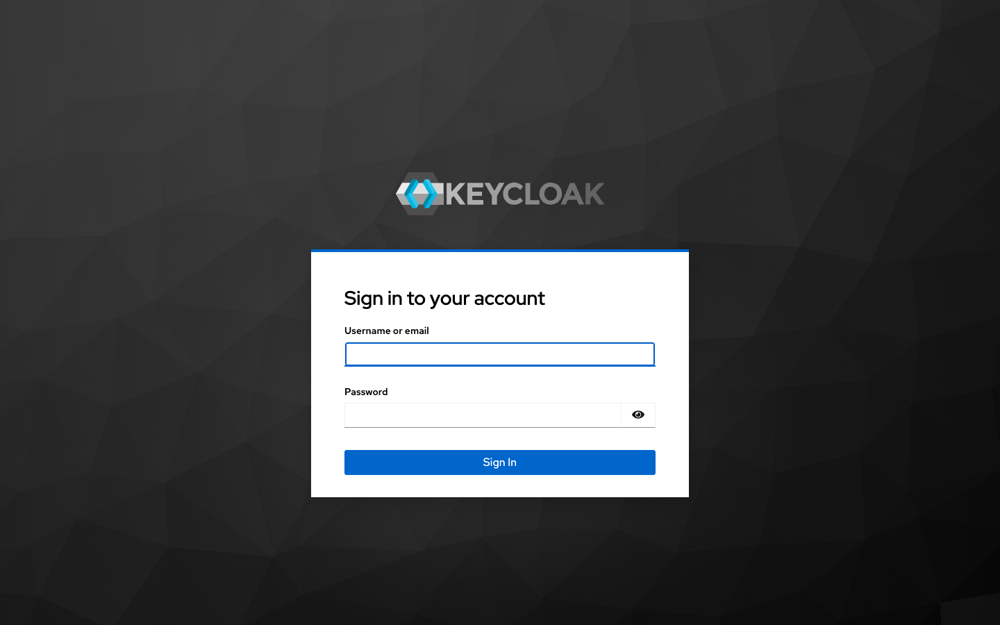
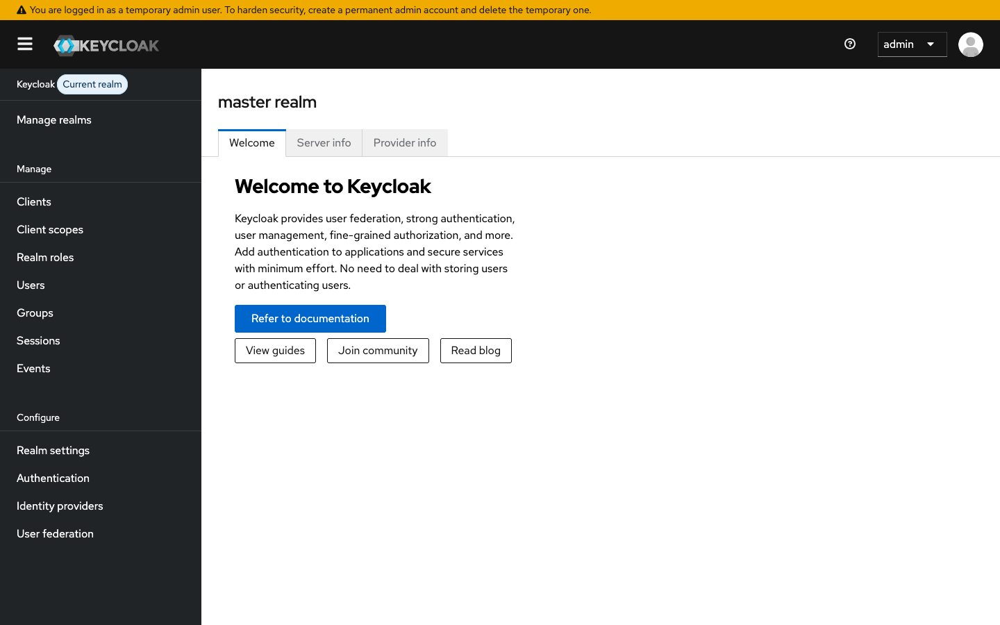
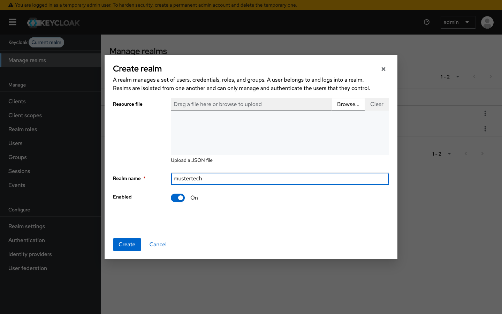
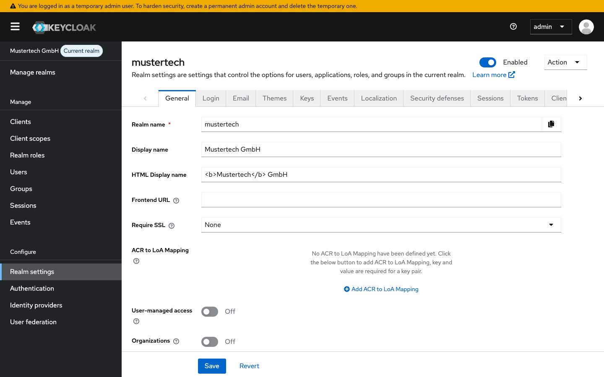
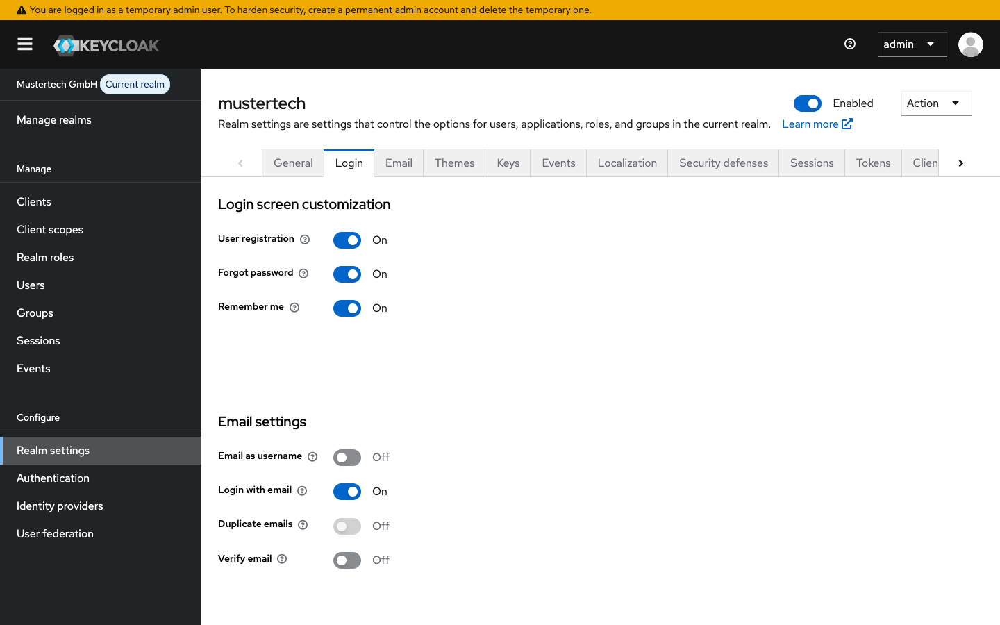
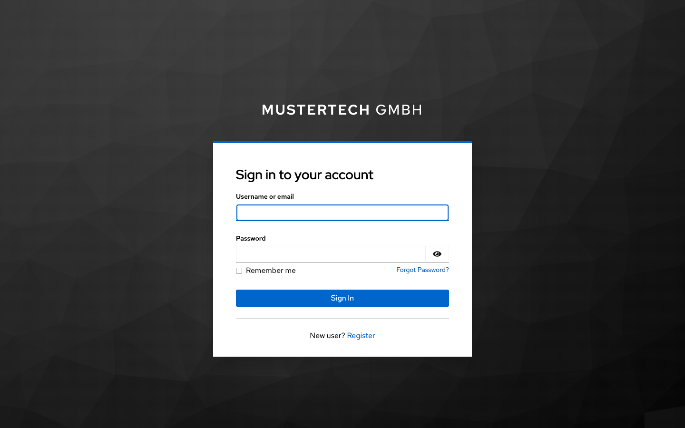
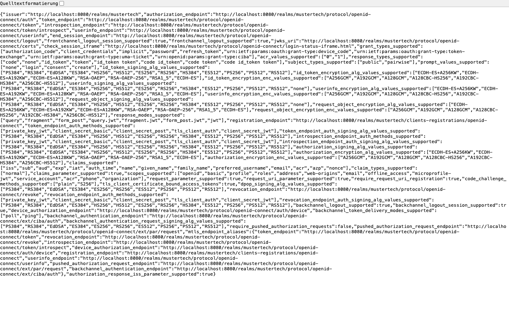

# Modul 03: Installation & Grundkonfiguration

## Übungsziel

Am Ende dieser Übung hast du:

- Keycloak mit PostgreSQL via Docker Compose gestartet
- Die Admin-Konsole kennengelernt
- Den Realm "mustertech" für unser Mitarbeiterportal angelegt

**Geschätzte Dauer:** 15 Minuten

---

## Voraussetzungen

- Docker Desktop installiert und gestartet

### Umgebung starten

```bash
cd assignments/modul-03-installation
docker compose up -d
```

---

## Teil 1: Docker Compose verstehen

### Schritt 1.1: Projektordner öffnen

Öffne den Ordner `assignments/modul-03-installation` in deinem Code-Editor (z.B. VS Code).

### Schritt 1.2: docker-compose.yml verstehen

Öffne die `docker-compose.yml` in diesem Verzeichnis und analysiere die Struktur:

```yaml
services:
  assignment-postgres:   # Datenbank für Keycloak
    image: postgres:18-alpine
    # ...

  assignment-keycloak:   # Identity Provider
    image: quay.io/keycloak/keycloak:26.5
    command: start-dev    # Entwicklungsmodus!
    # ...

  assignment-setup:      # Einmalige Konfiguration
    # Deaktiviert SSL-Pflicht im Master-Realm
    # (für lokale Entwicklung ohne HTTPS)
```

**Wichtige Konfigurationen:**

| Variable | Bedeutung |
| :--- | :--- |
| `KEYCLOAK_ADMIN` | Benutzername für die Admin-Konsole |
| `KEYCLOAK_ADMIN_PASSWORD` | Passwort für die Admin-Konsole |
| `KC_DB` | Datenbanktyp (postgres) |
| `start-dev` | Entwicklungsmodus (HTTP, kein HTTPS) |

> **Hinweis:** Der `start-dev` Modus ist nur für die Entwicklung gedacht! In Produktion
> verwendest du `start` mit HTTPS-Konfiguration.

### Schritt 1.3: Container starten

Stelle sicher, dass du im richtigen Verzeichnis bist:

```bash
cd assignments/modul-03-installation
docker compose up -d
```

### Schritt 1.4: Logs beobachten

Beobachte die Keycloak-Logs, um den Startvorgang zu verfolgen:

```bash
docker compose logs -f assignment-keycloak
```

Warte, bis du folgende Zeile siehst:

```
Keycloak 26.5.0 on JVM (powered by Quarkus) started in Xs.
Running the server in development mode. DO NOT use this configuration in production.
```

Drücke `Ctrl+C`, um die Log-Ausgabe zu beenden.

### Schritt 1.5: Status prüfen

Prüfe, ob alle Container laufen:

```bash
docker compose ps
```

Erwartete Ausgabe:

```
NAME                    STATUS
assignment-keycloak     Up (healthy)
assignment-postgres     Up (healthy)
assignment-setup        Exited (0)
```

> **Hinweis:** `assignment-setup` ist ein Hilfs-Container, der einmalig die SSL-Pflicht für den
> Master-Realm deaktiviert (für lokale Entwicklung ohne HTTPS). Er beendet sich nach
> erfolgreicher Ausführung automatisch.

---

## Teil 2: Admin-Konsole kennenlernen

### Schritt 2.1: Admin-Konsole öffnen

Öffne im Browser: [http://localhost:8080](http://localhost:8080)



Gib die Zugangsdaten ein:

- **Username:** `admin`
- **Password:** `admin`

Du siehst nun die Keycloak-Startseite.

### Schritt 2.2: Master-Realm erkunden

Nach dem Login siehst du den **Master-Realm**. Dieser ist nur für die Verwaltung anderer Realms gedacht.



#### Navigation erkunden

| Bereich | Zweck |
| :--- | :--- |
| **Clients** | Anwendungen, die Keycloak nutzen |
| **Realm Roles** | Berechtigungen auf Realm |
| **Users** | Benutzerkonten |
| **Groups** | Benutzergruppen |
| **Sessions** | Benutzersitzungen |
| **Events** | Benutzerereignisse |
| **Realm settings** | Grundeinstellungen des Realms |
| **Authentication** | Login-Flows |
| **Identity providers** | Externe Logins (Google, GitHub, etc.) |

---

## Teil 3: Realm "mustertech" anlegen

### Schritt 3.1: Neuen Realm erstellen

1. Klicke oben links auf **master** (Realm-Dropdown)
2. Klicke auf **Create realm**

### Schritt 3.2: Realm-Details eingeben

Gib folgende Werte ein:

| Feld | Wert |
| :--- | :--- |
| **Realm name** | `mustertech` |
| **Enabled** | ON |



Klicke auf **Create**.

### Schritt 3.3: Realm-Einstellungen prüfen

Du wirst automatisch in den neuen Realm weitergeleitet. Prüfe die Einstellungen unter **Realm settings**:

#### Tab "General"

- Display name: `Mustertech GmbH`
- HTML Display name: `<b>Mustertech</b> GmbH`



Klicke auf **Save**.

#### Tab "Login"

Aktiviere folgende Optionen:

| Option | Wert | Bedeutung |
| :--- | :--- | :--- |
| User registration | ON | Selbstregistrierung erlauben |
| Forgot password | ON | "Passwort vergessen" Link |
| Remember me | ON | "Angemeldet bleiben" Option |
| Email as username | OFF | Separater Benutzername |



Klicke auf **Save**.

#### Tab "Email"

Für die Entwicklung können wir dies überspringen. In Produktion würdest du hier deinen SMTP-Server konfigurieren.

---

## Teil 4: Erste Schritte im neuen Realm

### Aufgabe 4.1: Account Console öffnen

Jeder Realm hat eine eigene Account Console für Endbenutzer. Öffne:

[http://localhost:8080/realms/mustertech/account](http://localhost:8080/realms/mustertech/account)



> **Hinweis:** Du kannst dich noch nicht einloggen, da wir noch keine Benutzer angelegt
> haben. Das machen wir im nächsten Modul!

### Aufgabe 4.2: OIDC Discovery erkunden

Öffne die OpenID Connect Discovery URL:

<http://localhost:8080/realms/mustertech/.well-known/openid-configuration>

Du siehst ein JSON-Dokument mit allen Endpunkten des Realms:



```json
{
  "issuer": "http://localhost:8080/realms/mustertech",
  "authorization_endpoint": "http://localhost:8080/realms/mustertech/protocol/openid-connect/auth",
  "token_endpoint": "http://localhost:8080/realms/mustertech/protocol/openid-connect/token",
  ...
}
```

**Fragen zur Diskussion:**

- Welche Endpunkte erkennst du aus Modul 02 wieder?
- Was ist der Unterschied zwischen `authorization_endpoint` und `token_endpoint`?

---

## Zusammenfassung

Du hast erfolgreich:

- [x] Keycloak mit Docker Compose gestartet
- [x] Die Admin-Konsole kennengelernt
- [x] Den Realm "mustertech" angelegt
- [x] Grundlegende Realm-Einstellungen konfiguriert
- [x] Die OIDC Discovery URL erkundet

---

## Troubleshooting

### Container-Name-Konflikt

Siehe zentrales Troubleshooting: [Container-Name-Konflikt](../TROUBLESHOOTING.md#container-name-konflikt)

### Keycloak startet nicht

**Symptom:** Container startet, aber Health Check schlägt fehl.

**Lösung:**

```bash
# Logs prüfen
docker compose logs assignment-keycloak

# Häufige Ursachen:
# - PostgreSQL noch nicht bereit → warten
# - Port bereits belegt → Port ändern oder Prozess beenden
```

### "Connection refused" im Browser

**Symptom:** <http://localhost:8080> ist nicht erreichbar.

**Lösung:**

```bash
# Container-Status prüfen
docker compose ps

# Ist Keycloak "Up (healthy)"?
# Falls nicht, Logs prüfen
docker compose logs assignment-keycloak
```

### Passwort vergessen

**Lösung:** Setze alles zurück und starte neu:

```bash
docker compose down -v
docker compose up -d
```

> **Achtung:** `-v` löscht alle Daten (Volumes)!

---

## Bonus-Aufgaben

Falls du schneller fertig bist:

1. **Sessions erkunden:** Unter Sessions siehst du aktive Benutzersitzungen. Melde dich ab
   und wieder an - was ändert sich?

2. **Events aktivieren:** Unter Realm settings → Events kannst du Login-Events protokollieren.
   Aktiviere "Save events" und prüfe, ob deine Admin-Logins aufgezeichnet werden.
