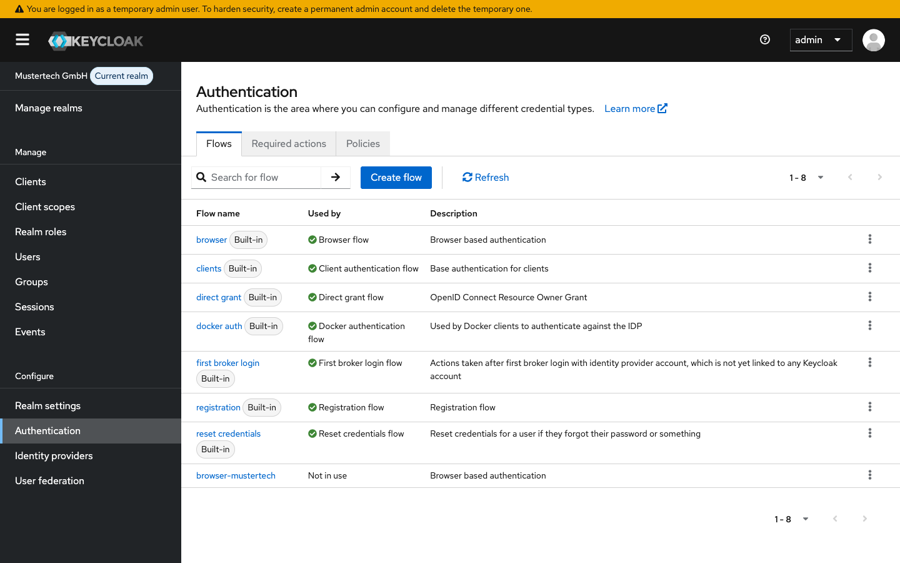
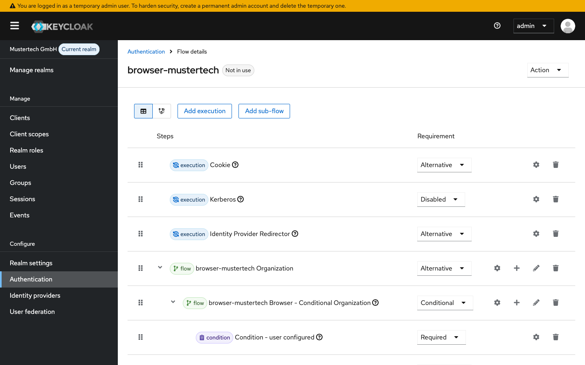
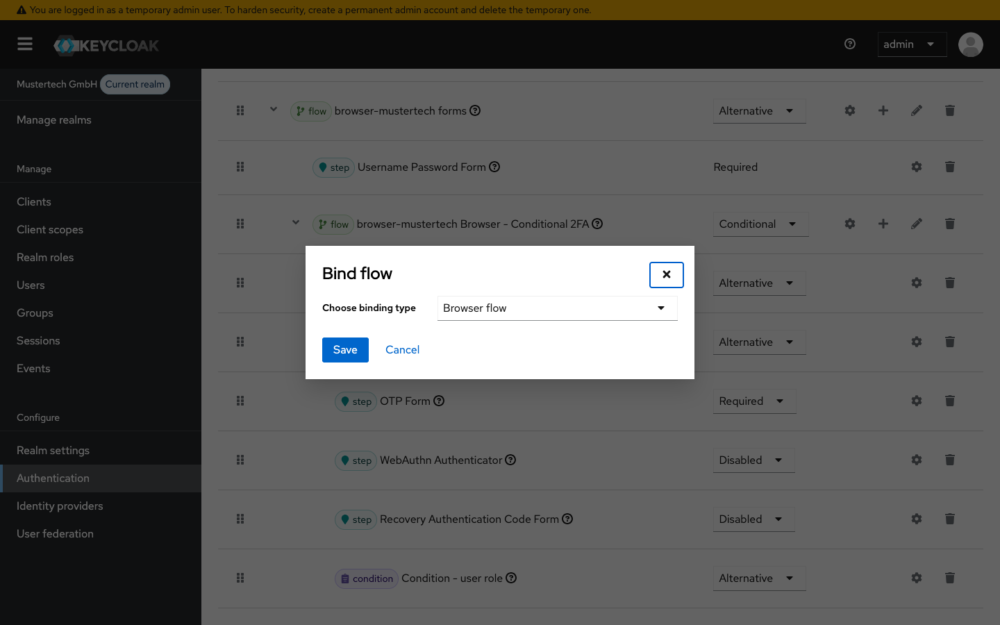
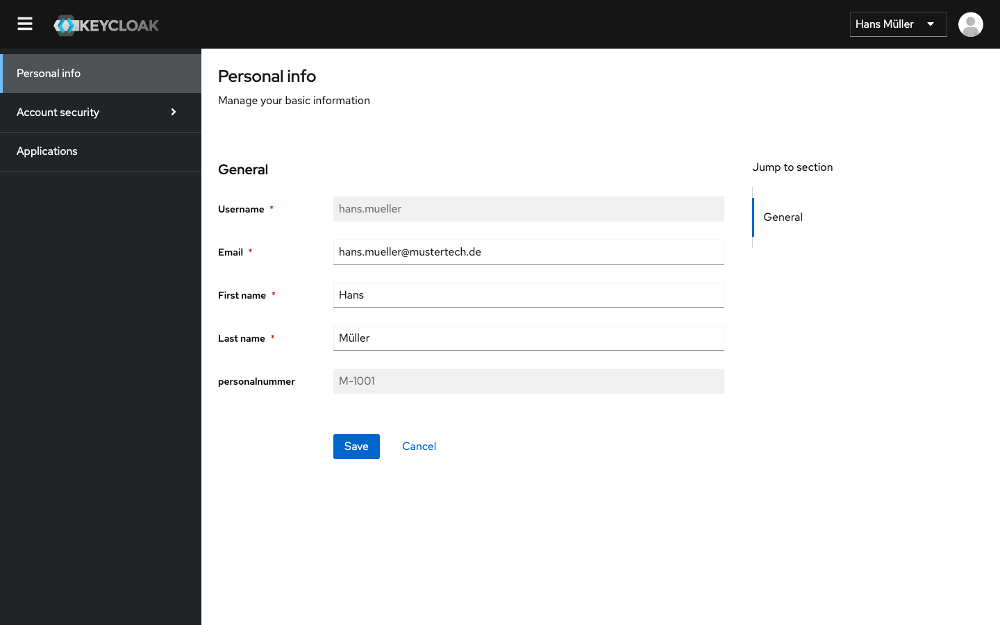
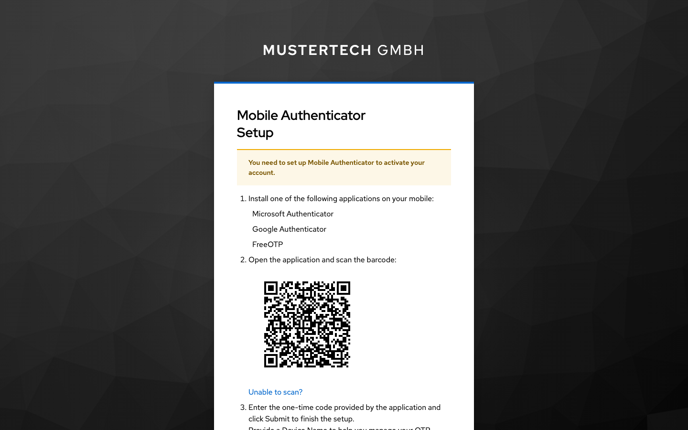
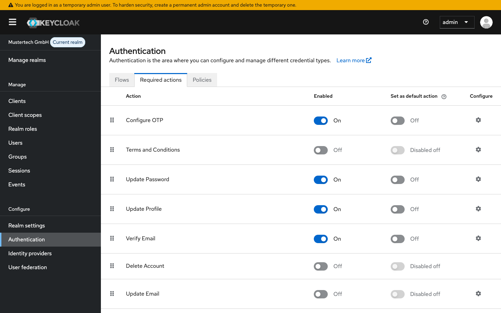

# Modul 05: Authentifizierung & MFA

## Übungsziel

Am Ende dieser Übung hast du:

- Den Standard-Browser-Flow verstanden und dupliziert
- Einen Custom Flow mit Conditional 2FA erstellt
- Bedingungen für MFA basierend auf Rollen konfiguriert
- Den Flow mit verschiedenen Usern getestet

**Geschätzte Dauer:** 25-30 Minuten

---

## Voraussetzungen

- Docker Desktop installiert und gestartet
- Smartphone mit Authenticator-App (getestet mit Google Authenticator und OTP Auth)

### Umgebung starten

```bash
cd assignments/modul-05-authentifizierung-mfa
docker compose up -d
```

> **Hinweis:** Falls die Container der vorherigen Übung noch laufen, stoppe diese zuerst
> mit `docker compose down -v` im Verzeichnis der vorherigen Übung. Details siehe
> [Troubleshooting](../TROUBLESHOOTING.md#container-name-konflikt).

Warte bis Keycloak bereit ist (~30 Sekunden). Der Realm "mustertech" wird automatisch
importiert mit allen Benutzern und Rollen aus dem vorherigen Modul.

---

## Teil 1: Authentication Flows verstehen

### Schritt 1.1: Zu Authentication navigieren

1. Öffne die Admin-Konsole: <http://localhost:8080>
2. Wähle den Realm **mustertech**
3. Navigiere zu **Authentication** (linke Navigation)

Du siehst eine Liste vordefinierter Flows.



### Schritt 1.2: Flow-Typen verstehen

Hier ist eine Auswahl der wichtigsten Flows:

| Flow                  | Verwendung                                      |
|:----------------------|:------------------------------------------------|
| **browser**           | Standard-Login über Browser (Username/Passwort) |
| **clients**           | Client-Authentifizierung                        |
| **direct grant**      | Resource Owner Password Credentials (Legacy)    |
| **registration**      | Benutzer-Selbstregistrierung                    |
| **reset credentials** | Passwort-Reset-Flow                             |

### Schritt 1.3: Browser-Flow analysieren

1. Klicke auf **browser**
2. Analysiere die Struktur:


**Execution-Typen:**

| Typ             | Bedeutung                                  |
|:----------------|:-------------------------------------------|
| **REQUIRED**    | Muss erfolgreich sein                      |
| **ALTERNATIVE** | Einer von mehreren muss erfolgreich sein   |
| **CONDITIONAL** | Wird nur ausgeführt wenn Bedingung erfüllt |
| **DISABLED**    | Deaktiviert                                |

---

## Teil 2: Custom Flow erstellen

Wir erstellen einen Flow, bei dem nur Admins OTP eingeben müssen.

### Schritt 2.1: Browser-Flow duplizieren

1. Gehe zurück zur Flow-Liste
2. Klicke bei **browser** auf die drei Punkte (⋮) → **Duplicate**
3. Gib als Name ein: `browser-mustertech`
4. Klicke auf **Duplicate**



### Schritt 2.2: OTP-Bedingung verstehen

Der Standard-Flow hat bereits einen CONDITIONAL Sub-Flow "Conditional 2FA".
Darin stecken Bedingungen wie "Condition - user configured" - OTP wird nur
abgefragt, wenn der User bereits OTP eingerichtet hat.

Wir wollen stattdessen: **OTP nur für Admins** (Rolle "admin").

### Schritt 2.3: Bestehende Bedingungen entfernen

1. Klappe den Sub-Flow **browser-mustertech Browser - Conditional 2FA** auf
2. Stelle **Condition - user configured** auf **Disabled**
3. Stelle **Condition - credential** auf **Disabled**

### Schritt 2.4: Admin-Bedingung hinzufügen

1. Klicke auf das **+** Symbol neben "browser-mustertech Browser - Conditional 2FA"
2. Wähle **Add condition**
3. Wähle **Condition - User Role**
4. Klicke auf **Add**

### Schritt 2.5: Bedingung konfigurieren

1. Klicke auf das Zahnrad-Symbol bei "Condition - User Role"
2. Konfiguriere:
   - **Alias:** `Is Admin`
   - **User role:** `admin`
   - **Negate output:** OFF
3. Klicke auf **Save**

### Schritt 2.6: Execution-Typen setzen

Setze die Requirement-Typen im Conditional 2FA Sub-Flow:

| Execution             | Requirement  |
|:----------------------|:-------------|
| Condition - User Role | **REQUIRED** |
| OTP Form              | **REQUIRED** |

Die anderen Einträge (WebAuthn, Recovery) können auf **DISABLED** bleiben.

> **Ergebnis:** Der Sub-Flow prüft jetzt nur noch, ob der User die Rolle "admin" hat.
> Wenn ja, wird OTP abgefragt. Für alle anderen User wird der Sub-Flow übersprungen.

---

## Teil 3: Flow aktivieren

### Schritt 3.1: Flow an Realm binden

1. Navigiere zu **Authentication**
2. Wähle den Flow **browser-mustertech**
3. Ändere **Action** -> **Bind Flow**
4. Wähle den Binding Type **Browser Flow**
5. Klicke auf **Save**



---

## Teil 4: Flow testen

### Test 4.1: Login als normaler User (kein OTP)

1. Öffne ein **Inkognito-Fenster**
2. Gehe zu: [http://localhost:8080/realms/mustertech/account](http://localhost:8080/realms/mustertech/account)
3. Melde dich an als:
   - Username: `hans.mueller`
   - Password: `test1234`

**Erwartetes Ergebnis:**

- Login erfolgreich OHNE OTP-Abfrage
- (hans.mueller hat nicht die Rolle "admin")



### Test 4.2: Login als Admin (mit OTP)

1. Melde dich ab
2. Melde dich an als:
   - Username: `max.admin`
   - Password: `test1234`
3. Dir wird ein QR-Code zur Einrichtung von OTP angezeigt
4. Richte OTP ein

**Erwartetes Ergebnis:**
Nach korrektem Code: Login erfolgreich



---

## Teil 5: Weitere Flow-Anpassungen (Optional)

### Aufgabe 5.1: Registrierungs-Flow erkunden

1. Navigiere zu **Authentication** → **registration**
2. Analysiere die Schritte. Wir können hier z.B. Captcha aktivieren

### Aufgabe 5.2: Required Actions verstehen

Required Actions sind Aktionen, die ein User ausführen muss:

1. Navigiere zu **Authentication** → **Required actions**
2. Wichtige Actions:

| Action | Beschreibung |
| :--- | :--- |
| **Update Password** | Passwort muss geändert werden |
| **Configure OTP** | OTP muss eingerichtet werden |
| **Verify Email** | E-Mail muss verifiziert werden |
| **Update Profile** | Profil muss aktualisiert werden |

Du kannst Actions als **Default** markieren (gilt für alle neu registrierenden User).



---

## Zusammenfassung

Du hast erfolgreich:

- [x] Den Standard-Browser-Flow analysiert
- [x] Einen Custom Flow mit Conditional 2FA erstellt
- [x] Bedingung basierend auf User-Rolle konfiguriert
- [x] Den Flow an den Realm gebunden
- [x] Den Flow mit verschiedenen Usern getestet

---

## Troubleshooting

### Container-Name-Konflikt

Siehe zentrales Troubleshooting: [Container-Name-Konflikt](../TROUBLESHOOTING.md#container-name-konflikt)
