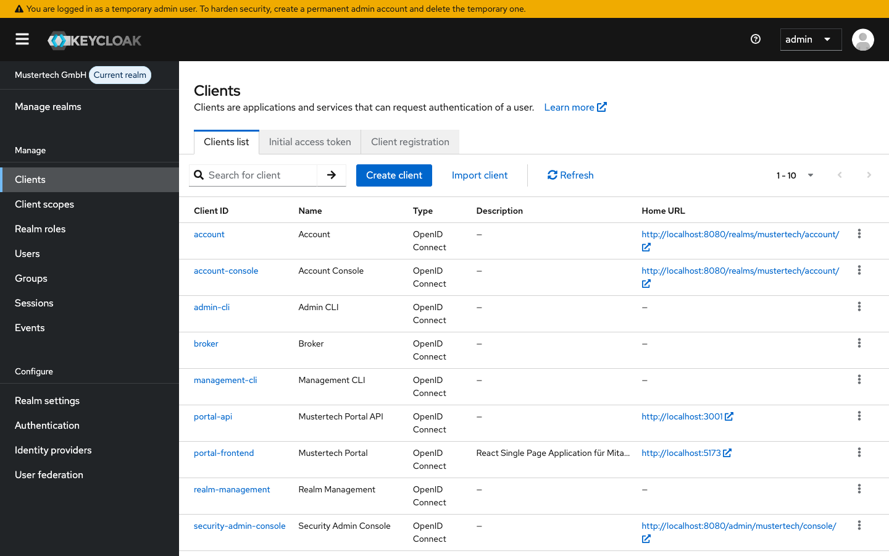
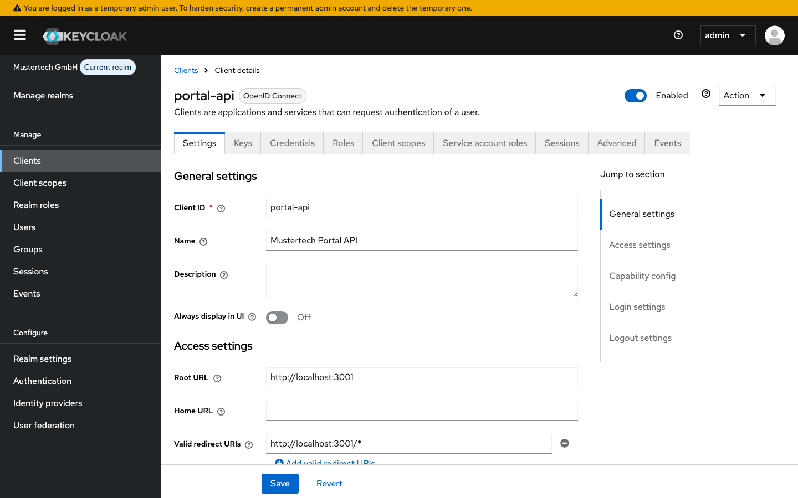
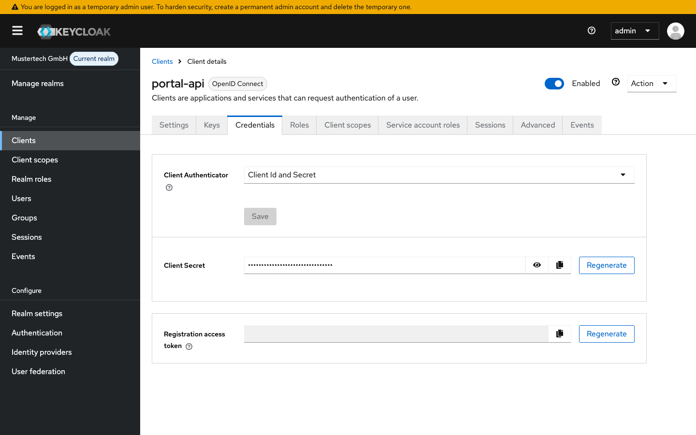
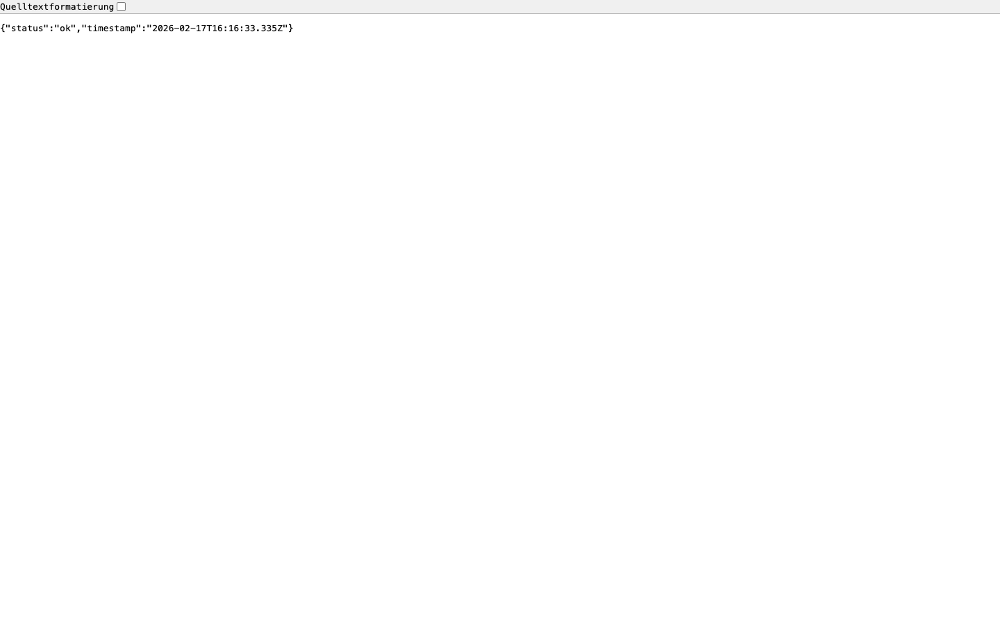
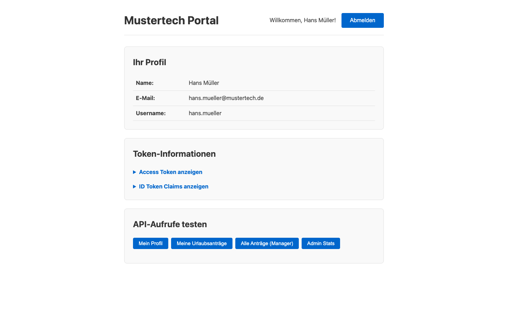
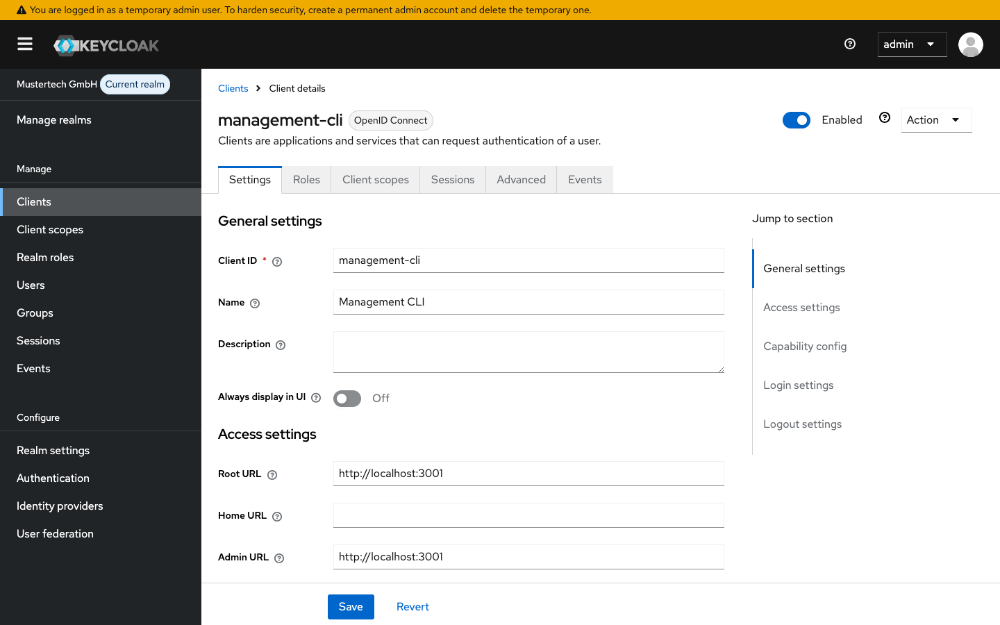
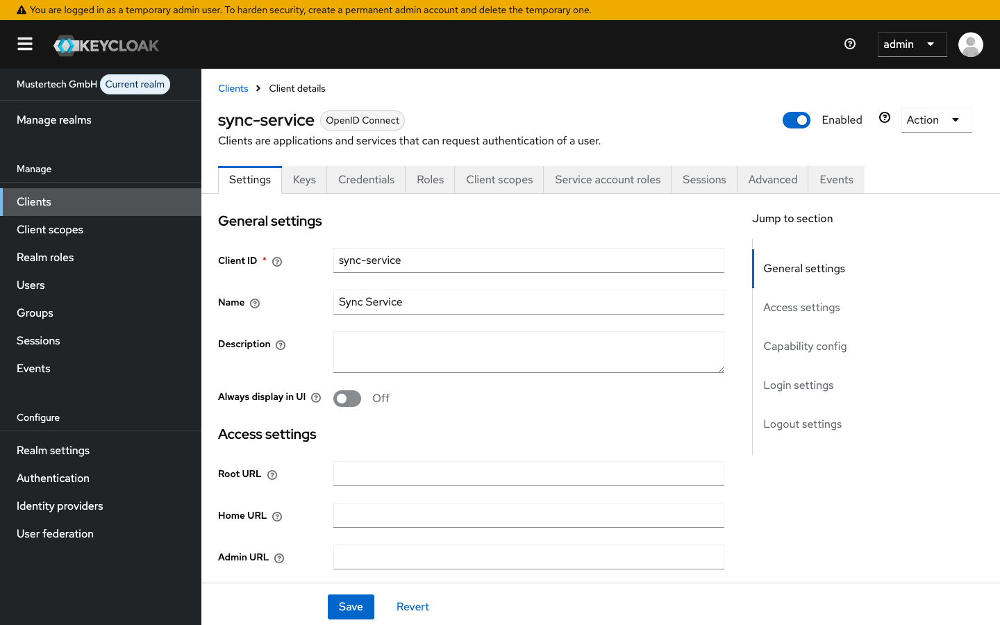
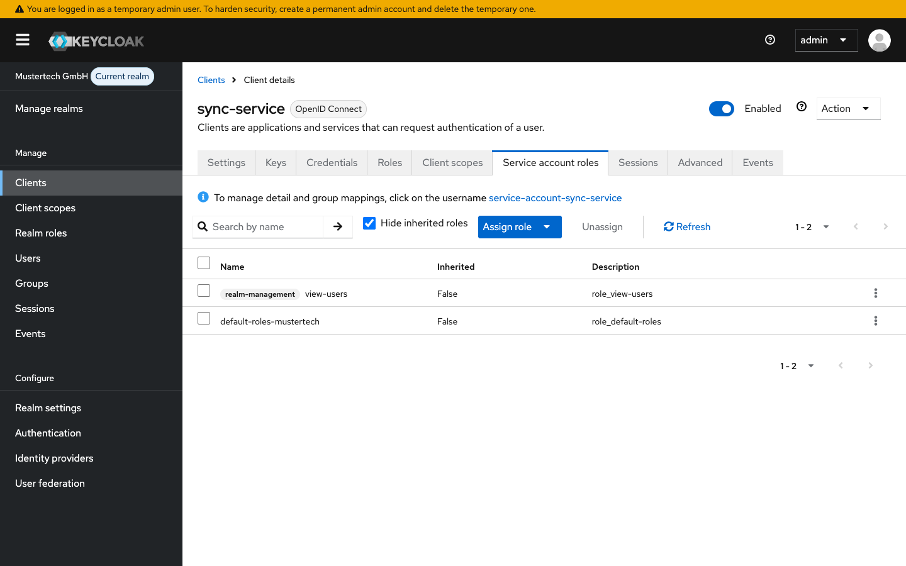
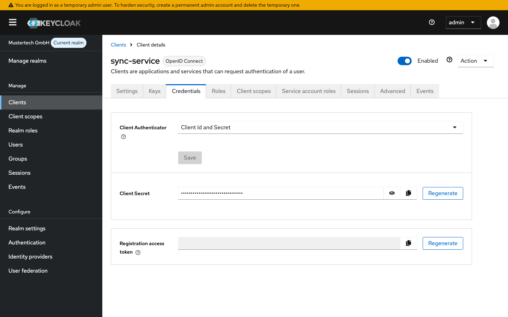

# Modul 06b: Client Management

## Übungsziel

Am Ende dieser Übung hast du:

- Die Portal-API als Confidential Client konfiguriert und deren Token-Validierung verstanden
- Das Frontend mit der API verbunden
- Das Management-CLI mit Device Flow konfiguriert und getestet
- Den Sync-Service mit Client Credentials konfiguriert und getestet

**Geschätzte Dauer:** 50-60 Minuten

---

## Voraussetzungen

- Docker Desktop installiert und gestartet

### Umgebung starten

```bash
cd assignments/modul-06b-client-management
docker compose up -d
```

> **Hinweis:** Falls die Container der vorherigen Übung noch laufen, stoppe diese zuerst
> mit `docker compose down -v` im Verzeichnis der vorherigen Übung. Details siehe
> [Troubleshooting](../TROUBLESHOOTING.md#container-name-konflikt).

Warte bis alle Services bereit sind (~60 Sekunden). Der Realm "mustertech" wird automatisch
importiert mit dem Portal-Frontend-Client und allen Konfigurationen aus den vorherigen Modulen.

---

## Teil 1: Portal-API - Confidential Client

Die Portal-API ist ein Express-Backend, das die Access Tokens des Frontends validiert und
rollenbasierte Endpunkte bereitstellt. Der Code liegt fertig unter `services/portal-api/`.

### Schritt 1.1: Client in Keycloak erstellen

1. Admin-Konsole → **Clients** → **Create client**



2. **General settings:**

| Feld | Wert |
| :--- | :--- |
| Client type | OpenID Connect |
| Client ID | `portal-api` |
| Name | `Mustertech Portal API` |

3. **Capability config:**

| Feld | Wert |
| :--- | :--- |
| Client authentication | **ON** (Confidential Client) |
| Authorization | OFF |
| Authentication flow | ☑ Standard flow, ☑ Service account roles |

4. **Login settings:**

| Feld | Wert |
| :--- | :--- |
| Root URL | `http://localhost:3001` |
| Valid redirect URIs | `http://localhost:3001/*` |
| Web origins | `+` (alle erlauben) |

Klicke auf **Save**.



### Schritt 1.2: Code-Walkthrough - `../services/portal-api/src/index.ts`

Die API hat eine einzige Quelldatei. Schauen wir uns die wichtigsten Bausteine an.

#### Abhängigkeiten

| Bibliothek | Zweck |
| :--- | :--- |
| **express** | HTTP-Framework - verarbeitet Requests und sendet Responses |
| **cors** | Erlaubt Anfragen von anderen Origins (z.B. `localhost:5173` → `localhost:3001`) |
| **jsonwebtoken** | Dekodiert und verifiziert JWT-Tokens |
| **jwks-rsa** | Holt die öffentlichen Schlüssel von Keycloaks JWKS-Endpoint |

#### JWKS-Client

```typescript
const client = jwksClient({
  jwksUri: `${KEYCLOAK_URL}/realms/${REALM}/protocol/openid-connect/certs`,
  cache: true,
  rateLimit: true,
});
```

Die API validiert Tokens **ohne ein Client Secret** zu benötigen. Stattdessen holt sie sich
die öffentlichen Schlüssel von Keycloaks JWKS-Endpoint (JSON Web Key Set). Damit kann sie
die Signatur jedes Access Tokens prüfen.

> **Konzept: Asymmetrische Signatur** - Keycloak signiert Tokens mit einem privaten Schlüssel
> (RS256). Jeder Service kann die Signatur mit dem öffentlichen Schlüssel verifizieren, ohne
> das Secret zu kennen. Die JWKS-URL liefert diese öffentlichen Schlüssel.

#### Token-Validierung Middleware (`validateToken`)

Diese Middleware prüft jeden geschützten Request in drei Schritten:

1. **Bearer Token extrahieren** - Aus dem `Authorization`-Header wird das Token gelesen
2. **Key ID (kid) ermitteln** - Der Token-Header enthält die ID des Schlüssels, mit dem
   signiert wurde. Die Middleware fragt den passenden öffentlichen Schlüssel vom JWKS-Endpoint ab.
3. **Signatur und Issuer prüfen** - `jwt.verify()` prüft die Signatur (RS256) und dass der
   Issuer mit der Keycloak-Realm-URL übereinstimmt

Bei Erfolg wird der dekodierte Token-Inhalt in `req.user` gespeichert.

#### Rollen-Check Middleware (`requireRole`)

```typescript
const requireRole = (role: string) => {
  return (req, res, next) => {
    const roles = req.user?.realm_access?.roles || [];
    if (!roles.includes(role)) {
      return res.status(403).json({ error: `Role '${role}' required` });
    }
    next();
  };
};
```

Prüft, ob der Benutzer eine bestimmte Realm-Rolle besitzt. Die Rollen stehen im Access Token
unter `realm_access.roles` - dort finden sich die Rollen, die wir in Modul 04 angelegt haben.

#### API-Endpunkte

| Endpunkt | Auth | Rolle | Beschreibung |
| :--- | :--- | :--- | :--- |
| `GET /api/health` | Nein | - | Health-Check |
| `GET /api/profile` | Ja | (jeder) | Eigenes Profil aus dem Token |
| `GET /api/urlaubsantraege` | Ja | `mitarbeiter` | Eigene Urlaubsanträge |
| `GET /api/urlaubsantraege/alle` | Ja | `manager` | Alle Urlaubsanträge |
| `GET /api/admin/stats` | Ja | `admin` | Admin-Statistiken |

Beachte, wie die Middlewares verkettet werden:

```typescript
app.get('/api/urlaubsantraege', validateToken, requireRole('mitarbeiter'), handler);
```

Express verarbeitet die Middlewares von links nach rechts: erst Token prüfen, dann Rolle
prüfen, dann den eigentlichen Handler ausführen.

### Schritt 1.3: Client Secret notieren

Wechsle zum Tab **Credentials** des `portal-api`-Clients. Hier findest du das Client Secret,
das die API zur Authentifizierung bei Keycloak nutzt.



### Schritt 1.4: Docker-Compose prüfen

Betrachte den `assignment-api` Service in der `docker-compose.yml` dieses Verzeichnisses.
Die Portal-API ist bereits konfiguriert und wird automatisch gebaut und gestartet.

> **Hinweis:** Die API braucht zwei Keycloak-URLs:
>
> - `VITE_KEYCLOAK_URL=http://assignment-keycloak:8080` - Interne URL für JWKS-Abruf (Docker-Netzwerk)
> - `KEYCLOAK_PUBLIC_URL=http://localhost:8080` - Öffentliche URL für Issuer-Validierung

### Schritt 1.5: API testen

Prüfe zunächst den öffentlichen Health-Endpoint im Browser:

[http://localhost:3001/api/health](http://localhost:3001/api/health)

**Erwartetes Ergebnis:** `{"status":"ok","timestamp":"..."}`



Teste nun einen geschützten Endpunkt. Hole dir dazu ein Access Token über den
Direct Access Grant (Username/Password):

**Bash / macOS / Linux:**

```bash
TOKEN=$(curl -s -X POST \
  http://localhost:8080/realms/mustertech/protocol/openid-connect/token \
  -H "Content-Type: application/x-www-form-urlencoded" \
  -d "grant_type=password" \
  -d "client_id=portal-frontend" \
  -d "username=hans.mueller" \
  -d "password=test1234" \
  | python3 -c "import sys,json; print(json.load(sys.stdin)['access_token'])")
```

**PowerShell:**

```powershell
$response = Invoke-RestMethod -Method Post `
  -Uri "http://localhost:8080/realms/mustertech/protocol/openid-connect/token" `
  -ContentType "application/x-www-form-urlencoded" `
  -Body "grant_type=password&client_id=portal-frontend&username=hans.mueller&password=test1234"
$TOKEN = $response.access_token
```

Rufe damit die geschützten Endpunkte auf:

**Bash / macOS / Linux:**

```bash
# Profil - sollte funktionieren (jeder authentifizierte User)
curl -H "Authorization: Bearer $TOKEN" http://localhost:3001/api/profile

# Urlaubsanträge - sollte funktionieren (hans.mueller hat Rolle 'mitarbeiter')
curl -H "Authorization: Bearer $TOKEN" http://localhost:3001/api/urlaubsantraege

# Admin Stats - sollte 403 liefern (hans.mueller ist kein Admin)
curl -H "Authorization: Bearer $TOKEN" http://localhost:3001/api/admin/stats
```

**PowerShell:**

```powershell
# Profil - sollte funktionieren (jeder authentifizierte User)
Invoke-RestMethod -Uri "http://localhost:3001/api/profile" `
  -Headers @{ Authorization = "Bearer $TOKEN" }

# Urlaubsanträge - sollte funktionieren (hans.mueller hat Rolle 'mitarbeiter')
Invoke-RestMethod -Uri "http://localhost:3001/api/urlaubsantraege" `
  -Headers @{ Authorization = "Bearer $TOKEN" }

# Admin Stats - sollte 403 liefern (hans.mueller ist kein Admin)
try { Invoke-RestMethod -Uri "http://localhost:3001/api/admin/stats" `
  -Headers @{ Authorization = "Bearer $TOKEN" } } catch { $_.Exception.Message }
```

---

## Teil 2: Frontend mit API verbinden

Im Portal-Frontend existiert bereits eine Komponente `ApiDemo.tsx`, die API-Aufrufe mit dem
Access Token des eingeloggten Benutzers durchführt. Wir schauen uns den Code an und binden
die Komponente ein.

### Schritt 2.1: Code-Walkthrough - `../services/portal-frontend/src/components/ApiDemo.tsx`

Die Komponente stellt Buttons für jeden API-Endpunkt bereit und zeigt das Ergebnis an.

Der zentrale Mechanismus ist die `callApi`-Funktion:

```tsx
const response = await fetch(`${API_URL}${endpoint}`, {
  headers: {
    Authorization: `Bearer ${auth.user?.access_token}`,
  },
});
```

Bei jedem API-Aufruf wird das Access Token aus dem OIDC-Context als `Bearer`-Token im
`Authorization`-Header mitgeschickt. Die API validiert dieses Token dann mit der
`validateToken`-Middleware aus Teil 1.

> **Konzept: Bearer Token** - Der Client (Browser) erhält das Access Token nach dem Login
> von Keycloak. Bei jedem API-Aufruf wird es als `Authorization: Bearer <token>` mitgeschickt.
> Die API verifiziert die Signatur des Tokens und braucht Keycloak dafür nicht erneut zu
> kontaktieren.

Die Komponente verwaltet drei States:

- `result` - Das JSON-Ergebnis eines erfolgreichen Aufrufs
- `error` - Die Fehlermeldung bei 401 (kein Token) oder 403 (fehlende Rolle)
- `loading` - Zeigt "Lädt..." während des Aufrufs

### Schritt 2.2: ApiDemo in App.tsx einbinden

Öffne `../services/portal-frontend/src/App.tsx` und füge oben den Import hinzu:

```tsx
import { ApiDemo } from './components/ApiDemo';
```

Füge die Komponente im authentifizierten Bereich ein, nach der Token-Informationen-Section:

```tsx
          </section>

          <ApiDemo />
        </main>
```

### Schritt 2.3: Frontend neu bauen und testen

```bash
docker compose up --build -d assignment-portal
```

Öffne <http://localhost:5173> und melde dich an.



**Test als `hans.mueller` (Rolle: mitarbeiter):**

| Button | Erwartetes Ergebnis |
| :--- | :--- |
| Mein Profil | Profildaten mit Rollen `["mitarbeiter", ...]` |
| Meine Urlaubsanträge | Liste mit 2 Urlaubsanträgen |
| Alle Anträge (Manager) | **Fehler 403** - Role 'manager' required |
| Admin Stats | **Fehler 403** - Role 'admin' required |


Melde dich ab und teste erneut:

**Test als `max.admin` (Rolle: admin → manager → mitarbeiter):**

| Button | Erwartetes Ergebnis |
| :--- | :--- |
| Mein Profil | Profildaten mit Rollen `["admin", "manager", "mitarbeiter", ...]` |
| Meine Urlaubsanträge | Liste mit 2 Urlaubsanträgen |
| Alle Anträge (Manager) | Liste aller Mitarbeiter-Anträge |
| Admin Stats | Statistik-Daten (42 Users, 15 Sessions, 3 Requests) |

**Token inspizieren:**

1. Klicke auf "Access Token anzeigen" im Portal
2. Kopiere den Token und öffne [jwt.io](https://jwt.io)
3. Prüfe:
   - `realm_access.roles` - Enthält die Rollen des Benutzers
   - `iss` - Issuer-URL zeigt auf den Keycloak-Realm
   - `azp` - Authorized Party ist `portal-frontend`

---

## Teil 3: Management-CLI mit Device Flow

Das Management-CLI ist ein Kommandozeilen-Tool, das den **Device Flow** nutzt. Dieser Flow ist
für Geräte ohne Browser gedacht (z.B. Smart TVs, CLI-Tools): Das Gerät zeigt einen Code an,
den der Benutzer auf einem anderen Gerät im Browser eingibt.

Der Code liegt unter `services/management-cli/`.

### Schritt 3.1: Client in Keycloak erstellen

1. Admin-Konsole → **Clients** → **Create client**
2. Konfiguration:

| Feld                  | Wert                                                        |
|:----------------------|:------------------------------------------------------------|
| Client ID             | `management-cli`                                            |
| Client authentication | **OFF** (Public Client)                                     |
| Authentication flow   | ☐ Standard flow, ☑ **OAuth 2.0 Device Authorization Grant** |



### Schritt 3.2: Code-Walkthrough - `../services/management-cli/src/index.ts`

| Bibliothek        | Zweck                                    |
|:------------------|:-----------------------------------------|
| **axios**         | HTTP-Client für die Keycloak-API-Aufrufe |
| **readline-sync** | Wartet auf Benutzereingabe im Terminal   |

#### Device Flow - Ablauf

**1. Gerätecode anfordern** (`startDeviceFlow`):

```typescript
const response = await axios.post(
  `${KEYCLOAK_URL}/realms/${REALM}/protocol/openid-connect/auth/device`,
  new URLSearchParams({
    client_id: CLIENT_ID,
    scope: 'openid profile email',
  })
);
```

Keycloak antwortet mit einem `user_code` (z.B. `ABCD-EFGH`) und einer `verification_uri`,
die der Benutzer im Browser öffnet.

**2. Polling auf Token** (`pollForToken`):

Das CLI fragt in regelmäßigen Abständen den Token-Endpoint, ob der Benutzer sich bereits
angemeldet hat:

```typescript
const response = await axios.post(
  `${KEYCLOAK_URL}/realms/${REALM}/protocol/openid-connect/token`,
  new URLSearchParams({
    grant_type: 'urn:ietf:params:oauth:grant-type:device_code',
    client_id: CLIENT_ID,
    device_code: deviceCode,
  })
);
```

Solange der Benutzer sich noch nicht angemeldet hat, antwortet Keycloak mit
`authorization_pending`. Das CLI wartet dann das konfigurierte Intervall ab und fragt erneut.

**3. Token auswerten**:

Nach erfolgreicher Anmeldung werden die Tokens dekodiert (Base64). Benutzerinfos (Name,
E-Mail) kommen aus dem **ID Token**, Rollen aus dem **Access Token** - entsprechend der
Trennung zwischen Identität und Berechtigung.

### Schritt 3.3: Docker-Compose prüfen

Betrachte den `assignment-management-cli` Service in der `docker-compose.yml`. Er ist mit
`profiles: ["cli"]` konfiguriert und startet daher nicht automatisch bei `docker compose up`.

> **Konzept: Docker Compose Profiles** - Services mit `profiles` werden bei `docker compose up`
> ignoriert. Sie lassen sich gezielt mit `docker compose run --rm <service>` starten. Das ist
> ideal für CLI-Tools, die nur bei Bedarf laufen sollen.

### Schritt 3.4: CLI ausführen und testen

```bash
docker compose run --rm assignment-management-cli
```

Das CLI zeigt eine URL und einen Code an. Öffne die URL im Browser, gib den Code
ein und melde dich als `hans.mueller` an. Danach wird das CLI automatisch fortfahren.

---

## Teil 4: Sync-Service mit Client Credentials

Der Sync-Service demonstriert den **Client Credentials Flow** - eine Machine-to-Machine-
Authentifizierung ohne Benutzerinteraktion. Der Service authentifiziert sich mit seiner
eigenen Client-ID und einem Secret, um Keycloaks Admin-API aufzurufen.

Der Code liegt unter `services/sync-service/`.

### Schritt 4.1: Client in Keycloak erstellen

1. Admin-Konsole → **Clients** → **Create client**
2. Konfiguration:

| Feld | Wert |
| :--- | :--- |
| Client ID | `sync-service` |
| Client authentication | **ON** (Confidential) |
| Authentication flow | ☐ Standard flow, ☑ **Service accounts roles** |



### Schritt 4.2: Service Account Rollen zuweisen

Der Service Account braucht die Berechtigung, Benutzer zu lesen:

1. Gehe zu **Clients** → **sync-service** → Tab **Service account roles**
2. Klicke auf **Assign role**
3. Klicke auf **Client roles**
4. Suche nach `view-users`
5. Wähle **view-users**
6. Klicke auf **Assign**



### Schritt 4.3: Client Secret konfigurieren

1. Gehe zum Tab **Credentials** des `sync-service`-Clients
2. Kopiere das **Client secret**



3. Kopiere die Datei `.env.example` zu `.env` und trage dein Secret in die Datei ein.

```bash
cp .env.example .env
# Secret in die neue Datei eintragen!
```

### Schritt 4.4: Code-Walkthrough - `../services/sync-service/src/index.ts`

#### Client Credentials Flow

Im Gegensatz zum Device Flow oder Authorization Code Flow ist hier **kein Benutzer beteiligt**.
Der Service authentifiziert sich selbst:

```typescript
const response = await axios.post(
  `${KEYCLOAK_URL}/realms/${REALM}/protocol/openid-connect/token`,
  new URLSearchParams({
    grant_type: 'client_credentials',
    client_id: CLIENT_ID,
    client_secret: CLIENT_SECRET,
  })
);
```

Mit dem erhaltenen Access Token ruft der Service dann die Keycloak Admin-API auf, um
alle Benutzer des Realms abzufragen:

```typescript
const response = await axios.get(
  `${KEYCLOAK_URL}/admin/realms/${REALM}/users`,
  { headers: { Authorization: `Bearer ${token}` } }
);
```

> **Konzept: Service Account** - Wenn "Service accounts roles" aktiviert ist, erstellt
> Keycloak automatisch einen internen Benutzer für den Client. Diesem "Service Account"
> werden Rollen zugewiesen (z.B. `view-users`), die bestimmen, welche Admin-APIs der
> Service aufrufen darf.

### Schritt 4.5: Sync-Service ausführen und testen

```bash
docker compose run --rm assignment-sync
```

**Erwartetes Ergebnis:**

```text
=================================
  Mustertech Sync Service
=================================

Hole Service Account Token...
Token erhalten!

Lade Benutzer aus Keycloak...

3 Benutzer gefunden:

- hans.mueller (hans.mueller@mustertech.de)
- anna.schmidt (anna.schmidt@mustertech.de)
- max.admin (max.admin@mustertech.de)

[Hier würde die Synchronisation stattfinden]
Sync abgeschlossen.
```

---

## Zusammenfassung

Du hast erfolgreich:

- [x] Portal-API mit Token-Validierung via JWKS konfiguriert
- [x] Frontend-API-Integration mit Bearer Token verstanden und eingebunden
- [x] Management-CLI mit Device Flow getestet
- [x] Sync-Service mit Client Credentials getestet
- [x] Rollenbasierte Zugriffskontrolle über die API verifiziert

---

## Troubleshooting

### Container-Name-Konflikt

Siehe zentrales Troubleshooting: [Container-Name-Konflikt](../TROUBLESHOOTING.md#container-name-konflikt)

### API gibt 401 zurück

- Token abgelaufen? → Neu einloggen im Portal
- JWKS-URL erreichbar? → `curl http://localhost:8080/realms/mustertech/protocol/openid-connect/certs`
- Issuer stimmt? → Im Docker-Netzwerk ist die URL `http://assignment-keycloak:8080`, vom Browser aus
  aber `http://localhost:8080`. Prüfe die `VITE_KEYCLOAK_URL` in der docker-compose.yml.

### API gibt 403 zurück

- Hat der Benutzer die richtige Rolle? → Admin-Konsole → Users → Role mapping prüfen
- Composite Roles korrekt? → `admin` enthält `manager` enthält `mitarbeiter`

### Device Flow: "invalid_client"

- Ist "OAuth 2.0 Device Authorization Grant" im Client aktiviert?
- Client ID korrekt (`management-cli`)?

### Client Credentials: "unauthorized_client"

- Ist "Service accounts roles" im Client aktiviert?
- Client Secret korrekt?
- Wurde `view-users` dem Service Account zugewiesen?
