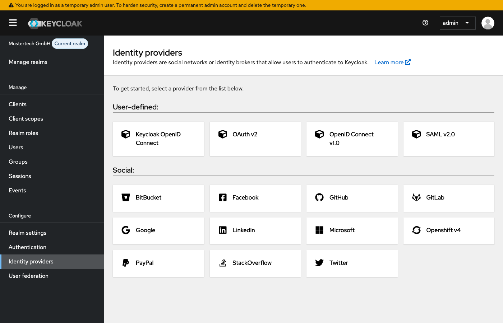
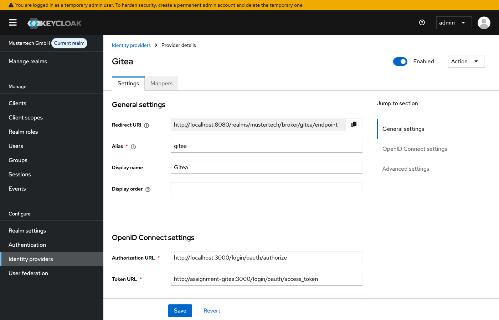
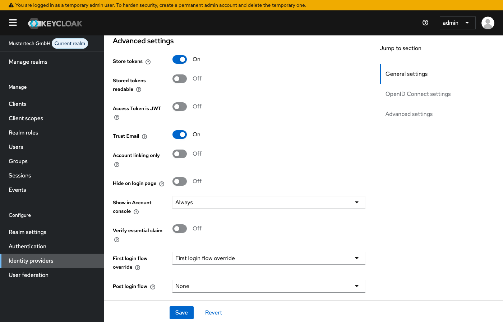
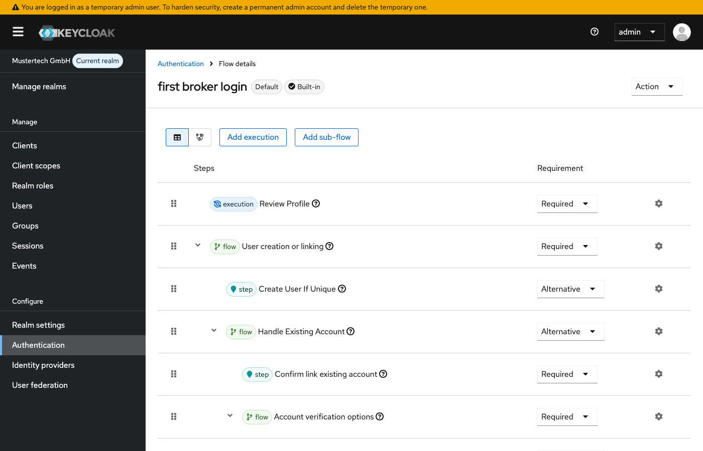
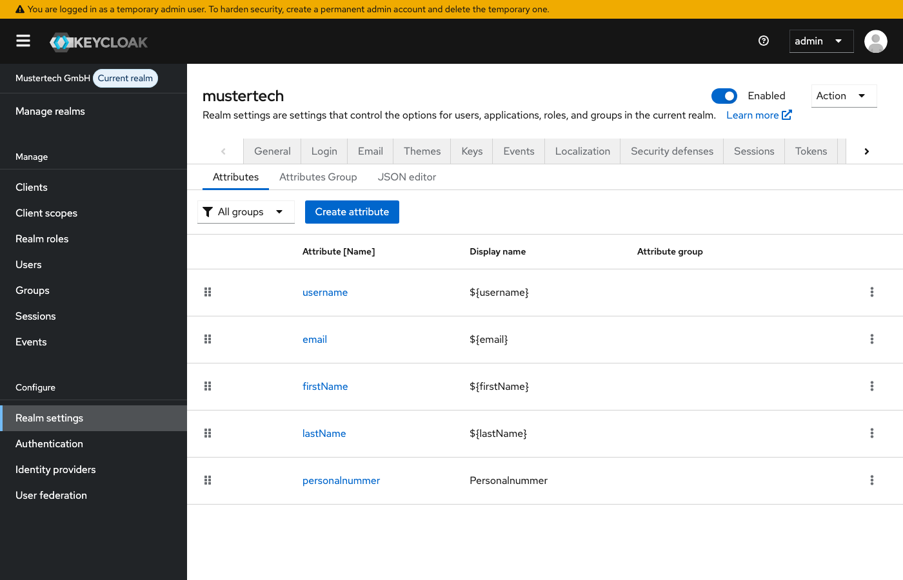
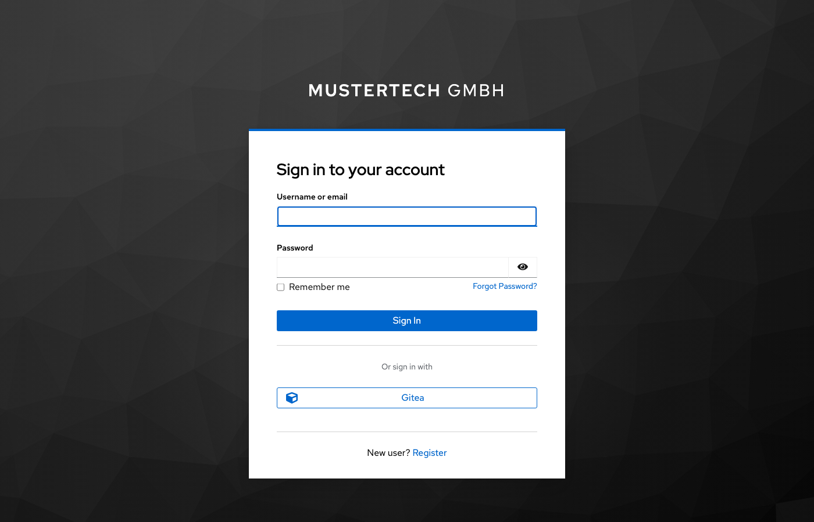

# Modul 07: Identity Provider & Federation

## Übungsziel

Am Ende dieser Übung hast du:

- Gitea als externen Identity Provider über OpenID Connect konfiguriert
- Den First Login Flow verstanden
- Attribute-Mapping zwischen Gitea und Keycloak eingerichtet
- Social Login im Portal getestet

**Geschätzte Dauer:** 20-25 Minuten

---

## Voraussetzungen

- Docker Desktop installiert und gestartet

### Umgebung starten

```bash
cd assignments/modul-07-identity-provider
docker compose up -d
```

> **Hinweis:** Falls die Container der vorherigen Übung noch laufen, stoppe diese zuerst
> mit `docker compose down -v` im Verzeichnis der vorherigen Übung. Details siehe
> [Troubleshooting](../TROUBLESHOOTING.md#container-name-konflikt).

Warte bis Keycloak, Gitea und das Portal-Frontend bereit sind (~60 Sekunden). Der Realm
"mustertech" wird automatisch importiert mit allen Clients und Konfigurationen aus den
vorherigen Modulen.

### Gitea einrichten

Sobald die Container laufen, führe das Setup-Skript aus:

```bash
bash setup.sh
```

Unter Windows (PowerShell):

```powershell
.\setup.ps1
```

Das Skript erstellt in Gitea:

- Einen Admin-User `gitea-admin` (Passwort: `admin1234`)
- Einen Test-User `alice` (Passwort: `demo1234`)
- Eine OAuth2-Application mit der passenden Redirect URI für Keycloak

Am Ende gibt das Skript die **Client ID** und das **Client Secret** aus -- notiere dir diese
Werte für die nächsten Schritte.

---

## Teil 1: Gitea als Identity Provider hinzufügen

### Schritt 1.1: Identity Providers öffnen

1. Öffne die Admin-Konsole: <http://localhost:8080>
2. Wähle den Realm **mustertech**
3. Navigiere zu **Identity providers**



### Schritt 1.2: OpenID Connect v1.0 auswählen

Gitea ist kein vorgefertigter Social Provider wie z.B. Google oder Facebook. Stattdessen wird
Gitea als generischer **OpenID Connect v1.0** Provider konfiguriert.

1. Klicke auf **Add provider**
2. Wähle **OpenID Connect v1.0**

### Schritt 1.3: Provider konfigurieren

Gib folgende Werte ein:

| Feld                   | Wert                                                    |
|:-----------------------|:--------------------------------------------------------|
| **Alias**              | `gitea`                                                 |
| **Display name**       | `Gitea`                                                 |
| **Discovery endpoint** | (deaktivieren -- siehe Hinweis unten)                   |
| **Authorization URL**  | `http://localhost:3000/login/oauth/authorize`           |
| **Token URL**          | `http://assignment-gitea:3000/login/oauth/access_token` |
| **User Info URL**      | `http://assignment-gitea:3000/login/oauth/userinfo`     |
| **Client ID**          | (aus `setup.sh`-Ausgabe)                                |
| **Client Secret**      | (aus `setup.sh`-Ausgabe)                                |

Klicke auf **Add**.



> **Warum kein Discovery?** Bei OIDC gibt es normalerweise einen Discovery-Endpoint
> (`.well-known/openid-configuration`), der alle URLs automatisch liefert. Das Problem:
> Der Browser erreicht Gitea unter `localhost:3000`, aber Keycloak (im Docker-Netzwerk)
> erreicht Gitea unter `assignment-gitea:3000`. Deshalb tragen wir die URLs manuell ein:
> die Authorization URL für den Browser, die Token URL und User Info URL für die
> Server-zu-Server-Kommunikation.

Aktiviere in den **Advanced Settings** folgende Merkmale:

| Feld | Wert |
| :--- | :--- |
| **Store tokens** | `On` |
| **Trust Email** | `On` |

Klicke auf **Save**.



### Schritt 1.4: Redirect URI prüfen

Nach dem Speichern siehst du die **Redirect URI**:

```
http://localhost:8080/realms/mustertech/broker/gitea/endpoint
```

Diese URL wurde im `setup.sh`-Skript bereits in der Gitea OAuth2-Application hinterlegt.

---

## Teil 2: First Login Flow verstehen

Wenn ein User sich zum ersten Mal über Gitea anmeldet, durchläuft er den **First Broker Login Flow**.

### Schritt 2.1: First Login Flow erkunden

1. Navigiere zu **Authentication**
2. Finde **first broker login**
3. Analysiere die Schritte (Diagramm vereinfacht):



### Schritt 2.2: Flow-Verhalten verstehen

| Szenario | Verhalten |
| :--- | :--- |
| **Neue E-Mail** | User wird automatisch erstellt |
| **E-Mail existiert bereits** | User wird gefragt, ob Accounts verknüpft werden sollen |
| **Username-Konflikt** | User muss Username ändern |

---

## Teil 3: Attribute Mapping konfigurieren

Gitea liefert verschiedene Attribute über die User-Info, die wir in Keycloak übernehmen können.

### Schritt 3.1: Mappers öffnen

1. Navigiere zu **Identity providers** -> **gitea**
2. Wechsle zum Tab **Mappers**

### Schritt 3.2: Mapper für Gitea-Username hinzufügen

Gitea liefert den Login-Namen, den wir als Attribut speichern können:

1. Klicke auf **Add mapper**
2. Wähle **Attribute Importer**
3. Konfiguriere:

| Feld                    | Wert                                 |
|:------------------------|:-------------------------------------|
| **Name**                | `gitea-username`                     |
| **Sync mode override**  | `inherit`                            |
| **Mapper type**         | `Attribute importer`                 |
| **Claim**               | `preferred_username`                 |
| **User attribute name** | `Custom Attribute -> gitea_username` |

Klicke auf **Save**.

### Schritt 3.3: Mapper für Avatar-URL hinzufügen (Optional)

1. Klicke auf **Add mapper**
2. Wähle **Attribute Importer**
3. Konfiguriere:

| Feld                    | Wert                          |
|:------------------------|:------------------------------|
| **Name**                | `gitea-avatar`                |
| **Sync mode override**  | `inherit`                     |
| **Mapper type**         | `Attribute importer`          |
| **Claim**               | `picture`                  |
| **User attribute name** | `Custom Attribute -> picture` |

### Schritt 3.4: Attribute im User Profile sichtbar machen

Damit die neuen Attribute in der Admin-Konsole angezeigt werden, müssen sie im User Profile definiert werden:

1. Navigiere zu **Realm settings** -> **User profile**
2. Klicke auf **Create attribute**
3. Lege das Attribut `gitea_username` an:

| Feld             | Wert             |
|:-----------------|:-----------------|
| **Name**         | `gitea_username` |
| **Display name** | `Gitea Username` |

4. Unter **Permissions** setze:

| Feld             | Wert    |
|:-----------------|:--------|
| **Who can edit** | `Admin` |
| **Who can view** | `Admin` |

5. Klicke auf **Create**
6. Wiederhole die Schritte für `picture`:

| Feld             | Wert         |
|:-----------------|:-------------|
| **Name**         | `picture`    |
| **Display name** | `Avatar URL` |
| **Who can edit** | `Admin`      |
| **Who can view** | `Admin`      |

7. Klicke auf **Save**

Die Attribute erscheinen nun im User-Detail neben den bereits vorhandenen Feldern wie `personalnummer`.



---

## Teil 4: Social Login testen

### Schritt 4.1: Portal öffnen

1. Öffne <http://localhost:5173>
2. Falls eingeloggt, melde dich ab

### Schritt 4.2: Gitea-Login starten

1. Klicke auf **Anmelden mit Keycloak**
2. Auf der Keycloak-Login-Seite siehst du jetzt **Gitea** als Option
3. Klicke auf **Gitea**



### Schritt 4.3: Bei Gitea autorisieren

1. Du wirst zu Gitea weitergeleitet
2. Melde dich an mit dem Test-User `alice` / `demo1234`
3. Autorisiere die OAuth-Application

---

## Teil 5: Verknüpften User prüfen

### Schritt 5.1: User in Admin-Konsole finden

1. Öffne die Admin-Konsole
2. Navigiere zu **Users**
3. Suche nach `alice`

### Schritt 5.2: Identity Provider Links prüfen

1. Öffne den User
2. Wechsle zum Tab **Identity provider links**
3. Du siehst die Verknüpfung zu Gitea

### Schritt 5.3: Attribute prüfen

1. Wechsle zum Tab **Attributes**
2. Du solltest sehen:
   - `gitea_username` (falls Mapper konfiguriert)
   - `picture` (Avatar-URL, falls Mapper konfiguriert)

---

## Teil 6: Erweiterte Konfiguration

### Aufgabe 6.1: Account Linking für bestehende User

Bestehende User können ihren Account mit Gitea verknüpfen. Entferne dazu zuerst den Link
der Benutzerin Alice zu ihrem Gitea-Account in den Benutzereinstellungen. Anschließend:

1. Login als bestehender User (z.B. hans.mueller)
2. Öffne die Account Console: <http://localhost:8080/realms/mustertech/account>
3. Navigiere zu **Linked accounts**
4. Klicke bei Gitea auf **Link account**

Du kannst nun den Account verlinken, mit dem du aktuell in Gitea angemeldet bist.


### Aufgabe 6.2: Default Identity Provider (Optional)

Wenn du möchtest, dass User direkt zu Gitea weitergeleitet werden:

1. Navigiere zu **Authentication** -> **browser** Flow
2. Finde **Identity Provider Redirector**
3. Klicke auf das Zahnrad
4. Setze **Default Identity Provider** auf `gitea`

**Hinweis:** Dies überspringt die Keycloak-Login-Seite komplett!

### Aufgabe 6.3: Gruppen/Rollen für Social Login User (optional)

Social Login User haben standardmäßig keine speziellen Rollen. Um ihnen automatisch Rollen zuzuweisen:

1. Navigiere zu **Identity providers** -> **gitea**
2. Wechsle zum Tab **Mappers**
3. Klicke auf **Add mapper**
4. Wähle **Hardcoded Role**
5. Konfiguriere:
   - **Name:** `default-role-gitea`
   - **Role:** `mitarbeiter`

Jetzt erhalten alle Gitea-User automatisch die Rolle `mitarbeiter`.

---

## Zusammenfassung

Du hast erfolgreich:

- [x] Gitea als Identity Provider über OpenID Connect konfiguriert
- [x] Den First Login Flow verstanden
- [x] Attribute Mapping eingerichtet
- [x] Social Login im Portal getestet
- [x] Verknüpfte Accounts geprüft

---

## Troubleshooting

### Container-Name-Konflikt

Siehe zentrales Troubleshooting: [Container-Name-Konflikt](../TROUBLESHOOTING.md#container-name-konflikt)

### "Invalid redirect_uri" bei Gitea

**Ursache:** Die Redirect URI in der Gitea OAuth2-Application stimmt nicht mit der Keycloak-Konfiguration überein.

**Lösung:** Prüfe, ob `setup.sh` korrekt durchgelaufen ist. Falls die OAuth2-Application
manuell gelöscht und neu erstellt werden muss:

1. Öffne <http://localhost:3000> und logge dich als `gitea-admin` / `admin1234` ein
2. Navigiere zu **Einstellungen** -> **Applikationen**
3. Prüfe die Redirect URI: `http://localhost:8080/realms/mustertech/broker/gitea/endpoint`

### Gitea-Button erscheint nicht auf der Login-Seite

**Prüfen:**

- Ist der Identity Provider **Enabled**?
- Ist der richtige Realm ausgewählt?
- Browser-Cache leeren

### Token URL Fehler / "Could not obtain access token"

**Ursache:** Keycloak kann Gitea nicht über den Docker-internen Hostnamen erreichen.

**Lösung:** Stelle sicher, dass die Token URL den Docker-Service-Namen verwendet:

```
http://assignment-gitea:3000/login/oauth/access_token
```

Die Authorization URL dagegen muss `localhost` verwenden, da sie vom Browser aufgerufen wird.

### E-Mail-Konflikt beim ersten Login

**Symptom:** "User with email already exists"

**Lösung:**

- Option A: Bestehenden Account mit Gitea verknüpfen (Link anklicken)
- Option B: Anderen Test-User in Gitea erstellen

### Attribute werden nicht übernommen

**Prüfen:**

- Mapper korrekt konfiguriert?
- JSON Field Path korrekt? (z.B. `login`, nicht `username`)
- Sync Mode: `inherit` oder `force`?
