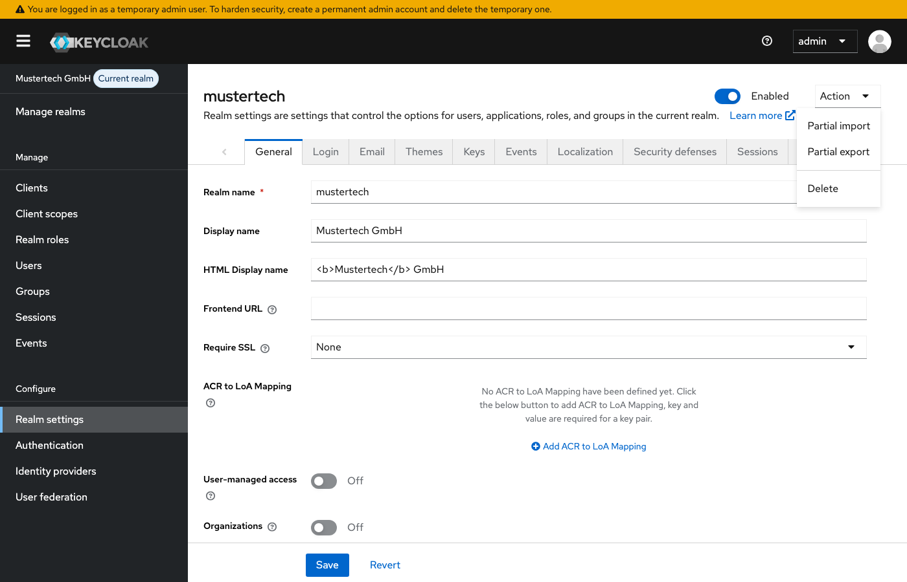
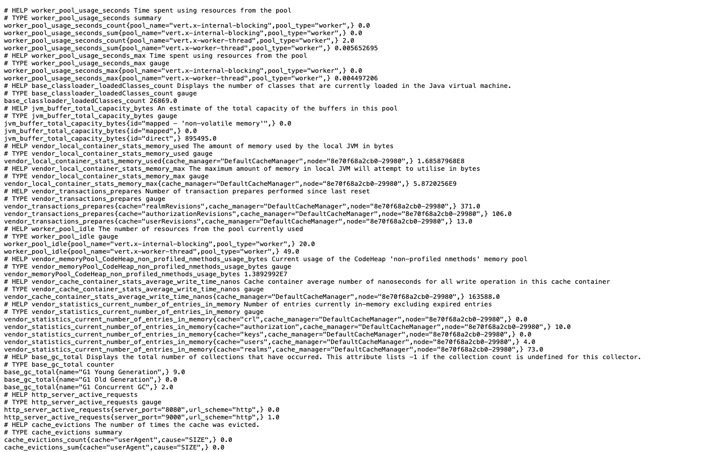

# Modul 10b: Best Practices & Produktion

## Übungsziel

Am Ende dieser Übung hast du:

- HTTPS mit einem Reverse Proxy konfiguriert
- Produktionsrelevante Einstellungen verstanden
- Backup & Restore Strategien kennengelernt
- Health Checks und Monitoring vorbereitet

**Geschätzte Dauer:** 35-45 Minuten

---

## Voraussetzungen

- Docker Desktop installiert und gestartet
- Grundverständnis für Docker und Netzwerke

### Umgebung starten

```bash
cd assignments/modul-10b-best-practices
docker compose up -d
```

> **Hinweis:** Falls die Container der vorherigen Übung noch laufen, stoppe
> diese zuerst mit `docker compose down -v` im Verzeichnis der vorherigen Übung.
> Details siehe [Troubleshooting](../TROUBLESHOOTING.md#container-name-konflikt).

Warte bis Keycloak bereit ist (~30 Sekunden). Der Realm "mustertech" wird
automatisch importiert mit allen Sicherheitskonfigurationen aus dem vorherigen
Modul.

> **Hinweis:** Die Benutzerpasswörter in diesem Modul lauten `Muster1234!` (
> statt `test1234`), da eine strenge Passwort-Policy aktiv ist.

---

## Teil 1: Produktionsmodus vs. Entwicklungsmodus

### Schritt 1.1: Unterschiede verstehen

| Aspekt      | Development (`start-dev`) | Production (`start`) |
|:------------|:--------------------------|:---------------------|
| HTTPS       | Optional                  | **Erforderlich**     |
| Hostname    | Flexibel                  | Fest konfiguriert    |
| Caching     | Deaktiviert               | Aktiviert            |
| Hot-Reload  | Ja                        | Nein                 |
| Performance | Geringer                  | Optimiert            |

### Schritt 1.2: Produktionsstart-Befehl

```yaml
keycloak:
  command: start
  environment:
    # Hostname muss konfiguriert sein
    KC_HOSTNAME: keycloak.mustertech.de
    KC_HOSTNAME_STRICT: true

    # HTTPS erforderlich
    KC_HTTPS_CERTIFICATE_FILE: /opt/keycloak/certs/cert.pem
    KC_HTTPS_CERTIFICATE_KEY_FILE: /opt/keycloak/certs/key.pem

    # Oder: Proxy-Modus (HTTPS am Reverse Proxy)
    KC_PROXY: edge
```


---

## Teil 2: HTTPS mit Traefik Reverse Proxy

### Schritt 2.1: Traefik hinzufügen

Erstelle `docker-compose.prod.yml`:

```yaml
services:
  traefik:
    image: traefik:v3.0
    container_name: assignment-traefik
    command:
      - "--api.insecure=true"
      - "--providers.docker=true"
      - "--providers.docker.exposedbydefault=false"
      - "--entrypoints.web.address=:80"
      - "--entrypoints.websecure.address=:443"
      # Für echte Zertifikate: Let's Encrypt konfigurieren
    ports:
      - "80:80"
      - "443:443"
      - "8081:8080"  # Traefik Dashboard
    volumes:
      - /var/run/docker.sock:/var/run/docker.sock:ro
    networks:
      - assignment-network

  keycloak:
    # ... bestehende Konfiguration ...
    labels:
      - "traefik.enable=true"
      - "traefik.http.routers.keycloak.rule=Host(`keycloak.localhost`)"
      - "traefik.http.routers.keycloak.entrypoints=websecure"
      - "traefik.http.routers.keycloak.tls=true"
      - "traefik.http.services.keycloak.loadbalancer.server.port=8080"
    environment:
      KC_PROXY: edge
      KC_HOSTNAME: keycloak.localhost
      KC_HOSTNAME_STRICT: false
```

### Schritt 2.2: Hosts-Datei anpassen (lokal)

Für lokales Testen füge zu `/etc/hosts` (Linux/Mac) oder
`C:\Windows\System32\drivers\etc\hosts` (Windows) hinzu:

```
127.0.0.1 keycloak.localhost
127.0.0.1 portal.localhost
```

---

## Teil 3: Sicherheitseinstellungen

### Schritt 3.1: Wichtige Produktionseinstellungen

```yaml
keycloak:
  environment:
    # Hostname
    KC_HOSTNAME: keycloak.mustertech.de
    KC_HOSTNAME_STRICT: true
    KC_HOSTNAME_STRICT_BACKCHANNEL: true

    # Proxy
    KC_PROXY: edge  # oder "reencrypt" für end-to-end TLS

    # HTTP deaktivieren
    KC_HTTP_ENABLED: false

    # Metriken (für Monitoring)
    KC_METRICS_ENABLED: true
    KC_HEALTH_ENABLED: true
```

### Schritt 3.2: Datenbank-Sicherheit

```yaml
postgres:
  environment:
    POSTGRES_PASSWORD_FILE: /run/secrets/db_password
  secrets:
    - db_password

secrets:
  db_password:
    file: ./secrets/db_password.txt
```

### Schritt 3.3: Admin-Credentials

**Niemals** Standard-Credentials in Produktion!

```yaml
keycloak:
  environment:
    KEYCLOAK_ADMIN: ${KEYCLOAK_ADMIN}
    KEYCLOAK_ADMIN_PASSWORD: ${KEYCLOAK_ADMIN_PASSWORD}
```

Oder Initial-Admin per Umgebungsvariable nur beim ersten Start setzen, dann
deaktivieren.

---

## Teil 4: Backup & Restore

### Schritt 4.1: Realm exportieren

**Manuell (Admin-Konsole):**

1. Realm settings → Action → Partial export
2. Optionen wählen (Users, Groups, Clients...)
3. Export



**Per API:**

```bash
curl "http://localhost:8080/admin/realms/mustertech" \
  -H "Authorization: Bearer $TOKEN" > backup/realm-mustertech.json
```

**Per CLI (im Container):**

```bash
docker exec assignment-keycloak /opt/keycloak/bin/kc.sh export \
  --dir /opt/keycloak/data/export \
  --realm mustertech \
  --users realm_file
```

### Schritt 4.2: Datenbank-Backup

```bash
# PostgreSQL Backup
docker exec assignment-postgres pg_dump -U keycloak keycloak > backup/db_backup.sql

# Restore
cat backup/db_backup.sql | docker exec -i assignment-postgres psql -U keycloak keycloak
```

### Schritt 4.3: Backup-Strategie

| Was           | Wie oft      | Aufbewahrung    |
|:--------------|:-------------|:----------------|
| Datenbank     | Täglich      | 30 Tage         |
| Realm-Export  | Wöchentlich  | 12 Wochen       |
| Konfiguration | Bei Änderung | Git-versioniert |

---

## Teil 5: Health Checks & Monitoring

### Schritt 5.1: Health Endpoints

Keycloak bietet Health Endpoints (wenn aktiviert):

```bash
# Liveness (Keycloak läuft?)
curl http://localhost:9000/health/live

# Readiness (Keycloak bereit?)
curl http://localhost:9000/health/ready

# Alle Checks
curl http://localhost:9000/health
```


> **Hinweis:** Ab Keycloak 24 werden Health- und Metrics-Endpoints auf einem
> separaten Management-Port (Standard: 9000) bereitgestellt.


### Schritt 5.2: Metriken für Prometheus

```bash
curl http://localhost:9000/metrics
```



Liefert Metriken im Prometheus-Format:

- JVM-Metriken (Heap, GC, Threads)
- HTTP-Request-Metriken
- Datenbank-Connection-Pool
- Cache-Statistiken

### Schritt 5.3: docker-compose Health Check

```yaml
keycloak:
  healthcheck:
    test: [ "CMD-SHELL", "curl -f http://localhost:9000/health/ready || exit 1" ]
    interval: 30s
    timeout: 10s
    retries: 3
    start_period: 60s
```

---

## Teil 6: Clustering (Überblick)

### Schritt 6.1: Cluster-Architektur

Für Hochverfügbarkeit:

```
          Load Balancer
               │
       ┌───────┴───────┐
       │               │
  ┌────▼────┐   ┌────▼────┐
  │Keycloak │   │Keycloak │
  │ Node 1  │   │ Node 2  │
  └────┬────┘   └────┬────┘
       │               │
       └───────┬───────┘
               │
        ┌──────▼──────┐
        │ PostgreSQL  │
        │  (shared)   │
        └─────────────┘
```

### Schritt 6.2: Wichtige Cluster-Einstellungen

```yaml
keycloak:
  environment:
    # Cache
    KC_CACHE: ispn
    KC_CACHE_STACK: kubernetes  # oder tcp, udp

    # Für Kubernetes
    jgroups.dns.query: keycloak-headless
```


---

## Zusammenfassung

Du hast erfolgreich:

- [x] Unterschiede zwischen Dev und Prod verstanden
- [x] HTTPS mit Reverse Proxy konfiguriert
- [x] Backup & Restore Strategien kennengelernt
- [x] Health Checks und Monitoring vorbereitet

---

## Troubleshooting

### Container-Name-Konflikt

Siehe zentrales Troubleshooting: [Container-Name-Konflikt](../TROUBLESHOOTING.md#container-name-konflikt)

---

## Weiterführende Ressourcen

- [Keycloak Server Administration Guide](https://www.keycloak.org/docs/latest/server_admin/)
- [Keycloak Operator (Kubernetes)](https://www.keycloak.org/operator/installation)
- [Red Hat SSO (Kommerzieller Support)](https://access.redhat.com/products/red-hat-single-sign-on)
