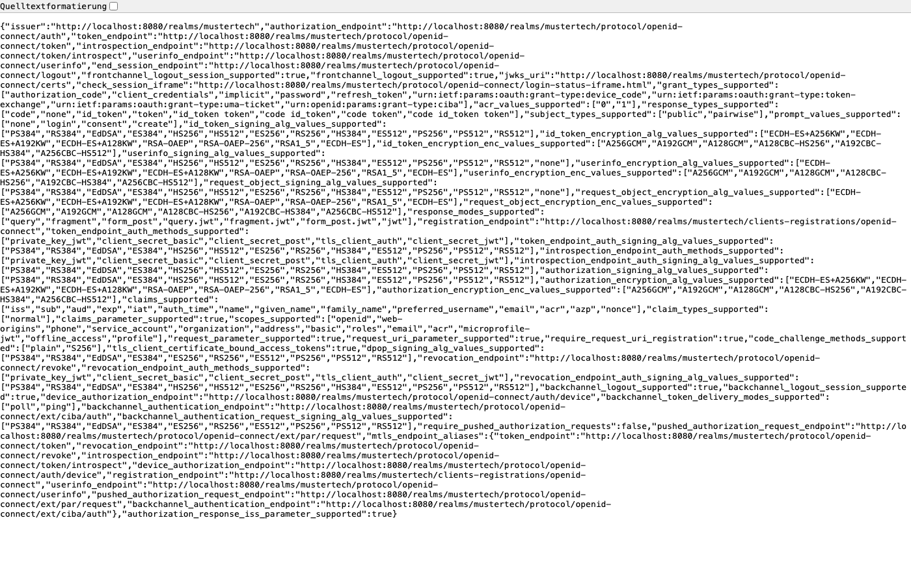
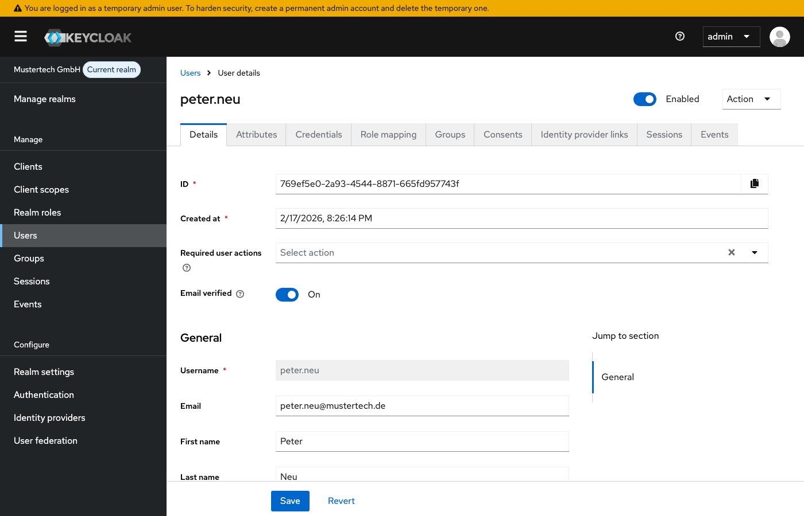
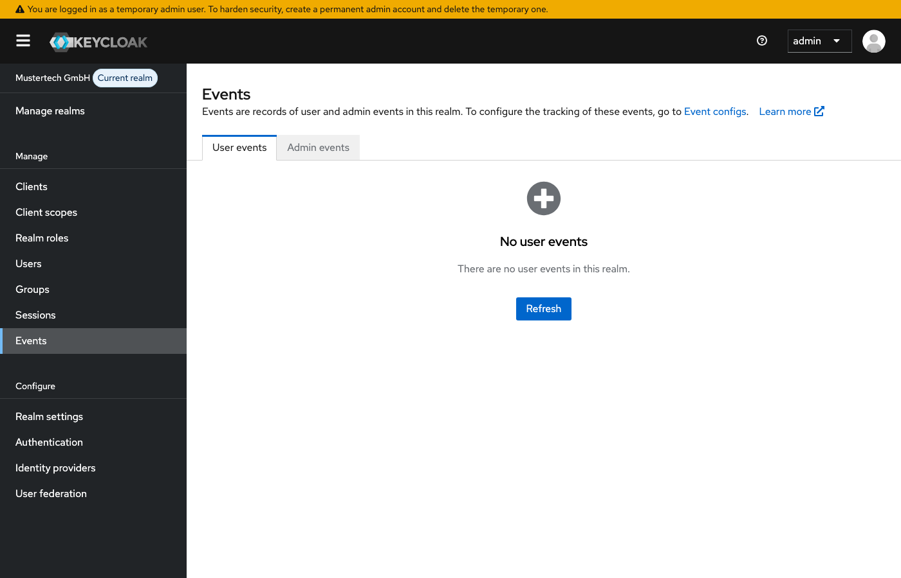

# Modul 09b: Anpassung, APIs & Erweiterungen

## Übungsziel

Am Ende dieser Übung hast du:

- Die Admin REST API verstanden und genutzt
- User per API angelegt und verwaltet
- Das Management-CLI um API-Funktionen erweitert
- Token Introspection implementiert

**Geschätzte Dauer:** 35-45 Minuten

---

## Voraussetzungen

- Docker Desktop installiert und gestartet

### Umgebung starten

```bash
cd assignments/modul-09b-anpassung-apis
docker compose up -d
```

> **Hinweis:** Falls die Container der vorherigen Übung noch laufen, stoppe
> diese zuerst mit `docker compose down -v` im Verzeichnis der vorherigen Übung.
> Details siehe [Troubleshooting](../TROUBLESHOOTING.md#container-name-konflikt).

Warte bis Keycloak bereit ist (~30 Sekunden). Der Realm "mustertech" wird
automatisch importiert mit allen Clients, Authorization Services und
Theme-Konfiguration aus den vorherigen Modulen.

---

## Teil 1: Admin REST API erkunden

### Schritt 1.1: API-Dokumentation

Keycloak bietet eine umfangreiche Admin REST API, mit der sich nahezu alle
Verwaltungsaufgaben automatisieren lassen - von der Benutzerverwaltung über
Rollen und Gruppen bis hin zur Realm-Konfiguration. Alles, was über die
Admin-Konsole möglich ist, lässt sich auch per API steuern.

Die vollständige API-Dokumentation findest du unter:
<https://www.keycloak.org/docs-api/latest/rest-api/>

### Schritt 1.2: API-Endpunkte verstehen

Alle Admin-API-Endpunkte folgen einem einheitlichen Muster: Sie beginnen mit
der Basis-URL `http://localhost:8080/admin/realms/{realm}`, wobei `{realm}` der
Name des jeweiligen Realms ist (in unserem Fall `mustertech`). Dahinter folgt
der Ressourcenpfad, z.B. `/users` oder `/groups`.

Die API ist RESTful aufgebaut. Das bedeutet, dass die HTTP-Methode bestimmt,
welche Aktion ausgeführt wird: `GET` zum Lesen, `POST` zum Erstellen, `PUT` zum
Aktualisieren und `DELETE` zum Löschen.



| Endpunkt                     | Methode | Beschreibung        |
|:-----------------------------|:--------|:--------------------|
| `/users`                     | GET     | Alle User auflisten |
| `/users`                     | POST    | User erstellen      |
| `/users/{id}`                | GET     | User Details        |
| `/users/{id}`                | PUT     | User aktualisieren  |
| `/users/{id}`                | DELETE  | User löschen        |
| `/users/{id}/reset-password` | PUT     | Passwort setzen     |
| `/groups`                    | GET     | Alle Gruppen        |
| `/roles`                     | GET     | Alle Rollen         |

### Schritt 1.3: Admin-Token beschaffen

Die Admin REST API ist durch OAuth 2.0 geschützt. Jeder API-Aufruf muss einen
gültigen Access Token im `Authorization`-Header mitschicken. Diesen Token holst
du dir über den Token-Endpoint des **Master-Realms**, da nur dort der
`admin-cli`-Client und das Admin-Konto existieren.

Der folgende Aufruf nutzt den **Resource Owner Password Credentials Grant**
(`grant_type=password`), um direkt mit Benutzername und Passwort einen Token zu
erhalten. In Produktionsumgebungen sollte stattdessen ein Service Account
verwendet werden.

```powershell
# Token holen (PowerShell)
$response = Invoke-RestMethod -Uri "http://localhost:8080/realms/master/protocol/openid-connect/token" `
  -Method Post `
  -Body @{
    grant_type = "password"
    client_id = "admin-cli"
    username = "admin"
    password = "admin"
  }

$token = $response.access_token
echo $token
```

Oder mit curl:

```bash
TOKEN=$(curl -s -X POST "http://localhost:8080/realms/master/protocol/openid-connect/token" \
  -d "grant_type=password" \
  -d "client_id=admin-cli" \
  -d "username=admin" \
  -d "password=admin" | jq -r '.access_token')
echo "$TOKEN"
```

---

## Teil 2: User per API verwalten

### Schritt 2.1: User auflisten

Mit dem Admin-Token aus Schritt 1.3 kannst du nun die User des
`mustertech`-Realms abfragen. Der `GET /users`-Endpunkt liefert ein JSON-Array
mit allen Benutzern zurück. Der Token wird dabei als **Bearer Token** im
`Authorization`-Header übergeben. Dieses Muster gilt für alle Admin-API-Aufrufe.

```bash
curl -X GET "http://localhost:8080/admin/realms/mustertech/users" \
  -H "Authorization: Bearer $TOKEN" \
  -H "Content-Type: application/json" | jq
```

```powershell
# PowerShell
Invoke-RestMethod -Uri "http://localhost:8080/admin/realms/mustertech/users" `
  -Headers @{ Authorization = "Bearer $token" } | ConvertTo-Json -Depth 5
```

**Erwartete Antwort:**

```json
[
  {
    "id": "...",
    "username": "hans.mueller",
    "email": "hans.mueller@mustertech.de",
    "firstName": "Hans",
    "lastName": "Müller",
    "enabled": true
  },
  ...
]
```

### Schritt 2.2: User erstellen

Um einen neuen Benutzer anzulegen, sendest du einen `POST`-Request an den
`/users`-Endpunkt. Der Request-Body enthält die Benutzerdaten als JSON-Objekt.
Beachte die folgenden Felder:

- **`enabled: true`** - aktiviert den Account sofort (ohne dieses Flag wäre der
  User deaktiviert und könnte sich nicht einloggen)
- **`emailVerified: true`:** überspringt die E-Mail-Verifizierung (nützlich
  für Testdaten; in Produktion würde man dies auf `false` setzen)
- **`attributes`** - benutzerdefinierte Attribute wie die Personalnummer, die
  als Key-Value-Paare mit String-Arrays gespeichert werden

```bash
curl -X POST "http://localhost:8080/admin/realms/mustertech/users" \
  -H "Authorization: Bearer $TOKEN" \
  -H "Content-Type: application/json" \
  -d '{
    "username": "peter.neu",
    "email": "peter.neu@mustertech.de",
    "firstName": "Peter",
    "lastName": "Neu",
    "enabled": true,
    "emailVerified": true,
    "attributes": {
      "personalnummer": ["M-1003"]
    }
  }'
```

```powershell
# PowerShell
Invoke-WebRequest -Uri "http://localhost:8080/admin/realms/mustertech/users" `
  -Method Post `
  -Headers @{ Authorization = "Bearer $token" } `
  -ContentType "application/json" `
  -Body '{
    "username": "peter.neu",
    "email": "peter.neu@mustertech.de",
    "firstName": "Peter",
    "lastName": "Neu",
    "enabled": true,
    "emailVerified": true,
    "attributes": {
      "personalnummer": ["M-1003"]
    }
  }'
```

**Erfolg:** HTTP 201 Created (Location-Header enthält User-ID)



### Schritt 2.3: Passwort setzen

Der neu erstellte User hat noch kein Passwort und kann sich daher nicht
einloggen. Um ein Passwort zu setzen, nutzt du den Endpunkt
`/users/{id}/reset-password`. Dafür benötigst du die **User-ID** (eine UUID),
die Keycloak beim Erstellen vergeben hat.

Der Ablauf ist zweistufig: Zuerst ermittelst du die User-ID über eine Suche
nach dem Benutzernamen, dann setzt du das Passwort. Das Feld `temporary: false`
bewirkt, dass der Benutzer das Passwort beim ersten Login **nicht** ändern muss.

```bash
# User-ID ermitteln
USER_ID=$(curl -s "http://localhost:8080/admin/realms/mustertech/users?username=peter.neu" \
  -H "Authorization: Bearer $TOKEN" | jq -r '.[0].id')

# Passwort setzen
curl -X PUT "http://localhost:8080/admin/realms/mustertech/users/$USER_ID/reset-password" \
  -H "Authorization: Bearer $TOKEN" \
  -H "Content-Type: application/json" \
  -d '{
    "type": "password",
    "value": "Test1234!@",
    "temporary": false
  }'
```

```powershell
# PowerShell: User-ID ermitteln
$userId = (Invoke-RestMethod -Uri "http://localhost:8080/admin/realms/mustertech/users?username=peter.neu" `
  -Headers @{ Authorization = "Bearer $token" })[0].id

# Passwort setzen
Invoke-WebRequest -Uri "http://localhost:8080/admin/realms/mustertech/users/$userId/reset-password" `
  -Method Put `
  -Headers @{ Authorization = "Bearer $token" } `
  -ContentType "application/json" `
  -Body '{
    "type": "password",
    "value": "Test1234!@",
    "temporary": false
  }'
```

### Schritt 2.4: User zu Gruppe hinzufügen

Um einen User einer Gruppe zuzuordnen, benötigst du sowohl
die **User-ID** als auch die **Gruppen-ID**. Die Gruppenzuordnung erfolgt über
einen `PUT`-Request ohne Body. Allein die URL mit beiden IDs reicht aus.

Analog zur User-Suche ermittelst du die Gruppen-ID über den `/groups`-Endpunkt
mit dem Query-Parameter `search`.

```bash
# Gruppen-ID ermitteln
GROUP_ID=$(curl -s "http://localhost:8080/admin/realms/mustertech/groups?search=Entwicklung" \
  -H "Authorization: Bearer $TOKEN" | jq -r '.[0].id')

# User zu Gruppe hinzufügen
curl -X PUT "http://localhost:8080/admin/realms/mustertech/users/$USER_ID/groups/$GROUP_ID" \
  -H "Authorization: Bearer $TOKEN"
```

```powershell
# PowerShell: Gruppen-ID ermitteln
$groupId = (Invoke-RestMethod -Uri "http://localhost:8080/admin/realms/mustertech/groups?search=Entwicklung" `
  -Headers @{ Authorization = "Bearer $token" })[0].id

# User zu Gruppe hinzufügen
Invoke-WebRequest -Uri "http://localhost:8080/admin/realms/mustertech/users/$userId/groups/$groupId" `
  -Method Put `
  -Headers @{ Authorization = "Bearer $token" }
```

---

## Teil 3: Token Introspection

**Token Introspection** ist ein standardisierter Endpunkt (RFC 7662), mit dem ein
Resource Server bei Keycloak nachfragen kann, ob ein Token noch gültig ist. Im
Gegensatz zur lokalen JWT-Validierung (Signaturprüfung + Ablaufzeit) wird dabei
der aktuelle Token-Status **serverseitig** geprüft - das bedeutet, auch
widerrufene Tokens werden korrekt als ungültig erkannt.

Der Introspection-Request erfordert die **Client-Credentials** des anfragenden
Clients (hier `portal-api`), damit Keycloak sicherstellen kann, dass nur
berechtigte Clients Tokens prüfen dürfen.

> **Hinweis:** Das Client-Secret für `portal-api` findest du in der Admin
> Console unter **Clients -> portal-api -> Credentials**.

```bash
curl -X POST "http://localhost:8080/realms/mustertech/protocol/openid-connect/token/introspect" \
  -d "token=$ACCESS_TOKEN" \
  -d "client_id=portal-api" \
  -d "client_secret=$CLIENT_SECRET"
```

```powershell
# PowerShell
Invoke-RestMethod -Uri "http://localhost:8080/realms/mustertech/protocol/openid-connect/token/introspect" `
  -Method Post `
  -Body @{
    token      = $accessToken
    client_id  = "portal-api"
    client_secret = $clientSecret
  }
```

**Antwort (gültiger Token):**

```json
{
  "active": true,
  "sub": "user-id",
  "username": "hans.mueller",
  "exp": 1234567890,
  "realm_access": {
    "roles": [
      "mitarbeiter"
    ]
  }
}
```

**Antwort (ungültiger Token):**

```json
{
  "active": false
}
```

## Teil 5: Weitere API-Endpunkte

### Schritt 5.1: Sessions verwalten

Keycloak verwaltet für jeden eingeloggten Benutzer eine oder mehrere
**Sessions**. Über die Admin API kannst du aktive Sessions einsehen - z.B. um
zu prüfen, von welchen Clients ein Benutzer aktuell angemeldet ist - oder alle
Sessions eines Users auf einen Schlag beenden (Forced Logout). Das ist
beispielsweise nützlich, wenn ein Mitarbeiterkonto kompromittiert wurde und
sofort gesperrt werden soll.

```bash
# Aktive Sessions eines Users
curl "http://localhost:8080/admin/realms/mustertech/users/$USER_ID/sessions" \
  -H "Authorization: Bearer $TOKEN"

# Alle Sessions eines Users beenden
curl -X DELETE "http://localhost:8080/admin/realms/mustertech/users/$USER_ID/sessions" \
  -H "Authorization: Bearer $TOKEN"
```

```powershell
# PowerShell: Aktive Sessions eines Users
Invoke-RestMethod -Uri "http://localhost:8080/admin/realms/mustertech/users/$userId/sessions" `
  -Headers @{ Authorization = "Bearer $token" }

# Alle Sessions eines Users beenden
Invoke-WebRequest -Uri "http://localhost:8080/admin/realms/mustertech/users/$userId/sessions" `
  -Method Delete `
  -Headers @{ Authorization = "Bearer $token" }
```

### Schritt 5.2: Events abfragen

Keycloak protokolliert sicherheitsrelevante Ereignisse wie Logins, fehlgeschlagene
Anmeldeversuche oder Passwortänderungen als **Events**. Über die Admin API lassen
sich diese Events filtern und auswerten - das ist die Grundlage für
Security-Monitoring und Audit-Logging. Der Query-Parameter `type` filtert nach
Event-Typ (z.B. `LOGIN`, `LOGIN_ERROR`, `REGISTER`), `max` begrenzt die Anzahl
der Ergebnisse.



```bash
# Letzte Login-Events
curl "http://localhost:8080/admin/realms/mustertech/events?type=LOGIN&max=10" \
  -H "Authorization: Bearer $TOKEN"
```

```powershell
# PowerShell
Invoke-RestMethod -Uri "http://localhost:8080/admin/realms/mustertech/events?type=LOGIN&max=10" `
  -Headers @{ Authorization = "Bearer $token" }
```

### Schritt 5.3: Realm-Konfiguration exportieren

Die gesamte Konfiguration eines Realms - inklusive Clients, Rollen, Gruppen und
Einstellungen - lässt sich über einen einfachen `GET`-Request auf den
Realm-Endpunkt als JSON exportieren. Das ist nützlich, um Konfigurationen zu
sichern, zwischen Umgebungen zu übertragen (z.B. von Staging nach Produktion)
oder um Änderungen im Versionskontrollsystem nachzuverfolgen.

> **Hinweis:** Dieser Export enthält **keine** User-Daten und keine Secrets.
> Für einen vollständigen Export inklusive User nutze den
> `partial-export`-Endpunkt oder das Keycloak CLI.

```bash
curl "http://localhost:8080/admin/realms/mustertech" \
  -H "Authorization: Bearer $TOKEN" > realm-export.json
```

```powershell
# PowerShell
Invoke-RestMethod -Uri "http://localhost:8080/admin/realms/mustertech" `
  -Headers @{ Authorization = "Bearer $token" } |
  ConvertTo-Json -Depth 10 |
  Set-Content realm-export.json
```

---

## Zusammenfassung

Du hast erfolgreich:

- [x] Admin REST API Endpunkte verstanden
- [x] User per API aufgelistet und erstellt
- [x] Passwörter und Gruppenzugehörigkeit per API verwaltet
- [x] Management-CLI um API-Funktionen erweitert
- [x] Token Introspection kennengelernt
