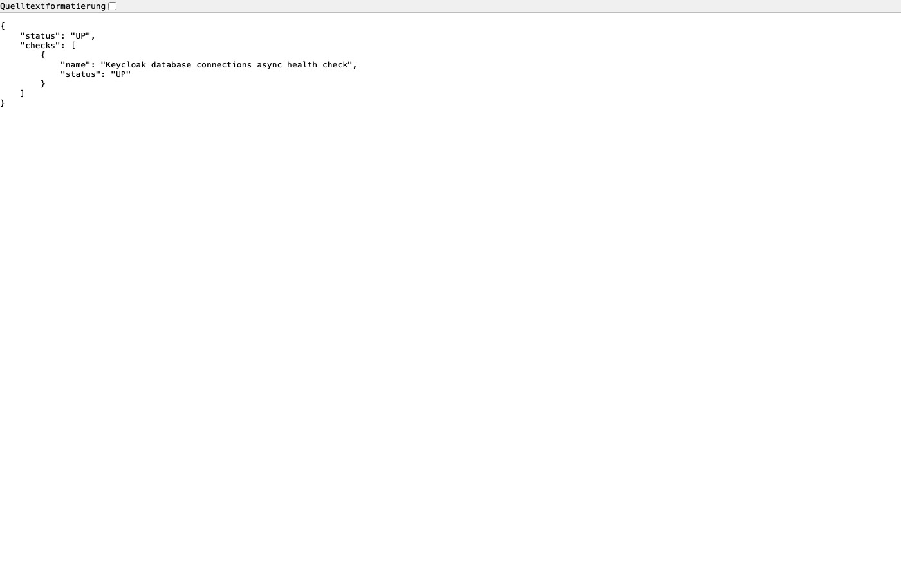
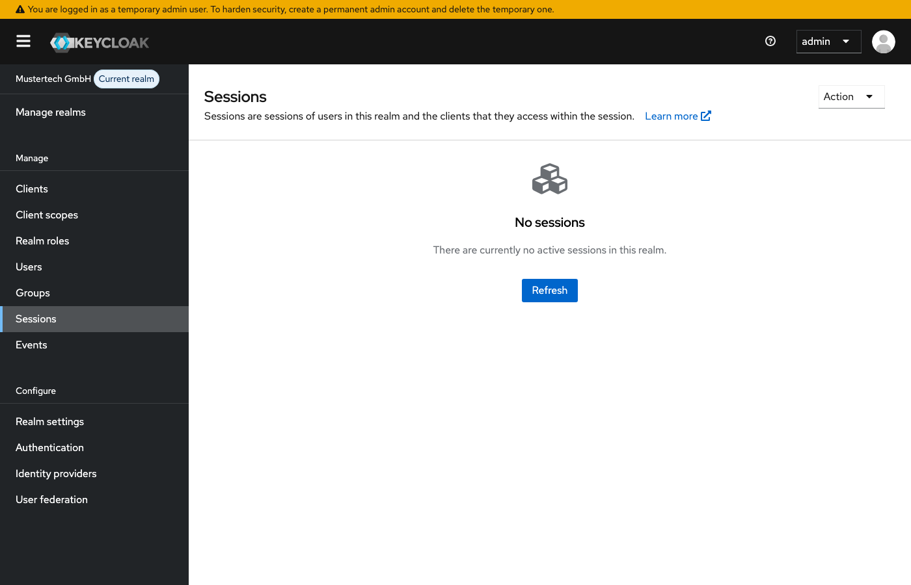

# Modul 10b: Best Practices & Produktion

## Übungsziel

Am Ende dieser Übung hast du:

- HTTPS mit einem Reverse Proxy konfiguriert
- Produktionsrelevante Einstellungen verstanden
- Backup & Restore Strategien kennengelernt
- Health Checks und Monitoring vorbereitet

**Geschätzte Dauer:** 35-45 Minuten

---

## Voraussetzungen

- Docker Desktop installiert und gestartet, Docker Compose ab 2.24.4
- Grundverständnis für Docker und Netzwerke

### Umgebung starten

```bash
cd assignments/modul-10b-best-practices
docker compose up -d
```

> **Hinweis:** Falls die Container der vorherigen Übung noch laufen, stoppe
> diese zuerst mit `docker compose down -v` im Verzeichnis der vorherigen Übung.
> Details siehe [Troubleshooting](../TROUBLESHOOTING.md#container-name-konflikt).

Warte, bis `docker compose ps` Keycloak als `healthy` zeigt. Der Realm "mustertech" wird
automatisch importiert mit allen Sicherheitskonfigurationen aus dem vorherigen
Modul.

> **Hinweis:** Die Benutzerpasswörter in diesem Modul lauten `Muster1234!` (
> statt `test1234`), da eine strenge Passwort-Policy aktiv ist.

---

## Teil 1: Produktionsmodus vs. Entwicklungsmodus

### Schritt 1.1: Unterschiede verstehen

| Aspekt      | Development (`start-dev`) | Production (`start`) |
|:------------|:--------------------------|:---------------------|
| HTTPS       | Optional                  | **Erforderlich**     |
| Hostname    | Flexibel                  | Fest konfiguriert    |
| Caching     | Deaktiviert               | Aktiviert            |
| Hot-Reload  | Ja                        | Nein                 |
| Performance | Geringer                  | Optimiert            |

### Schritt 1.2: Produktionsstart-Befehl

`start` benötigt einen festen öffentlichen Hostnamen und einen TLS-Aufbau. In diesem
Lab beendet Traefik TLS; Keycloak empfängt intern HTTP. Die folgenden Einstellungen
gehören deshalb zusammen:

```yaml
services:
  assignment-keycloak:
    command: start --import-realm
    environment:
      KC_HOSTNAME: https://keycloak.localhost:8443
      KC_HOSTNAME_STRICT: "true"
      KC_PROXY_HEADERS: xforwarded
      KC_HTTP_ENABLED: "true"
```

Bei TLS direkt an Keycloak werden stattdessen `KC_HTTPS_CERTIFICATE_FILE` und
`KC_HTTPS_CERTIFICATE_KEY_FILE` samt eingebundenen Zertifikatsdateien benötigt.
Die frühere Option `KC_PROXY=edge` gibt es in Keycloak 26 nicht mehr.


---

## Teil 2: HTTPS mit Traefik Reverse Proxy

### Schritt 2.1: Traefik hinzufügen

Erstelle im Lab-Verzeichnis `docker-compose.prod.yml`:

```yaml
services:
  traefik:
    image: traefik:v3.0
    container_name: assignment-traefik
    command:
      - "--providers.file.filename=/etc/traefik/dynamic.yml"
      - "--entrypoints.websecure.address=:443"
    ports:
      - "127.0.0.1:8443:443"
    volumes:
      - ./traefik-dynamic.yml:/etc/traefik/dynamic.yml:ro
    networks:
      - assignment-network

  assignment-keycloak:
    command: start --import-realm
    ports: !override
      - "127.0.0.1:9000:9000"
    environment:
      KC_HOSTNAME: https://keycloak.localhost:8443
      KC_HOSTNAME_STRICT: "true"
      KC_PROXY_HEADERS: xforwarded
      KC_HTTP_ENABLED: "true"
```

`!override` ersetzt die Portliste der Basisdatei. Port 8080 bleibt damit im
Docker-Netz; nur Traefik ist für den Browser erreichbar. Der Management-Port 9000
ist für die lokalen Monitoring-Schritte auf die Loopback-Adresse begrenzt.

Erstelle daneben `traefik-dynamic.yml`:

```yaml
http:
  routers:
    keycloak:
      rule: "Host(`keycloak.localhost`)"
      entryPoints:
        - websecure
      service: keycloak
      tls: {}
  services:
    keycloak:
      loadBalancer:
        servers:
          - url: "http://assignment-keycloak:8080"
```

### Schritt 2.2: HTTPS starten und prüfen

Die Befehle funktionieren in Bash und PowerShell:

```bash
docker compose -f docker-compose.yml -f docker-compose.prod.yml config --quiet
docker compose -f docker-compose.yml -f docker-compose.prod.yml up -d
docker compose -f docker-compose.yml -f docker-compose.prod.yml ps
```

Öffne <https://keycloak.localhost:8443/admin/> und melde dich mit `admin` / `admin` an.
Traefik erzeugt hier ein selbstsigniertes Standardzertifikat. Bestätige die
Zertifikatsausnahme nur für dieses lokale Lab. Für den Produktivbetrieb sind ein
zum Hostnamen passendes, vertrauenswürdiges Zertifikat und eigene Zugangsdaten nötig.

Falls `keycloak.localhost` nicht aufgelöst wird, ergänze `127.0.0.1 keycloak.localhost`
in `/etc/hosts` (Linux/macOS) bzw. `C:\Windows\System32\drivers\etc\hosts` (Windows).
Prüfe die Discovery; der `issuer` muss `https://keycloak.localhost:8443/realms/mustertech` sein.

**Bash:**

```bash
curl --fail --insecure --resolve keycloak.localhost:8443:127.0.0.1 \
  https://keycloak.localhost:8443/realms/mustertech/.well-known/openid-configuration
```

**PowerShell:**

```powershell
curl.exe --fail --insecure --resolve keycloak.localhost:8443:127.0.0.1 `
  https://keycloak.localhost:8443/realms/mustertech/.well-known/openid-configuration
```

`--insecure` überbrückt hier ausschließlich die Prüfung des lokalen Testzertifikats.
Prüfe außerdem den Benutzerlogin unter <https://keycloak.localhost:8443/realms/mustertech/account/>.

---

## Teil 3: Sicherheitseinstellungen

### Schritt 3.1: Wichtige Produktionseinstellungen

- Setze `KC_HOSTNAME` auf die vollständige öffentliche HTTPS-URL.
- Bei TLS-Terminierung am Proxy bleibt `KC_HTTP_ENABLED: "true"`. Der Proxy überschreibt
  die `X-Forwarded-*`-Header; Clients dürfen den internen HTTP-Port nicht direkt erreichen.
- Stelle Health- und Metrics-Endpunkte nur dem internen Monitoring bereit.
- Bei direktem HTTPS oder TLS-Passthrough aktiviere stattdessen HTTPS an Keycloak.
  Dafür werden eigene Zertifikatsdateien benötigt; `KC_PROXY_HEADERS` ist bei Passthrough nicht gesetzt.

### Schritt 3.2: Datenbank-Sicherheit

Die Labdatei enthält ein festes Testpasswort. Ein Produktivaufbau benötigt eigene
Datenbank-Zugangsdaten aus einer Secret-Verwaltung. PostgreSQL kann sie mit
`POSTGRES_PASSWORD_FILE` aus einem Docker-Secret lesen. Keycloak braucht denselben
Wert über seine eigene Konfiguration; das PostgreSQL-Secret setzt `KC_DB_PASSWORD`
nicht automatisch. Beschränke außerdem den Netzwerkzugriff auf die Datenbank.

### Schritt 3.3: Admin-Credentials

**Niemals** die Lab-Zugangsdaten in Produktion verwenden. Für einen frischen Server
heißen die Bootstrap-Variablen `KC_BOOTSTRAP_ADMIN_USERNAME` und
`KC_BOOTSTRAP_ADMIN_PASSWORD`. Erstelle danach einen persönlichen Admin mit MFA und
entferne den temporären Bootstrap-Admin sowie die Bootstrap-Zugangsdaten.

### Schritt 3.4: Zur lokalen HTTP-Umgebung zurückkehren

Die folgenden Backup- und Monitoring-Schritte verwenden wieder die Basisdatei.
Beende die Proxy-Variante ohne `-v`, damit die Daten erhalten bleiben:

```bash
docker compose -f docker-compose.yml -f docker-compose.prod.yml down
docker compose up -d
```

Warte erneut auf `healthy`; die Admin-Konsole ist wieder unter <http://localhost:8080> erreichbar.

---

## Teil 4: Backup & Restore

### Schritt 4.1: Realm exportieren

**Manuell (Admin-Konsole):**

1. Öffne **Realm settings** → **Action** → **Partial export**.
2. Wähle Gruppen/Rollen und Clients und exportiere die Konfiguration.
3. Prüfe das JSON. Reguläre Benutzer fehlen; Service-Account-Benutzer können enthalten sein.

Ein Partial Export ist kein vollständiges Backup. Auch `GET /admin/realms/mustertech`
liefert nur Realm-Einstellungen, nicht die Clients, Rollen, Gruppen und Benutzer.


**Vollständiger Realm-Export mit Benutzerkonfiguration:**

Lege zuerst das Zielverzeichnis an.

**Bash:**

```bash
mkdir -p backup
```

**PowerShell:**

```powershell
New-Item -ItemType Directory -Force backup
```

Stoppe Keycloak vor dem Export. Ein zweiter Serverprozess im laufenden Container
würde unter anderem um Port 9000 konkurrieren. Die folgenden Befehle gelten für beide Shells:

```bash
docker compose stop assignment-keycloak
docker compose run --name assignment-export --no-deps assignment-keycloak export --dir /tmp/realm-export
docker cp assignment-export:/tmp/realm-export/. backup/
docker rm assignment-export
docker compose up -d assignment-keycloak
```

Der Export muss mit Exitcode 0 enden. Der Befehl exportiert alle Realms.
Prüfe `backup/mustertech-realm.json`: Die Datei enthält unter anderem Clients, Rollen und Gruppen.
`backup/mustertech-users-0.json` enthält die Benutzer
`hans.mueller`, `anna.schmidt` und `max.admin`.
Der Export enthält sensible Benutzer- und Clientdaten. Bewahre ihn geschützt auf und committe ihn nicht.
Laufende Sitzungen werden damit nicht gesichert; für die gesamte Installation
ist das Datenbank-Backup in Schritt 4.2 maßgeblich.

### Schritt 4.2: Datenbank-Backup und Wiederherstellung

Die folgenden Befehle funktionieren in Bash und PowerShell. Der Dump wird zunächst
im Container geschrieben und anschließend kopiert, damit keine Shell-Umleitung das
Binärformat verändert. `backup/` wurde in Schritt 4.1 angelegt.

```bash
docker compose stop assignment-keycloak
docker exec assignment-postgres pg_dump -U keycloak -Fc -f /tmp/keycloak.dump keycloak
docker cp assignment-postgres:/tmp/keycloak.dump backup/keycloak.dump
docker compose up -d assignment-keycloak
```

Lege nach dem Backup in der Admin-Konsole einen Benutzer `restore-probe` an.
Spiele dann den Dump zurück. **Dies ersetzt den Datenbestand dieses Labs durch den
Sicherungsstand.** Keycloak muss währenddessen gestoppt bleiben.

```bash
docker compose stop assignment-keycloak
docker cp backup/keycloak.dump assignment-postgres:/tmp/keycloak.dump
docker exec assignment-postgres pg_restore -U keycloak -d keycloak --clean --if-exists --exit-on-error /tmp/keycloak.dump
docker compose up -d assignment-keycloak
```

Fahre bei einem Fehler nicht mit dem nächsten Befehl fort. `pg_restore` muss ohne
SQL-Fehler mit Exitcode 0 enden. Warte auf `healthy` und prüfe anschließend:

1. Der Realm `mustertech` und seine Clients sind vorhanden.
2. `restore-probe` fehlt, weil der Benutzer erst nach der Sicherung angelegt wurde.
3. Eine neue Anmeldung als `hans.mueller` mit `Muster1234!` an der Account Console funktioniert.

### Schritt 4.3: Backup-Strategie

| Was           | Wie oft      | Aufbewahrung    |
|:--------------|:-------------|:----------------|
| Datenbank     | Täglich      | 30 Tage         |
| Realm-Export  | Wöchentlich  | 12 Wochen       |
| Konfiguration | Bei Änderung | Git-versioniert |

---

## Teil 5: Health Checks & Monitoring

### Schritt 5.1: Health Endpoints

Keycloak bietet Health Endpoints (wenn aktiviert):

```bash
# Liveness (Keycloak läuft?)
curl http://localhost:9000/health/live

# Readiness (Keycloak bereit?)
curl http://localhost:9000/health/ready

# Alle Checks
curl http://localhost:9000/health
```



> **Hinweis:** Ab Keycloak 25 werden Health- und Metrics-Endpoints auf einem
> separaten Management-Port (Standard: 9000) bereitgestellt.


### Schritt 5.2: Metriken für Prometheus

```bash
curl http://localhost:9000/metrics
```


Liefert Metriken im Prometheus-Format:

- JVM-Metriken (Heap, GC, Threads)
- HTTP-Request-Metriken
- Datenbank-Connection-Pool
- Cache-Statistiken

### Schritt 5.3: docker-compose Health Check

```yaml
services:
  assignment-keycloak:
    healthcheck:
      test:
        - CMD-SHELL
        - >-
          exec 3<>/dev/tcp/127.0.0.1/9000 &&
          printf 'GET /health/ready HTTP/1.0\r\nHost: localhost\r\n\r\n' >&3 &&
          head -n 1 <&3 | grep -q ' 200 '
      interval: 10s
      timeout: 5s
      retries: 10
      start_period: 90s
```

Im Keycloak-Image fehlt `curl`. Dieser Check nutzt die vorhandene Bash und prüft
die HTTP-Antwort des Readiness-Endpunkts.

---

## Teil 6: Clustering (Überblick)

### Schritt 6.1: Cluster-Architektur

Für Hochverfügbarkeit:

```text
          Load Balancer
               │
       ┌───────┴───────┐
       │               │
  ┌────▼────┐   ┌────▼────┐
  │Keycloak │   │Keycloak │
  │ Node 1  │   │ Node 2  │
  └────┬────┘   └────┬────┘
       │               │
       └───────┬───────┘
               │
        ┌──────▼──────┐
        │ PostgreSQL  │
        │  (shared)   │
        └─────────────┘
```

### Schritt 6.2: Wichtige Cluster-Einstellungen

```yaml
services:
  assignment-keycloak:
    environment:
      KC_CACHE: ispn
      KC_CACHE_STACK: jdbc-ping
```

Die Knoten finden sich in dieser Version über die gemeinsame Datenbank.
Das Fragment startet keinen zweiten Knoten; Skalierung und Ausfallverhalten werden
im folgenden Kubernetes-Lab praktisch geprüft.



---

## Zusammenfassung

Du hast erfolgreich:

- [x] Unterschiede zwischen Dev und Prod verstanden
- [x] HTTPS mit Reverse Proxy konfiguriert
- [x] Backup & Restore Strategien kennengelernt
- [x] Health Checks und Monitoring vorbereitet

---

## Troubleshooting

### Container-Name-Konflikt

Siehe zentrales Troubleshooting: [Container-Name-Konflikt](../TROUBLESHOOTING.md#container-name-konflikt)

---

## Weiterführende Ressourcen

- [Keycloak Server Administration Guide](https://www.keycloak.org/docs/latest/server_admin/)
- [Keycloak Operator (Kubernetes)](https://www.keycloak.org/operator/installation)
- [Red Hat SSO (Kommerzieller Support)](https://access.redhat.com/products/red-hat-single-sign-on)
