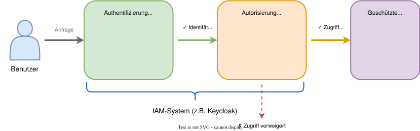
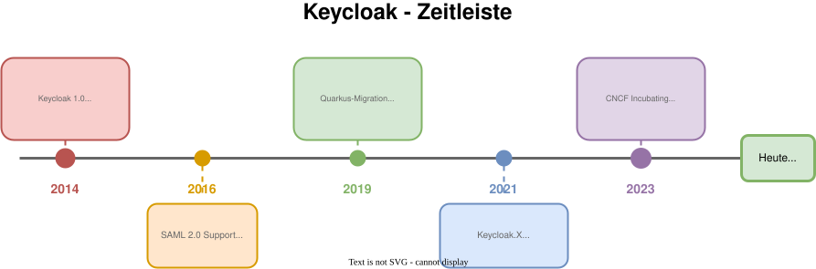
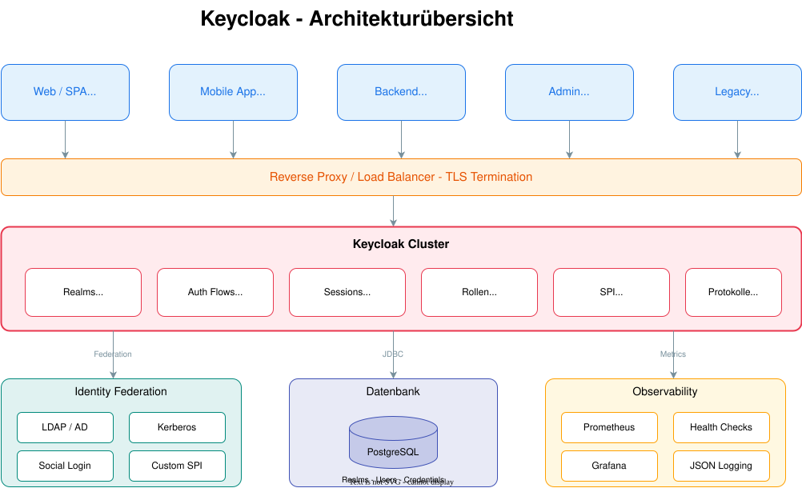

# Modul 01

## Einführung in IAM & Keycloak

---

## Lernziele

Nach diesem Modul kannst du:

- **IAM (Identity and Access Management)** und dessen Bedeutung einordnen.
- Die **Rolle von Keycloak** in einer modernen Anwendungslandschaft erklären.
- Die **Geschichte und Relevanz** von Keycloak verstehen.
- Die **technische Architektur** von Keycloak im Überblick beschreiben.

---

## 1. Definition von IAM

**Identity and Access Management (IAM)**

- Regelt, **wer** (Authentifizierung) **was** (Autorisierung) tun darf.
- Zentralisiert die Verwaltung von Benutzern und Zugriffsrechten.
- Erhöht die Sicherheit (Single Point of Control).
- Verbessert die Compliance und Auditierbarkeit.

> **Ziel:** "Die richtigen Personen erhalten den angemessenen Zugriff zu den korrekten
> Ressourcen zur rechten Zeit aus den passenden Gründen."

---

---

## 2. Was ist Keycloak?

- **Open Source** Identity and Access Management Lösung.
- Ursprünglich von JBoss/Red Hat, heute ein CNCF Incubating Project (unterstützt von Red Hat).
- Fokus auf **moderne Anwendungen**:
  - Single-Page Applications (SPA)
  - Mobile Apps
  - REST APIs
- Basierend auf Standard-Protokollen:
  - **OpenID Connect (OIDC)**
  - **OAuth 2.0**
  - **SAML 2.0**

---

## 2.1 Die Entstehung von Keycloak

**Das Problem (vor 2014):**

- JBoss hatte **PicketLink** für Security - war komplex und schwer zu integrieren
- Jedes Team baute eigene Auth-Lösungen
- Keine einheitliche Lösung für moderne Web-Apps (SPAs, REST APIs)

**Die Lösung:**

- 2014: **Keycloak** als kompletter Neustart
- Ziel: **Developer Experience** - einfache Integration in Minuten
- Fokus auf moderne Standards (OAuth 2.0, OIDC) von Anfang an

> **Vision:** "Security sollte nicht kompliziert sein."

---

---

## 2.3 Von Red Hat zu CNCF

**Was ist die CNCF?**

- **Cloud Native Computing Foundation** - Teil der Linux Foundation
- Heimat von Kubernetes, Prometheus, Envoy, Helm...
- Garantiert: **Vendor-neutral**, offene Governance

**Was bedeutet "Incubating"?**

| Status | Bedeutung |
| :--- | :--- |
| Sandbox | Frühe Phase, experimentell |
| **Incubating** | ← Keycloak ist hier! Produktionsreif, wachsende Adoption |
| Graduated | Etabliert, weit verbreitet (z.B. Kubernetes) |

> **Red Hat** sponsert weiterhin die Hauptentwicklung, aber das Projekt gehört der Community.

---

## 2.4 Warum Keycloak? - Business-Argumente

| Argument | Vorteil |
| :--- | :--- |
| **Kostenkontrolle** | Keine Pay-per-User Gebühren (vs. Auth0/Okta: Pay-per-User-Modell) |
| **Datenhoheit** | DSGVO-konform: Daten bleiben bei dir |
| **Anpassbarkeit** | SPIs, Themes, Custom Flows - alles erweiterbar |
| **Kein Vendor Lock-in** | Open Source, Standards-basiert, migrierbar |
| **Enterprise-Support** | Red Hat bietet kommerziellen Support (Red Hat build of Keycloak) |

> **Tipp:** Für Startups oft günstiger als SaaS, für Enterprises oft sicherer.

---

## 2.5 Wer nutzt Keycloak?

**Community & Adoption:**

- **25.000+** GitHub Stars
- **Millionen** Downloads (Quay.io, Docker Hub)
- **Aktive Community:** Discourse Forum, GitHub Discussions

**Branchen:**

- **Fintech:** Regulierte Umgebungen, Datenhoheit wichtig
- **Healthcare:** HIPAA-Compliance, On-Premise Anforderungen
- **Government:** Souveränität, keine Cloud-Abhängigkeit
- **E-Commerce:** Skalierbarkeit, Multi-Tenant

> Keycloak ist der **De-facto-Standard** für Self-Hosted IAM.

---

---

## 3.1 Quarkus Runtime

**Warum Quarkus?** (Migration von WildFly abgeschlossen seit v20)

| Aspekt | Früher (WildFly) | Heute (Quarkus) |
| :--- | :--- | :--- |
| **Startzeit** | 30-60 Sekunden | 2-5 Sekunden |
| **Memory** | 500MB+ | ~200MB |
| **Container-Größe** | Groß | Optimiert |
| **Native Compilation** | Nein | Möglich (GraalVM) |

> Quarkus macht Keycloak **Cloud-native** und ideal für Container-Deployments.

---

## 3.2 Caching & Clustering mit Infinispan

- **Infinispan** ist der eingebettete Cache in Keycloak.
- Cached **Sessions**, **Auth-Daten** und **Realm-Konfigurationen** für schnelle Zugriffe.
- Ermöglicht **Clustering**: Mehrere Keycloak-Instanzen teilen sich den Cache.
- Wichtig für **Hochverfügbarkeit** und horizontale Skalierung.

> **Details** zu Clustering-Topologien und Konfiguration folgen in späteren Modulen.

---

## 3.3 Erweiterbarkeit: SPIs

Keycloak ist über **Service Provider Interfaces (SPIs)** erweiterbar:

- Eigene **Authentifizierungs-Flows** (z.B. 2FA per Hardware-Token)
- Custom **User Storage** (z.B. Anbindung an Legacy-Datenbanken)
- Eigene **Event Listener** (z.B. Audit-Logging an externes SIEM)
- Custom **Themes** für Login-Seiten und Admin-Konsole

> **Details** in Modul 11: Anpassung & Theming.

---

## 4. Zusammenfassung

- **IAM** regelt Identitäten und Zugriffsrechte zentral.
- **Keycloak** ist die führende Open-Source IAM-Lösung.
- Ursprünglich von Red Hat, heute ein **CNCF Incubating Project**.
- Basiert auf **Quarkus** (schnell, Cloud-native).
- **Infinispan** ermöglicht Caching und Clustering für Hochverfügbarkeit.
- **SPIs** erlauben umfassende Anpassungen (Details in späteren Modulen).

---

## Fragen?

- Hast du bereits Erfahrungen mit anderen IAM-Systemen?
- Welche Anwendung möchtest du als erstes anbinden?

---

## Nächste Schritte

Im nächsten Modul: **Protokolle**

- OAuth 2.0, OpenID Connect und SAML 2.0 verstehen.
- Die verschiedenen Flows und deren Anwendungsfälle kennenlernen.
