# Modul 02

## Protokoll-Standards

---

## Lernziele

Nach diesem Modul kannst du:

- Die **Entstehung und Notwendigkeit** von Auth-Standards verstehen.
- **OAuth 2.0 Flows** und deren Anwendungsfälle erklären.
- **OpenID Connect** und die JWT-Struktur verstehen.
- **SAML 2.0** für Enterprise-Szenarien einordnen.
- Das **richtige Protokoll** für einen Use-Case auswählen.

---

## 1. Die Protokoll-Standards

Bevor wir tiefer einsteigen: Woher kommen OIDC, OAuth und SAML eigentlich?

**Die drei wichtigsten Standards für IAM:**

| Standard | Zweck | Typischer Einsatz |
| :--- | :--- | :--- |
| **OAuth 2.0** | Autorisierung | API-Zugriff delegieren |
| **OpenID Connect** | Authentifizierung | "Wer bist du?" |
| **SAML 2.0** | Beides | Enterprise SSO |

> Keycloak unterstützt alle drei!

---

## 1.1 Das Problem vor Standards

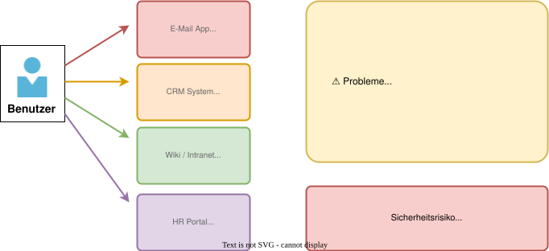

---

## 1.2 Evolution der Standards

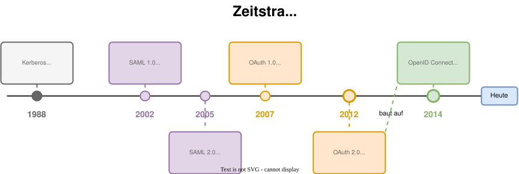

---

## 1.3 Wann welches Protokoll?

| Kriterium | OAuth 2.0 | OIDC | SAML 2.0 |
| :--- | :--- | :--- | :--- |
| **Hauptzweck** | API-Autorisierung | Authentifizierung | SSO (Enterprise) |
| **Format** | JSON | JSON (JWT) | XML |
| **Komplexität** | Mittel | Mittel | Hoch |

> **Faustregel:** Neue Projekte → OIDC. Legacy/Enterprise → SAML. Detailvergleich in Abschnitt 4.4.

---

## 2. OAuth 2.0 - Das Konzept

**OAuth 2.0** ist ein Protokoll für **delegierte Autorisierung**.

> **Analogie:** Ein Valet Parking Key - er erlaubt dem Parkwächter, das Auto zu
> fahren, aber nicht den Kofferraum zu öffnen.

**OAuth beantwortet:** "Darf diese App in meinem Namen handeln?"

**OAuth beantwortet NICHT:** "Wer bist du?" (das ist OIDC)

---

## 2.1 OAuth 2.0 - Die 4 Rollen

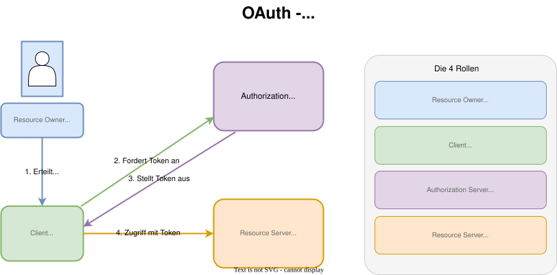

---

## 2.2 Authorization Code Flow

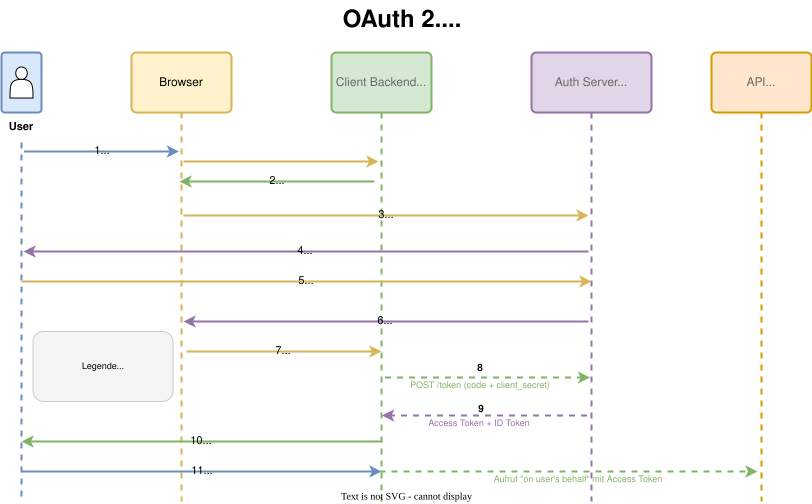

---

## 2.3 Authorization Code + PKCE

Für **SPAs** und **Mobile Apps** - Clients ohne sicheres Backend.

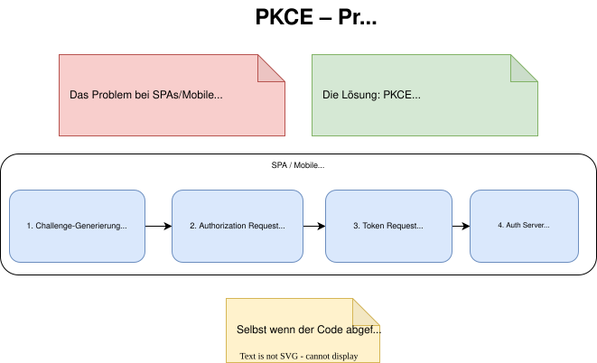

---

## 2.4 Client Credentials Flow

Für **Machine-to-Machine** Kommunikation - kein User involviert.

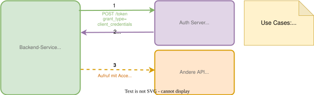

---

## 2.5 Device Authorization Flow (Smart TV)

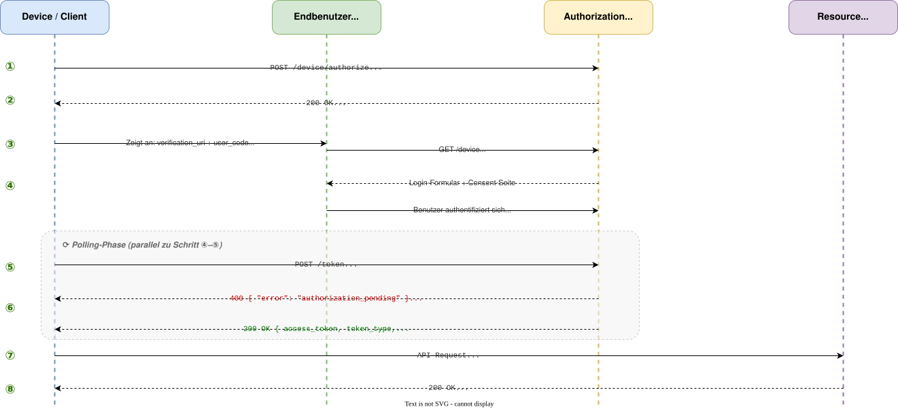

---

## 2.6 OAuth 2.0 — Was fehlt?

OAuth 2.0 regelt nur **Autorisierung** — es sagt nichts über die **Identität** des Nutzers aus.

**Was OAuth allein nicht kann:**

- Wer ist der eingeloggte Benutzer? (kein standardisiertes ID-Format)
- Wie kann sich eine App über die Identität sicher sein? (kein ID Token)
- Wie erhält man Profildaten? (kein standardisierter Userinfo-Endpoint)

**Die Lösung:** OpenID Connect erweitert OAuth 2.0 um genau diese fehlenden Bausteine.

> **OIDC = OAuth 2.0 + Identitäts-Schicht**

---

## 3. OpenID Connect - OAuth + Identität

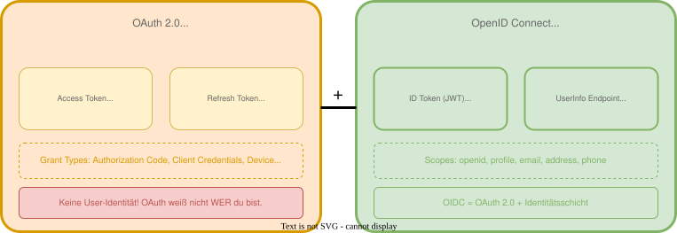

---
<style scoped>
table { font-size: 0.85rem; }
</style>

## 3.1 Die drei Token-Typen

| Token | Zweck | Lebensdauer | Empfänger |
| :--- | :--- | :--- | :--- |
| **ID Token** | Identität beweisen | Kurz (Min) | Die App selbst |
| **Access Token** | API-Zugriff | Kurz (5-15 Min) | Resource Server |
| **Refresh Token** | Neue Tokens holen | Lang (Stunden) | Auth Server |

> **Wichtig:** ID Token niemals an APIs senden! Nur für die App selbst.

---

## 3.2 ID Token Anatomie (JWT)

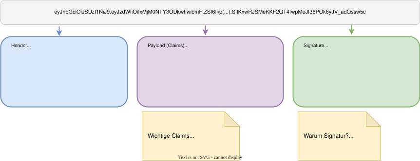

---
<style scoped>
section { font-size: 1.5rem; }
</style>

## 3.3 OIDC Discovery

Keycloak (und alle OIDC-Provider) veröffentlichen ihre Konfiguration:

**URL:** `https://keycloak.example.com/realms/{realm}/.well-known/openid-configuration`

```json
{
  "issuer": "https://keycloak.example.com/realms/demo",
  "authorization_endpoint": "https://.../protocol/openid-connect/auth",
  "token_endpoint": "https://.../protocol/openid-connect/token",
  "userinfo_endpoint": "https://.../protocol/openid-connect/userinfo",
  "jwks_uri": "https://.../protocol/openid-connect/certs",
  "scopes_supported": ["openid", "profile", "email", "roles"],
  ...
}
```

> **Vorteil:** Client-Libraries können sich automatisch konfigurieren!

---

## 3.4 OIDC Scopes & Claims

| Scope | Claims im Token |
| :--- | :--- |
| `openid` | **Pflicht!** `sub` (Subject = User-ID) |
| `profile` | `name`, `family_name`, `given_name`, `picture` |
| `email` | `email`, `email_verified` |
| `address` | `address` (strukturiert) |
| `phone` | `phone_number`, `phone_number_verified` |

> **Tipp:** Nur anfordern, was benötigt wird (Datensparsamkeit / DSGVO).

---

## 4. SAML 2.0 - Der Enterprise-Standard

**Security Assertion Markup Language** - seit 2005 der Standard für Enterprise SSO.

- **XML-basiert** (im Gegensatz zu OIDC/JSON)
- **Weit verbreitet** in Unternehmen und B2B-Szenarien
- **Unterstützt von** Salesforce, ServiceNow, AWS, Google Workspace...

**Typische Use-Cases:**

- Mitarbeiter-Login für SaaS-Anwendungen
- Föderierte Identitäten zwischen Unternehmen
- Legacy-Systeme, die kein OIDC unterstützen

---
<style scoped>
table { font-size: 0.8rem; }
</style>

## 4.1 SAML Terminologie

| SAML-Begriff                | OIDC-Äquivalent        | Bedeutung                            |
|:----------------------------|:-----------------------|:-------------------------------------|
| **Identity Provider (IdP)** | Authorization Server   | Authentifiziert User (z.B. Keycloak) |
| **Service Provider (SP)**   | Client / Relying Party | Die geschützte Anwendung             |
| **Assertion**               | ID Token               | Signierte Aussage über den User      |
| **SAMLRequest**             | Authorization Request  | Anfrage zur Authentifizierung        |
| **SAMLResponse**            | Token Response         | Antwort mit Assertion                |

---

## 4.2 SAML Web Browser SSO Flow

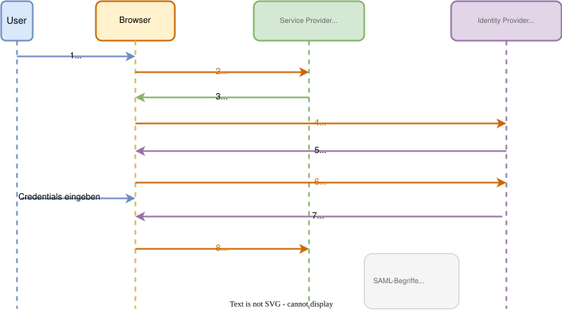

---

## 4.3 SAML Assertion Anatomie

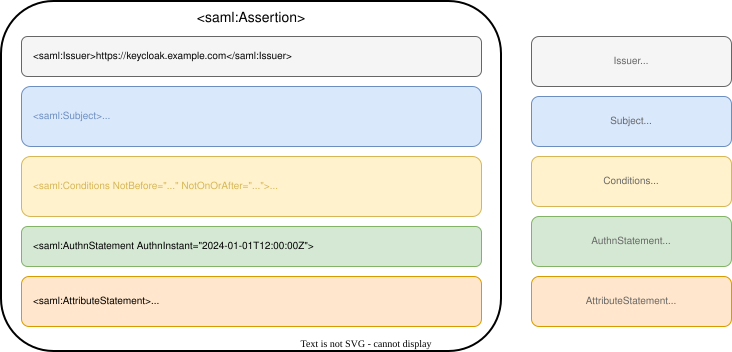

---
<style scoped>
table { font-size: 0.75rem; }
</style>

## 4.4 SAML vs. OIDC - Vergleich

| Aspekt                  | SAML 2.0                | OpenID Connect          |
|:------------------------|:------------------------|:------------------------|
| **Format**              | XML                     | JSON (JWT)              |
| **Komplexität**         | Hoch                    | Niedrig-Mittel          |
| **Token-Größe**         | Groß (KB)               | Klein (Bytes)           |
| **Mobile-tauglich**     | Eingeschränkt           | Sehr gut                |
| **Browser-Anforderung** | POST-Binding braucht JS | Standard HTTP Redirects |
| **Erweiterbarkeit**     | Profile, Bindings       | Scopes, Claims          |
| **Verbreitung**         | Enterprise, B2B         | Web, Mobile, APIs       |
| **Keycloak-Support**    | Vollständig             | Vollständig             |

> **Empfehlung:** OIDC für neue Projekte. SAML für Legacy/Enterprise-Integration.

---

## 5. Entscheidungsbaum: Welches Protokoll?

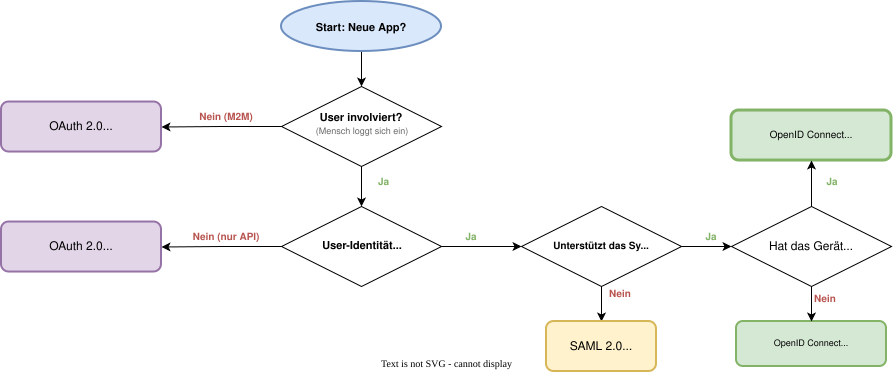

---
<style scoped>
section { font-size: 1.4rem; }
</style>

## 6. Übung: Protokollwahl

**Szenario:** Ein mittelständisches Unternehmen plant die Modernisierung seiner IT-Landschaft. Folgende Anwendungen sollen an ein zentrales IAM (Keycloak) angebunden werden:

| # | Anwendung                 | Beschreibung                                    |
|:--|:--------------------------|:------------------------------------------------|
| 1 | **Mitarbeiterportal**     | React-SPA für interne Self-Services             |
| 2 | **Reporting-Service**     | Backend-Dienst, der nächtlich Daten aggregiert  |
| 3 | **Salesforce**            | Bereits vorhanden, nutzt SAML für SSO           |
| 4 | **Konferenzraum-Display** | Kleines Gerät ohne Tastatur, zeigt Raumbelegung |

---
<style scoped>
section { font-size: 1.5rem; }
</style>

## 6. Übung: Aufgabenstellung

**Deine Aufgabe (10 Min):**

1. **Analysiere** jede Anwendung: Welche Eigenschaften sind relevant?
   (Browser vorhanden? User involviert? Geheimnis speicherbar?)

2. **Entscheide:** Welches Protokoll / welchen Flow empfiehlst du?

3. **Begründe** deine Wahl kurz.

| Anwendung | Protokoll/Flow | Begründung |
| :--- | :--- | :--- |
| Mitarbeiterportal | ? | ? |
| Reporting-Service | ? | ? |
| Salesforce | ? | ? |
| Konferenzraum-Display | ? | ? |

---
<style scoped>
section { font-size: 1.35rem; }
</style>

## 6. Übung: Musterlösung

| Anwendung | Protokoll/Flow | Begründung |
| :--- | :--- | :--- |
| **Mitarbeiterportal** | OIDC + Auth Code + PKCE | SPA ohne Backend, User-Login erforderlich |
| **Reporting-Service** | OAuth 2.0 Client Credentials | Machine-to-Machine, kein User involviert |
| **Salesforce** | SAML 2.0 | Bereits vorhanden, Enterprise-Standard |
| **Konferenzraum-Display** | OAuth 2.0 Device Flow | Kein Browser/Tastatur, User autorisiert extern |

**Diskussion:**

- Warum nicht SAML für das Mitarbeiterportal?
- Was wäre, wenn der Reporting-Service im Namen eines Users handeln müsste?

---

## Zusammenfassung

- **OAuth 2.0** ermöglicht delegierte Autorisierung (API-Zugriff).
- **OpenID Connect** erweitert OAuth um Authentifizierung (ID Token).
- **SAML 2.0** ist der etablierte Enterprise-Standard für SSO.
- Die Wahl des Protokolls hängt vom **Use-Case** ab:
  - Neue Apps, Mobile → **OIDC**
  - Machine-to-Machine → **OAuth 2.0 Client Credentials**
  - Enterprise/Legacy → **SAML 2.0**

---

## Fragen?

- Welche Protokolle nutzt du aktuell in deiner Umgebung?
- Gibt es Legacy-Systeme, die SAML erfordern?

---

## Nächste Schritte

Im nächsten Modul:
**Installation und Grundkonfiguration**

- Wir installieren Keycloak.
- Wir legen den ersten Realm und Admin-User an.
