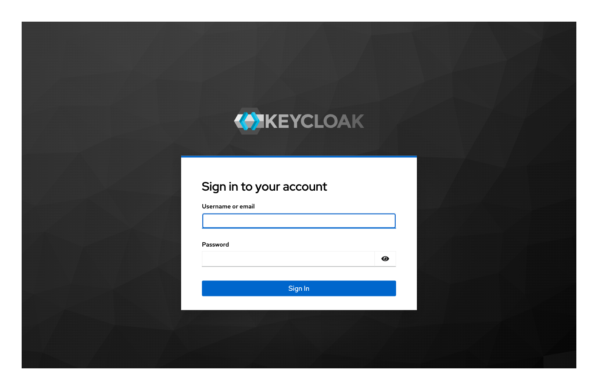
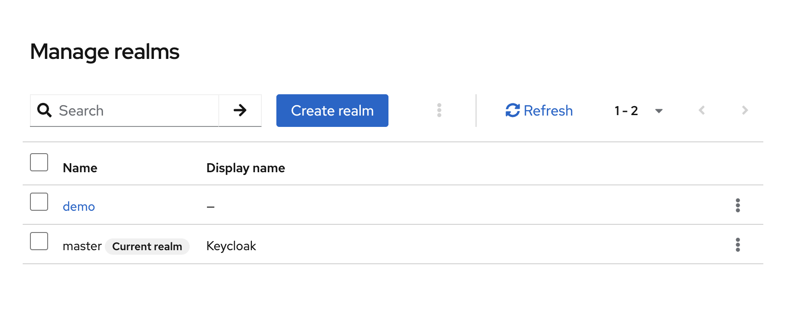
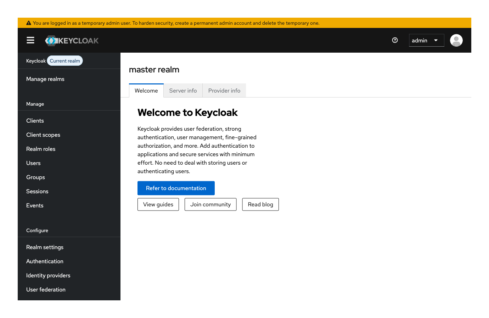
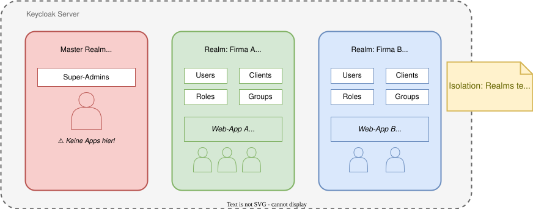
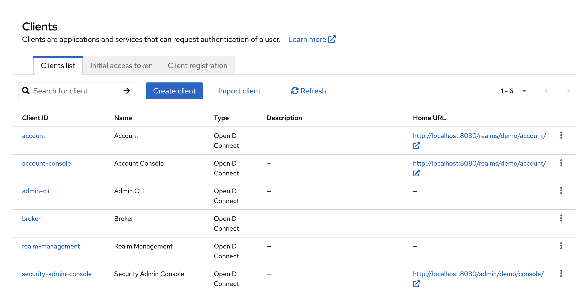

# Modul 03

## Installation und Grundkonfiguration

---

## Lernziele

Nach diesem Modul kannst du:

- Keycloak erfolgreich installieren (Docker & Distribution).
- Die Admin-Konsole bedienen.
- Die grundlegende Hierarchie (Realm, Client, User) verstehen.
- Erste Schritte für eine Produktionsumgebung benennen.

---

## 1. Systemvoraussetzungen

Keycloak ist eine Java-Anwendung (basiert auf Quarkus).

- **Java:** JDK 17 oder neuer (nur bei manueller Installation).
- **RAM:** Min. 512 MB Heap (empfohlen: 1GB+ für Prod).
- **Datenbank:** H2 (nur Dev/Test), PostgreSQL, MySQL, MariaDB, Oracle, MS SQL.
- **Netzwerk:** Standard-Port 8080 (HTTP) bzw. 8443 (HTTPS).

---

## 2. Installationswege

### A. Docker / Container (Empfohlen)

Schnellster Weg für Dev und Prod (Cloud Native).

```bash
docker run -p 8080:8080 -e KEYCLOAK_ADMIN=admin -e KEYCLOAK_ADMIN_PASSWORD=admin quay.io/keycloak/keycloak:latest start-dev
```

### B. Distribution (Zip/Tar.gz)

Für klassische Server-Installationen.

1. Download von keycloak.org
2. Entpacken
3. `bin/kc.sh start-dev` (Linux/Mac) oder `bin/kc.bat start-dev` (Windows)

---
<style scoped>
section {
    font-size: 1.5rem;
}
</style>

## 3. Der erste Start & Admin-User

Keycloak hat **keinen** Default-Admin. Er muss beim ersten Start gesetzt werden.

- **Via Umgebungsvariablen:** `KEYCLOAK_ADMIN` / `KEYCLOAK_ADMIN_PASSWORD` (bequem bei Docker).

- **Via Localhost:** Wenn nicht gesetzt, erlaubt Keycloak das Anlegen eines Admins nur via `http://localhost:8080/`.



> **Hinweis:** Der Modus `start-dev` erlaubt HTTP und externe Verbindungen (für Tests). In Prod ist `start` + HTTPS-Zertifikat Pflicht.

---

## 4. Die Admin-Konsole (GUI Tour)

URL: `http://localhost:8080/admin`


Wichtige Bereiche:

1. **Realm Selector (oben links):** Wechseln zwischen Mandanten.

2. **Manage (Menü):** Clients, Client Scopes, Roles, Users, Groups.

3. **Configure (Menü):** Realm-Einstellungen, Authentication, IdP.

---

## 5. Grundkonfiguration: Realms

Ein **Realm** ist der logische Container.



- Der `master` Realm dient nur zur Verwaltung anderer Realms (Admins).

- **Best Practice:** Erstelle immer einen eigenen Realm für deine Anwendungen (z.B. "my-company" oder "customer-x").

---

## 5. Grundkonfiguration: Realms



**Einstellungen:**

- **Display Name:** Was der User auf der Login-Seite sieht.

- **HTML Display Name:** Erlaubt HTML.

---

## 5. Realm-Architektur: Überblick



---

## 5. Grundkonfiguration: Clients



Ein **Client** ist eine Anwendung, die Keycloak nutzt.

- **Client ID:** Eindeutige ID (z.B. `my-webapp`).
- **Client Protocol:** Meist `openid-connect`.
- **Root URL / Valid Redirect URIs:** Sicherheitskritisch! Wohin darf Keycloak den User nach dem Login zurückschicken? (z.B. `https://myapp.com/*`).

> Mehr dazu später.

---

## Fragen?

- Hast du Container-Technologien bei dir in der Firma im Einsatz oder hostet ihr direkt auf VMs?
- Welche Datenbanken, Backend-Technologien und Frontends nutzt du in deiner Firma typischerweise?
