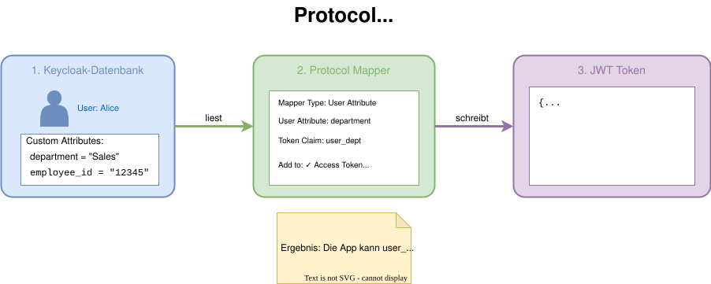
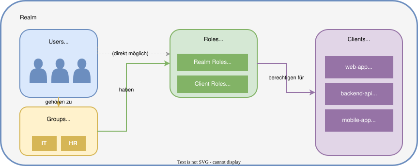
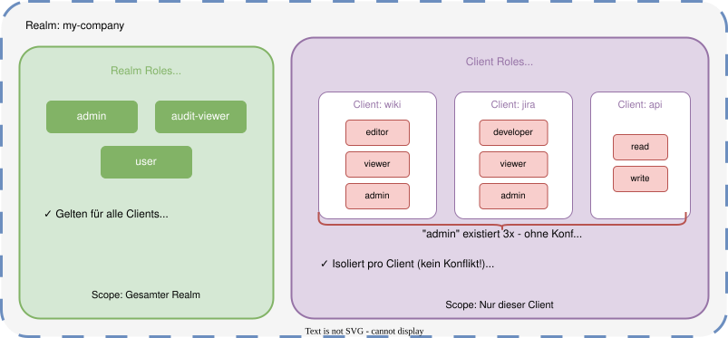
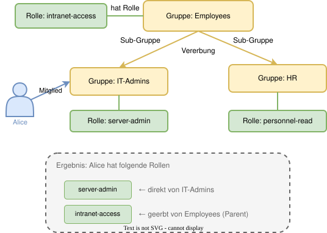
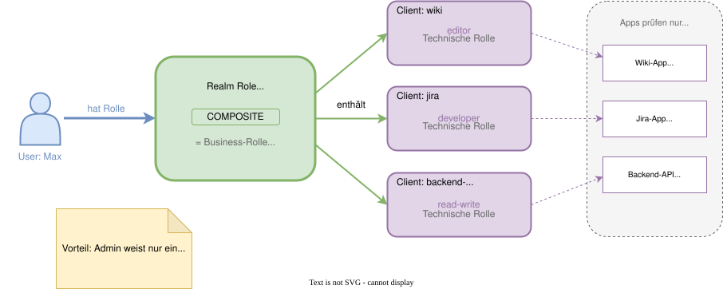

# Modul 04

## Clients & Benutzerverwaltung

---

## Lernziele

Nach diesem Modul kannst du:

- Die drei **Client-Typen** (Public, Confidential, Bearer-only) unterscheiden.
- **Service Accounts** für Machine-to-Machine-Zugriff konfigurieren.
- Das **Keycloak User-Modell** im Detail erklären.
- Eine **skalierbare Berechtigungsstruktur** entwerfen (Composite Roles).
- **Protocol Mappers** und **Client Scopes** einsetzen, um Tokens gezielt anzupassen.

---

## 1. Was ist ein Client?

Ein **Client** ist eine Anwendung, die Keycloak zur Authentifizierung/Autorisierung nutzt.

- **Client ID:** Eindeutige ID (z.B. `my-webapp`).
- **Client Protocol:** Meist `openid-connect`.
- **Root URL / Valid Redirect URIs:** Sicherheitskritisch! Wohin darf Keycloak den User nach dem Login zurückschicken?

> **Merke:** Jede Anwendung, die Keycloak nutzt, muss als Client registriert werden.

---

## 1.1 Client-Typen (Access Type)

Keycloak (OIDC) unterscheidet Sicherheitsstufen:

1. **Public:**
   - Kann kein Secret sicher speichern (z.B. SPA, Mobile App).
   - Nutzt PKCE für Sicherheit.
2. **Confidential:**
   - Server-seitige App (z.B. Java/PHP/Node.js Backend).
   - Besitzt ein **Client Secret**, mit dem es sich authentifiziert.
3. **Bearer-only:**
   - (Veraltet, heute meist "Confidential" ohne Login-Flow).
   - Nur für REST Services, die Tokens validieren, aber nie User einloggen.

---

## 1.2 Authentifizierungs-Flows pro Client

Im Tab *Capability config* des Clients:

- **Standard Flow:** Der klassische Redirect (Browser -> Keycloak -> Browser). Für fast alle Apps.
- **Implicit Flow:** Veraltet! (Unsicher, nicht nutzen).
- **Direct Access Grants:** User/Passwort direkt an Keycloak senden (REST). Nur für Legacy/CLI!
- **Service Accounts Roles:** Erlaubt "Client Credentials Grant" (siehe nächster Abschnitt).

---

## 2. Service Accounts

Wenn sich eine **Maschine** (kein Mensch) einloggen muss.

- Aktivieren: *Service Accounts Enabled = ON* (nur bei Confidential Clients).
- Ablauf: Client sendet ID + Secret an Token-Endpoint -> erhält Access Token.
- **Berechtigungen:** Tab *Service Account Roles* im Client-Menü. Hier werden dem "Roboter" Rollen zugewiesen.

> **Anwendungsfall:** Cronjobs, Backend-Services, CI/CD-Pipelines.

---

## 3. Client Scopes

Gruppierung von Mappern und Rollen.

- **Default Client Scopes:** Werden IMMER ins Token gepackt (z.B. `email`, `profile`).
- **Optional Client Scopes:** Müssen vom Client angefordert werden (Parameter `scope=address phone`).
- **Vorteil:** Man definiert einmal ein Set an Claims (z.B. "employee-info") und weist es mehreren Clients zu.

---

## 3.1 Protocol Mappers

Wie kommen Daten in das Token (JWT)?

- Menü: *Client → Client Scopes → Dedicated Scope → Mappers*.
- Keycloak fügt Standard-Claims hinzu (`sub`, `iss`, `email`...).
- **Custom Mapper:**
  - *Type:* "User Attribute".
  - *User Attribute:* `department`.
  - *Token Claim Name:* `custom_data.department`.
  - *Add to access token:* ON.

> **Ergebnis:** Das Frontend/API kann das Department direkt aus dem Token lesen, ohne DB-Query.

---

## 3.2 Protocol Mapper: Visualisierung

---

## 4. Das User-Datenmodell

Ein User in Keycloak ist mehr als nur `username` und `password`.

- **Core Attributes:** ID (UUID), Username, Email, First/Last Name.
- **Custom Attributes:** Beliebige Key-Value Paare (z.B. `cost_center`, `manager_id`).
- **Consent:** Gespeicherte Zustimmungen des Users zu Client-Zugriffen.
- **Groups & Roles:** Zugehörigkeiten und Rechte.

> **Merke:** Die UUID ist der einzig stabile Identifier. Usernames können sich ändern!

---

## 4. Realm-Komponenten: Überblick

---

## 5. Credentials & User States

### User States

- **Enabled:** Grundvoraussetzung für Login.
- **Email Verified:** Wichtig für "Forgot Password" Flows.
- **Required User Actions:** Eine Queue von Aufgaben.
  - *Beispiel:* Admin setzt Passwort zurück -> Fügt Action `UPDATE_PASSWORD` hinzu -> User loggt sich ein -> Muss sofort neues Passwort setzen.

---

### Credentials

Keycloak unterstützt mehrere Credentials pro User gleichzeitig:

- Password
- OTP (TOTP/HOTP)
- WebAuthn (FIDO2)

---

## 6. Rollenkonzepte (RBAC)

Rollen sind **Permission Tokens** (Berechtigungsmarken).

### Realm Roles (Global)

- Gelten für den gesamten Mandanten.
- *Beispiel:* `audit-admin`, `global-viewer`.
- *Nachteil:* Namenskonflikte möglich (`admin` gibt es überall).

### Client Roles (Lokal)

- Gehören einer spezifischen App (Client).
- *Beispiel:* Client `wiki` hat Rolle `editor`. Client `jira` hat Rolle `editor`.
- Im Token als: `resource_access.wiki.roles = ['editor']`.

---

## 6. Realm Roles vs. Client Roles

---

## 7. Gruppen & Vererbung

Gruppen dienen der **Organisation** und der **effizienten Zuweisung**.

**Die Vererbungs-Kette:**
User → Mitglied in Gruppe → Hat zugeordnete Rollen → Zugriff.

---

## 7. Gruppen & Vererbung: Beispiel

---

## 8. Best Practice: Composite Roles (Verbundene Rollen)

Wie vermeiden wir "Rollen-Explosion"? Durch **Composite Roles**.

- **Technische Rollen:** Client-spezifisch, granular (z.B. `app-a-write`, `app-b-read`).
- **Business Rollen:** Realm-Roles, die technische Rollen bündeln (z.B. `Manager`).

---

## 8. Composite Roles: Beispiel

---

## Zusammenfassung

1. Wähle **Public** für Frontends und **Confidential** für Backends.
2. Nutze **Service Accounts** für Server-to-Server Kommunikation.
3. Nutze **Client Scopes** für wiederverwendbare Token-Konfigurationen.
4. **User** → **Group** → **Composite Role** → **Client Role** ist die Goldene Regel der Zuweisung.
