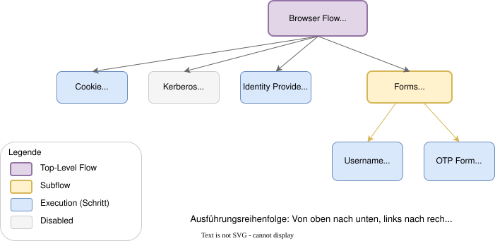
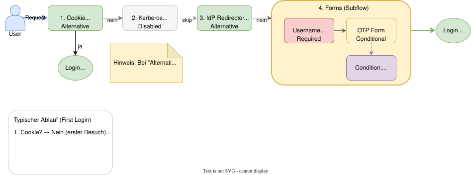

# Modul 05

## Authentifizierungsflüsse & Multi-Faktor-Authentifizierung

---

## Lernziele

Nach diesem Modul kannst du:

- Das Konzept der **Authentication Flows** in Keycloak erklären.
- Die Struktur von Flows (**Executions**, **Subflows**) verstehen.
- Die **Requirement-Typen** (Required, Alternative, Conditional, Disabled) anwenden.
- **Standard-Flows** (Browser, Direct Grant) analysieren und sicher anpassen.
- **Multi-Faktor-Authentifizierung (MFA)** mittels OTP oder **WebAuthn** konfigurieren.
- **Passwort- und OTP-Policies** definieren.

---

## 1. Was sind Authentifizierungsflüsse?

Keycloak nutzt ein flexibles System, um zu definieren, wie Benutzer (oder Clients) authentifiziert werden.

- **Kein "Hardcoding":** Der Login-Prozess ist nicht starr, sondern konfigurierbar.
- **Schritt-für-Schritt:** Ein Flow besteht aus einer Sequenz von Schritten ("Executions").
- **Interaktiv & Nicht-Interaktiv:**
  - *Browser Flow:* Interaktiv (Login-Formulare, OTP-Eingabe).
  - *Direct Grant Flow:* Nicht-interaktiv (REST-Call mit User/Passwort).

---

## 1.1 Struktur und Komponenten

Ein Flow ist ein Baum aus **Executions** und **Subflows**.

### Executions

Einzelne Arbeitsschritte, z.B.:

- "Username Password Form" (Zeigt Login-Maske)
- "OTP Form" (Fragt nach 2. Faktor)
- "Cookie" (Prüft, ob schon eingeloggt)

### Subflows

Gruppierung von Executions, um komplexe Logik (z.B. "Entweder Passwort ODER Kerberos") abzubilden.

---

---

## 1.2 Struktur: Requirements

Jeder Schritt hat eine Bedingung ("Requirement"):

| Requirement | Bedeutung |
| ------------- | ----------- |
| **Required** | MUSS erfolgreich sein, sonst Abbruch |
| **Alternative** | EINE der Alternativen muss erfolgreich sein |
| **Conditional** | Nur ausgeführt, wenn Bedingung erfüllt |
| **Disabled** | Schritt wird übersprungen |

---

## 1.3 Standard-Flows im Überblick

Keycloak liefert "Built-in" Flows mit (Menü: *Authentication*):

| Flow | Verwendung |
| ------ | ------------ |
| **Browser** | Standard für Web-Apps (interaktiv) |
| **Direct Grant** | REST-API Login (nicht-interaktiv) |
| **Registration** | Selbstregistrierung neuer User |
| **Reset Credentials** | "Passwort vergessen"-Workflow |
| **First Broker Login** | Erstmaliger Login via externen IdP |

---

---

## 2. Customizing: Flows anpassen

**Wichtige Regel:** Built-in Flows sollten nicht direkt editiert werden!

**Vorgehen:**

1. **Duplizieren:** Bestehenden Flow (z.B. "Browser") auswählen -> "Duplicate".
2. **Benennen:** Eindeutigen Namen geben (z.B. "Browser mit MFA").
3. **Editieren:** Schritte hinzufügen, entfernen, verschieben oder konfigurieren.
4. **Binden:** Den neuen Flow als "Browser Flow" im *Bindings*-Tab (oder beim Client) setzen.

---

## 2.1 Multi-Faktor-Authentifizierung (MFA)

Ziel: User müssen zusätzlich zum Passwort einen **zweiten Faktor** eingeben.

**Keycloak unterstützt:**

| Methode | Beschreibung |
| --------- | -------------- |
| **OTP (TOTP)** | Zeitbasierter Code (Google Authenticator, Authy) |
| **WebAuthn** | Hardware-Keys (YubiKey) oder Passkeys |
| **SMS/Email** | Via Custom Authenticator (nicht built-in) |

---

## 2.2 WebAuthn / Passkeys

**WebAuthn** unterstützt Security-Keys und Passkeys, als zweiten Faktor oder für passwortlose Flows.

Die Domain-Bindung schützt vor Phishing. Ein Schlüssel ersetzt die Code-Eingabe;
je nach Gerät ist Biometrie möglich.

**Beispiel: Passwort plus WebAuthn**

1. `browser` als `browser-webauthn` duplizieren; Subflow `browser-webauthn forms` öffnen.
2. Dort **WebAuthn Authenticator** hinter **Username Password Form** hinzufügen, **Required** setzen.
3. Den vorhandenen **Conditional 2FA**-Subflow deaktivieren, damit dieses Beispiel kein OTP zusätzlich verlangt.
4. Kopie als **Browser Flow** binden. Im privaten Fenster anmelden, Schlüssel registrieren, erneut anmelden.

**Conditional** gehört auf einen Subflow mit Bedingung. Dieser Ablauf verlangt weiterhin ein Passwort.

---

## 2.3 Policies: Passwort

Unter *Authentication → Policies → Password Policy*:

| Policy | Empfehlung |
| -------- | ------------ |
| **Minimum Length** | 12+ Zeichen |
| **Not Username** | Aktivieren |
| **Password History** | 3-5 Passwörter |

> **Hinweis:** Password Policies wirken bei Passwort-Änderung, nicht rückwirkend!

---

## 2.4 Policies: OTP

Unter *Authentication → Policies → OTP Policy*:

| Parameter | Beschreibung | Empfehlung |
| ----------- | -------------- | ------------ |
| **Type** | TOTP (Zeit) oder HOTP (Zähler) | TOTP |
| **Algorithm** | SHA1, SHA256, SHA512 | SHA256 |
| **Digits** | 6 oder 8 Stellen | 6 |
| **Look Ahead Window** | Toleranz bei Zeitabweichung | 1 |
| **Initial Counter** | Nur für HOTP relevant | 0 |

---

## Zusammenfassung

- **Authentication Flows** definieren die Login-Logik als Baum aus Schritten.
- **Requirements** (Required, Alternative, Conditional) steuern die Auswertung.
- **Niemals Built-in Flows editieren** – immer duplizieren!
- **MFA** via OTP oder WebAuthn einfach aktivierbar.
- **Conditional** führt einen Subflow bei erfüllter Bedingung aus; **Required** erzwingt einen Schritt.
