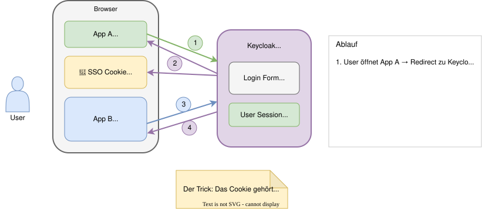
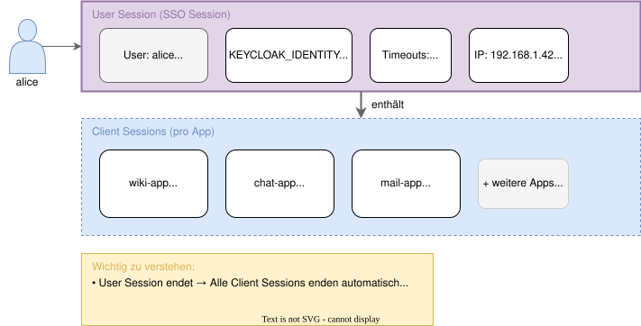
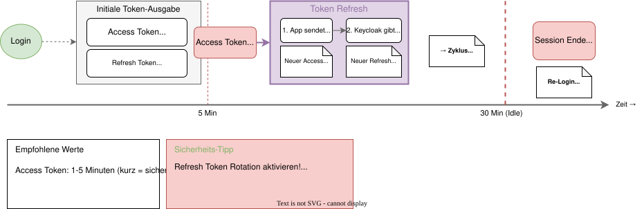
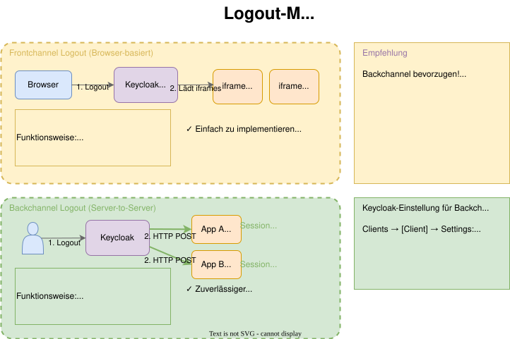

# Modul 06

## Single Sign-On, Sessions & Token Management

---

## Lernziele

Nach diesem Modul kannst du:

- Das **SSO-Prinzip** (User Session vs. Client Session) erklären.
- Die **Session-Timeouts** (Idle, Max) konfigurieren.
- Den **Token-Lifecycle** (Ausstellung, Refresh, Ablauf) verstehen.
- **Refresh Token Rotation** als Sicherheitsmechanismus einsetzen.
- Den Unterschied zwischen **Frontchannel** und **Backchannel Logout** verstehen.

---

---

---

## 1 User Session vs. Client Session

| Session-Typ | Beschreibung | Lebenszyklus |
| ----------- | ------------ | ------------ |
| **User Session** | Globale SSO-Sitzung im Browser | Endet → Alle Client Sessions enden |
| **Client Session** | Sitzung pro Anwendung | Endet → Nur diese App betroffen |

**Verwaltung:**

- User Sessions: *Realm Settings → Sessions*
- Client Sessions: Automatisch pro Login in eine App

---

## 2 Timeouts & Lifetimes

Wichtige Einstellungen (*Realm Settings → Sessions*):

| Einstellung | Beschreibung | Empfehlung |
| ----------- | ------------ | ---------- |
| **SSO Session Idle** | Timeout bei Inaktivität | 30 Min |
| **SSO Session Max** | Maximale Lebensdauer | 8-10 Std |
| **Access Token Lifespan** | Kurz halten! Token wird oft erneuert | 5 Min |
| **Refresh Token Max Reuse** | Verhindert Token-Replay | 0 |

> **Tipp:** Kürzere Timeouts = höhere Sicherheit, aber mehr Re-Logins. Balance finden!

---

## 2.1 Remember Me & Offline Sessions

**Remember Me:**

- Checkbox auf Login-Seite (aktivieren unter *Realm Settings → Login*)
- Verlängert Session Idle auf **"Remember Me Session Max"** (z.B. 30 Tage)

**Offline Sessions:**

- Für Mobile Apps / CLI Tools ohne ständige Browser-Interaktion
- Eigene Timeouts (*Realm Settings → Tokens → Offline Session*)
- Typisch: Tage bis Monate (z.B. 30 Tage Idle, 60 Tage Max)

---

---

## 3 Access Token vs. Refresh Token

| Token | Lebensdauer | Verwendung |
| ----- | ----------- | ---------- |
| **Access Token** | 1-5 Min (kurz!) | Bei jedem API-Request |
| **Refresh Token** | Gebunden an Session | Neue Access Tokens holen |

**Zur Erinnerung** (siehe Modul 02):

- **ID Token** = Identität (für die App selbst)
- **Access Token** = API-Zugriff (für den Resource Server)
- **Refresh Token** = neue Tokens holen (nur für Keycloak)

---

## 3.1 Refresh Token Rotation

**Sicherheit durch Rotation:**

- Aktivieren: *Realm Settings → Tokens → "Revoke Refresh Token" = ON*
- Jeder Refresh Token ist nur **einmal** nutzbar
- Bei Verwendung wird ein neuer Refresh Token ausgestellt
- Erkennung von Token-Diebstahl: Wird ein bereits verwendeter Token erneut genutzt, wird die gesamte Session ungültig

> **Best Practice:** Immer aktivieren!

---

## 4 Frontchannel vs. Backchannel Logout

| Mechanismus | Funktionsweise | Vor-/Nachteile |
| ----------- | -------------- | -------------- |
| **Frontchannel** | iFrames im Browser laden Logout-URLs | Einfach, aber 3rd-Party-Cookie-Probleme |
| **Backchannel** | Server-to-Server HTTP POST | Zuverlässiger, App muss erreichbar sein |

**Konfiguration pro Client:**

- *Clients → [Client] → Settings → "Backchannel Logout URL"*
- z.B. `https://app.example.com/logout`

> **Empfehlung:** Backchannel bevorzugen! Moderne Browser blockieren zunehmend 3rd-Party-Cookies.

---

---

## 4.1 Revocation (Not-Before Policy)

Notfall-Knopf: "Alle Tokens ungültig machen".

- Menü: *Sessions → Revocation*
- **"Set to now":** Setzt einen Zeitstempel
- Alle Tokens, die **vor** diesem Zeitpunkt ausgestellt wurden, werden sofort ungültig
- Zwingt alle User zum Re-Login (oder Token-Refresh)

> **Anwendungsfall:** Sicherheitsvorfall, bei dem Tokens kompromittiert sein könnten.

---

## Zusammenfassung

- **SSO** basiert auf einem zentralen Cookie im Browser.
- **User Session** = globale Sitzung, **Client Session** = pro App.
- **Session Idle** und **Session Max** steuern die Login-Dauer.
- **Refresh Token Rotation** aktivieren für höhere Sicherheit.
- **Backchannel Logout** ist zuverlässiger als Frontchannel.
