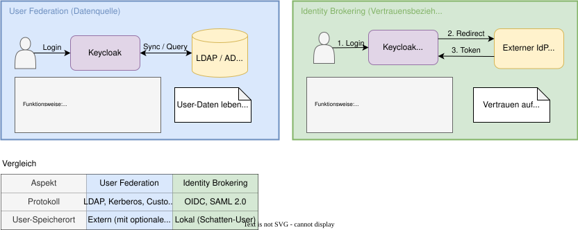
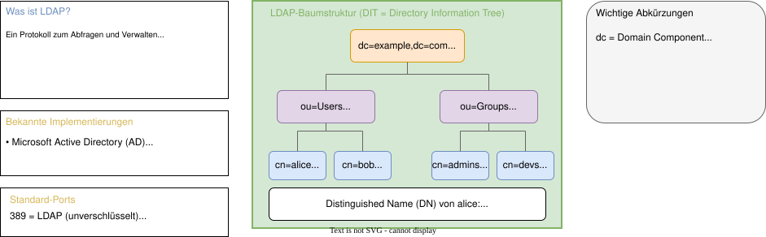
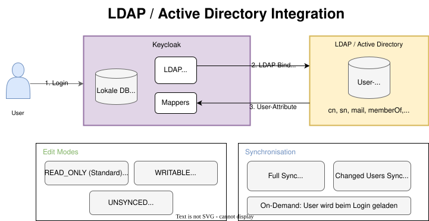
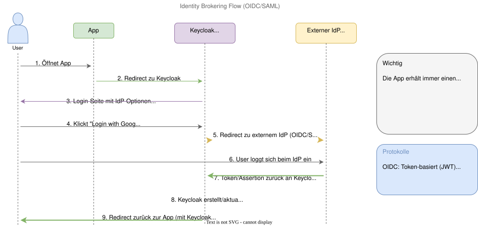
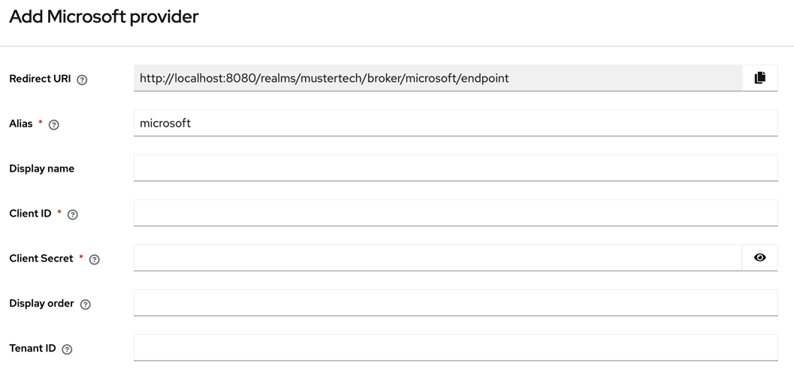
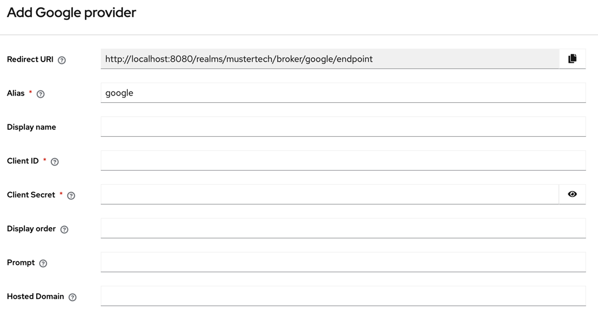
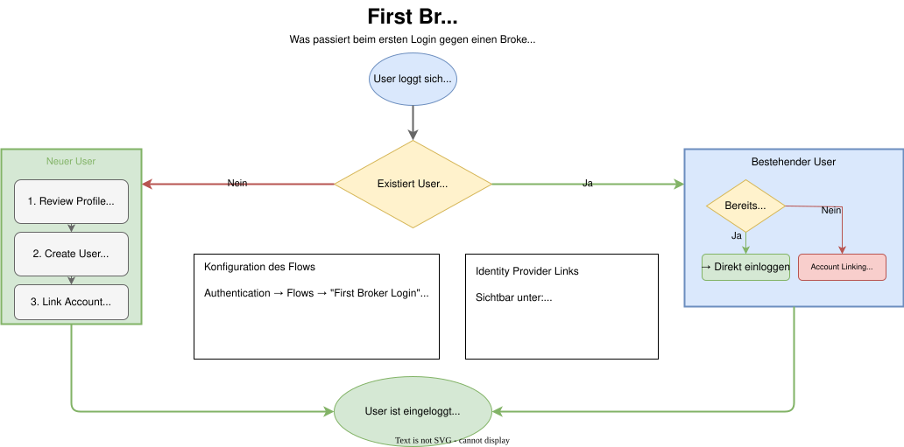

# Modul 07

## Identity Provider & User Federation

---

## Lernziele

Nach diesem Modul kannst du:

- Den Unterschied zwischen **User Federation** und **Identity Brokering** erklären.
- Ein **LDAP / Active Directory** anbinden.
- **Azure AD / Entra ID** als Identity Provider konfigurieren.
- **Social Login** (z.B. GitHub, Google) einrichten.
- Den **First Broker Login** Flow verstehen und anpassen.

---

## 1. Federation vs. Brokering

Zwei Wege, externe Benutzerquellen einzubinden:

---

## 1.1 User Federation

Keycloak verbindet sich **direkt** mit einer Datenbank.

| Aspekt           | Beschreibung                         |
|------------------|--------------------------------------|
| Protokoll        | LDAP, Kerberos, Custom SPI           |
| Passwort         | Wird gegen externes System validiert |
| User-Speicherort | Extern (mit optionalem Cache)        |
| Beispiele        | Active Directory, OpenLDAP           |

> **Anwendungsfall:** Mitarbeiter-Verzeichnisse

---

## 1.2 Identity Brokering

Keycloak **vertraut** einem anderen Identity Provider.

| Aspekt           | Beschreibung                      |
|------------------|-----------------------------------|
| Protokoll        | OIDC, SAML 2.0                    |
| Passwort         | Wird beim externen IdP eingegeben |
| User-Speicherort | Lokal ("Schatten-User")           |
| Beispiele        | Google, Azure AD, Partner-IdP     |

> **Anwendungsfall:** Kunden, Partner, Social Login

---

## 2. Exkurs: Was ist LDAP?

---

## 2.1 LDAP-Konzepte

| Begriff                     | Bedeutung                                           | Beispiel                              |
|-----------------------------|-----------------------------------------------------|---------------------------------------|
| **Verzeichnisdienst**       | Hierarchische Datenbank für Benutzer, Gruppen, etc. | Active Directory                      |
| **DN** (Distinguished Name) | Eindeutiger Pfad zu einem Eintrag                   | `cn=alice,ou=Users,dc=example,dc=com` |
| **Attribut**                | Eigenschaft eines Eintrags                          | `mail`, `cn`, `memberOf`              |

> **Merksatz:** LDAP ist wie ein Telefonbuch für Unternehmen – strukturiert nach Abteilungen und Personen.

---

## 2.2 User Federation (LDAP/AD)

Integration bestehender Verzeichnisse:

---

## 3. Identity Brokering

Keycloak als **Service Provider (SP)** gegenüber externem IdP:

---

## 3.1 IdP-Konfiguration

Menü: *Identity Providers → Add Provider*

**OIDC-Provider:**

- Discovery URL: `https://idp.example.com/.well-known/openid-configuration`
- Client ID & Secret (vom externen IdP)

**SAML-Provider:**

- Entity ID, SSO URL, Zertifikat
- Oder: Import from URL (Metadata)

---

## 4. Azure AD / Entra ID

Häufiger Enterprise-Anwendungsfall:

**Schritt 1:** In Azure Portal → App-Registrierung erstellen
**Schritt 2:** Client ID & Secret kopieren
**Schritt 3:** In Keycloak → *Identity Providers → Microsoft*

> **Tipp:** "Microsoft" Provider in Keycloak unterstützt Azure AD nativ.

---

## 5. Social Login

Spezialfall von Identity Brokering für bekannte Anbieter:

| Provider     | Wo registrieren?          |
|--------------|---------------------------|
| **Google**   | Google Cloud Console      |
| **GitHub**   | GitHub Developer Settings |
| **Facebook** | Meta for Developers       |
| **Apple**    | Apple Developer Portal    |

**Vorteil:** Vorkonfigurierte Templates – nur Client ID & Secret eintragen.

> **Datenschutz:** Minimale Scopes anfordern (nur `email`, `profile`).

---

## 6. First Broker Login Flow

Was passiert beim ersten Login über einen externen IdP?

---

## 6.1 Flow-Konfiguration

Menü: *Authentication → Flows → "First Broker Login"*

| Execution                 | Beschreibung                                   |
|---------------------------|------------------------------------------------|
| **Review Profile**        | User muss Profildaten bestätigen               |
| **Create User If Unique** | Nur erstellen wenn E-Mail eindeutig            |
| **Confirm Link Existing** | Verknüpfung mit bestehendem Account bestätigen |

> **Hinweis:** Ein User kann mehrere IdP-Links haben (z.B. Google + GitHub).

---

## 7. Zusammenfassung

- **LDAP** ist ein Protokoll für Verzeichnisdienste (Active Directory).
- **User Federation** bindet Legacy-Verzeichnisse (LDAP/AD) tief ein.
- **Identity Brokering** ermöglicht SSO über Organisationsgrenzen.
- **Azure AD / Entra ID** ist der häufigste Enterprise-IdP.
- **First Broker Login** Flow steuert Account-Erstellung und -Verknüpfung.
