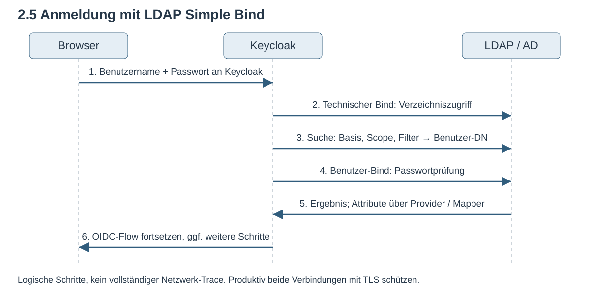

# Modul 07

## Identity Provider & User Federation

---

## Lernziele

Nach diesem Modul kannst du:

- **User Federation** und **Identity Brokering** unterscheiden.
- **LDAP-Suchen und Bind** beim Benutzerlogin erklären.
- **Import, Cache und Gruppenrechte** in Keycloak prüfen.
- Die zusätzlichen Anforderungen von **Active Directory und Kerberos** benennen.
- **Entra ID und Social Login** als externe Identity Provider anbinden.
- Mit dem **First Broker Login** neue und vorhandene Konten zuordnen.

---

## 1. Benutzerquelle oder Identity Provider?

| Frage                      | User Federation              | Identity Brokering      |
| -------------------------- | ---------------------------- | ----------------------- |
| Was bindet Keycloak an?    | Benutzerverzeichnis          | Externen Anmeldedienst  |
| Wer prüft das Passwort?    | Im LDAP-Fall das Verzeichnis | Der externe IdP         |
| Wie erfolgt die Anbindung? | Etwa LDAP                    | Etwa OIDC oder SAML     |
| Beispiel                   | Mitarbeiter im AD DS         | Anmeldung über Entra ID |

Für die Anwendung bleibt Keycloak der Ansprechpartner für die Anmeldung.

---

## 1.1 User Federation

Keycloak greift über einen User Storage Provider auf eine **externe Benutzerquelle** zu.

| Aspekt           | Beschreibung                                          |
| ---------------- | ----------------------------------------------------- |
| Anbindung        | LDAP-Provider oder eigener User Storage Provider      |
| Passwort         | Wird gegen externes System validiert                  |
| User-Speicherort | Extern; je nach Provider mit lokalem Import und Cache |
| Beispiele        | Active Directory, OpenLDAP                            |

> **Anwendungsfall:** Mitarbeiter-Verzeichnisse

---

## 1.2 Identity Brokering

Keycloak **vertraut** einem anderen Identity Provider.

| Aspekt           | Beschreibung                      |
| ---------------- | --------------------------------- |
| Protokoll        | OIDC, SAML 2.0                    |
| Passwort         | Wird beim externen IdP eingegeben |
| User-Speicherort | Lokal ("Schatten-User")           |
| Beispiele        | Google, Azure AD, Partner-IdP     |

> **Anwendungsfall:** Kunden, Partner, Social Login

---

## 2.1 Ein Verzeichnis lesen

LDAP ist ein Protokoll zum Abfragen und Verwalten von Verzeichniseinträgen.

```text
dc=mustertech,dc=de
├── ou=users
│   ├── uid=hans.mueller
│   └── uid=anna.schmidt
└── ou=groups
    ├── cn=entwicklung
    └── cn=vertrieb
```

**Eintrag:** Attribute wie `uid`, `mail`, `givenName` und `objectClass`.
**Gruppe im Lab:** `member` enthält den vollständigen DN des Mitglieds.

---

## 2.2 Name, Suchbasis und stabile ID

| Begriff         | Beispiel / Bedeutung                                    |
| --------------- | ------------------------------------------------------- |
| DN              | `uid=hans.mueller,ou=users,dc=mustertech,dc=de`         |
| RDN             | `uid=hans.mueller`, relativ zum übergeordneten Eintrag  |
| Base DN         | `ou=users,dc=mustertech,dc=de`, Ausgangspunkt der Suche |
| Stabile LDAP-ID | Im Lab `entryUUID`, bei AD typischerweise `objectGUID`  |

Beim Verschieben kann sich der DN ändern. Die ID desselben Objekts bleibt erhalten.
LDAP-ID, Keycloak-Benutzer-ID und OIDC-Subject sind unterschiedliche Bezeichner.

---

## 2.3 Wo und wonach sucht Keycloak?

- **Basis:** Unter welchem Eintrag beginnt die Suche?
- **Scope:** Nur dieser Eintrag, direkte Kinder oder der ganze Teilbaum?
- **Filter:** Welche Attribute müssen passen, etwa `(uid=hans.mueller)`?

Was findet dieser Filter unter `ou=groups`? Sagt das Ergebnis voraus.

Ein erfolgreicher LDAP-Aufruf kann null Treffer liefern.

---

## 2.4 Zwei verschiedene Anmeldungen am LDAP

Ein Bind authentifiziert eine Verbindung gegenüber dem LDAP-Server.

| Identität              | Zweck                                           |
| ---------------------- | ----------------------------------------------- |
| Technisches Bind-Konto | Benutzer und benötigte Attribute suchen / lesen |
| Gefundener Benutzer    | Sein eingegebenes Passwort per Bind überprüfen  |

**Test authentication** prüft die konfigurierten Bind-Zugangsdaten.
Ein erfolgreicher Test belegt noch keinen erfolgreichen Benutzerlogin.

---



---

## 2.6 Wo liegen Benutzerdaten und Rechte?

- **LDAP:** Benutzer, Passwortprüfung und LDAP-verwaltete Zugehörigkeiten
- **Lokaler Import:** Dauerhafte Benutzerdaten mit Verknüpfung zum LDAP-Provider
- **User Cache:** Bereits gelesene Daten, die Keycloak wiederverwendet
- **Access Token:** Bereits ausgestellte Claims ändern sich nicht nachträglich

Im READ_ONLY-Lab werden LDAP-Passwörter nicht nach Keycloak kopiert.
Eine bestehende SSO-Sitzung kann eine erneute Passwortprüfung vermeiden.

---

## 2.7 Wer darf Daten verändern?

| Edit Mode | Bedeutung                                                       |
| --------- | --------------------------------------------------------------- |
| READ_ONLY | Über diesen Provider keine Änderungen an LDAP-verwalteten Daten |
| WRITABLE  | Unterstützte Änderungen können ins LDAP geschrieben werden      |
| UNSYNCED  | Änderungen können lokal bleiben, auch lokal gesetzte Passwörter |

Auch Import Users, Attribut-Mapper und die Rechte im LDAP bestimmen das Verhalten.
Ein späterer Moduswechsel baut vorhandene Mapper nicht automatisch passend um.

---

## 2.8 Selbst bearbeiten: Lab 07c, 30 Minuten

1. Verzeichnis lesen und Benutzerquelle anbinden.
2. Benutzer importieren und einen frischen Login testen.
3. Gruppen-Mapper einrichten und Gruppen auf Rollen abbilden.

Prüft den Vornamen, den Federation Link und die geerbte Rolle.

---

## 2.9 Gegenproben,  15 Minuten

Sucht Hans zuerst unter `ou=users`, dann unter `ou=groups`.
Bind und Filter bleiben gleich. Sagt vor beiden Aufrufen das Ergebnis voraus.

Fügt Anna vorübergehend der Gruppe `entwicklung` hinzu.
Prüft die Änderung in LDAP und Keycloak, synchronisiert und nehmt sie wieder zurück.

Was geschieht dabei mit einem bereits ausgestellten Token?

[Aufgabenblatt mit Befehlen](../../workshops/ldap-ad/aufgabe.md)

---

## 2.10 Welches Microsoft-System ist gemeint?

| System / Verfahren               | Einordnung                                             |
| -------------------------------- | ------------------------------------------------------ |
| Active Directory Domain Services | Verzeichnisdienst, unter anderem LDAP und Kerberos     |
| Microsoft Entra ID               | Cloud-Identitätsdienst, etwa über OIDC/SAML angebunden |
| Microsoft Entra Domain Services  | Verwaltete Domänendienste; von Entra ID unterscheiden  |

**Entscheidung:** Benutzerquelle direkt anbinden oder einem externen IdP vertrauen?

---

## 2.11 Diese AD-Einstellungen braucht Keycloak

- **Login:** `sAMAccountName` oder `userPrincipalName`, passend zum Anmeldekonzept
- **Objekt-ID:** `objectGUID`; ein DN oder eine E-Mail ist kein Ersatz
- **Gruppen:** Direkte und verschachtelte Mitgliedschaft unterscheiden
- **Kontozustand:** MSAD User Account Mapper und Passwortzustände prüfen

Ein UPN muss nicht der Mail-Adresse entsprechen.
Bei mehreren Domänen muss die Kontozuordnung eindeutig bleiben.

---

## 2.12 Eine Sperre wirkt auf mehreren Ebenen

Anna verliert eine AD-Gruppe oder ihr Konto wird deaktiviert.

1. Ist die Änderung im verwendeten Verzeichnis sichtbar?
2. Wann laden Keycloak und seine Mapper den neuen Zustand?
3. Was passiert bei neuem Login, bestehendem SSO und Refresh?
4. Was akzeptiert die API mit einem vorhandenen Token noch?

Legt fest, wie schnell ein Rechteentzug wirken muss, und testet diese Frist bis zur API.

---

## 2.13 TLS und Betriebszugang

- **LDAPS:** TLS ab Verbindungsbeginn, typischerweise Port `636`
- **StartTLS:** Upgrade einer LDAP-Verbindung, typischerweise auf Port `389`
- **Vertrauen:** Zertifikatskette, Servername, Gültigkeit und Truststore prüfen
- **Bind-Konto:** Nur die benötigten Rechte, getrennt von der Benutzerprüfung

Im lokalen Lab nutzen wir vereinfachte Zugänge.
READ_ONLY in Keycloak ersetzt keine Berechtigungsbegrenzung im LDAP.

---

## 2.14 Windows-SSO ist ein eigener Anmeldeweg

Kerberos/SPNEGO kann eine vorhandene Windows-Anmeldung für Keycloak nutzbar machen.

- **Dienstidentität:** Service Principal und Keytab
- **Umgebung:** Passendes DNS und abgestimmte Zeit
- **Browser:** Kerberos-Nutzung für den Dienst zulassen
- **Keycloak:** Kerberos-Anmeldung und Benutzerzuordnung konfigurieren

LDAP-Federation allein aktiviert diesen Ablauf nicht.

---

## 2.15 Zurück zu Hans und Anna

- Warum kann Test authentication erfolgreich sein und Hans trotzdem nicht einloggen?
- Was ändert ein OU-Wechsel an Suche und Identität?
- Welche Wirkung hat Gruppenentzug auf ein vorhandenes JWT?
- Welche Einstellung fehlt für verschachtelte Gruppen möglicherweise?
- Warum reicht LDAP-Anbindung nicht für Windows-SSO?

Welche dieser Antworten könnt ihr im OpenLDAP-Lab prüfen, für welche braucht ihr ein AD?

---

## 3. Identity Brokering im OIDC Code Flow

1. Die Anwendung schickt den Browser zu Keycloak.
2. Keycloak leitet ihn zum gewählten externen IdP weiter.
3. Der IdP meldet den Benutzer an und schickt einen Code an Keycloaks Redirect URI.
4. Keycloak tauscht diesen Code beim IdP gegen Tokens und prüft die Antwort.
5. Keycloak ordnet die externe Identität einem Benutzer im eigenen Realm zu.
6. Die Anwendung erhält einen eigenen Code von Keycloak und tauscht ihn dort gegen Tokens.

Es gibt zwei Code-Austausche. Die Anwendung verwendet die Tokens von Keycloak.

---

## 3.1 IdP-Konfiguration

Menü: *Identity Providers → Add Provider*

**OIDC-Provider:**

- Discovery URL: `https://idp.example.com/.well-known/openid-configuration`
- Client ID & Secret (vom externen IdP)

**SAML-Provider:**

- Entity ID, SSO URL, Zertifikat
- Oder: Import from URL (Metadata)

---
<style scoped>
section {
    font-size: 1.6rem;
}
</style>

## 4. Azure AD / Entra ID

Häufiger Enterprise-Anwendungsfall:

**Schritt 1:** In Azure Portal → App-Registrierung erstellen
**Schritt 2:** Client ID & Secret kopieren
**Schritt 3:** In Keycloak → *Identity Providers → Microsoft*


> **Tipp:** "Microsoft" Provider in Keycloak unterstützt Azure AD nativ.

---
<style scoped>
section {
    font-size: 1.5rem;
}
</style>

## 5. Social Login

Spezialfall von Identity Brokering für bekannte Anbieter:

| Provider     | Wo registrieren?          |
| ------------ | ------------------------- |
| **Google**   | Google Cloud Console      |
| **GitHub**   | GitHub Developer Settings |
| **Facebook** | Meta for Developers       |
| **Apple**    | Apple Developer Portal    |

**Vorteil:** Vorkonfigurierte Provider; Client-Zugangsdaten und Redirect URI müssen zusammenpassen.


> **Datenschutz:** Nur benötigte Scopes anfordern; ihre Namen hängen vom Provider ab.

---

## 6. First Broker Login und Kontenzuordnung

Der First Broker Login legt fest, was mit einer noch nicht verknüpften externen Identität geschieht.

- **Neues Konto:** Keycloak erstellt den Benutzer und speichert den IdP-Link.
- **Vorhandenes Konto:** Der Flow lässt den Benutzer die Zuordnung bestätigen und nachweisen.
- **Späterer Login:** Keycloak verwendet den gespeicherten Link zur externen Identität.

Eine gleiche E-Mail-Adresse allein beweist nicht, dass beide Konten derselben Person gehören.
Die Prüfung des bestehenden Kontos erfolgt etwa durch erneute Anmeldung oder E-Mail-Verifikation.

---

## 6.1 Flow-Konfiguration

Menü: *Authentication → Flows → "First Broker Login"*

| Execution                 | Beschreibung                                           |
| ------------------------- | ------------------------------------------------------ |
| **Review Profile**        | User muss Profildaten bestätigen                       |
| **Create User If Unique** | Prüft Kollisionen bei Benutzername und E-Mail          |
| **Confirm Link Existing** | Gewünschte Verknüpfung bestätigen; Kontonachweis folgt |

> **Hinweis:** Ein Benutzer kann mehrere IdP-Links haben. Die Kontoprüfung bleibt Teil des Flows.

---

## 7. Zusammenfassung

- **Federation** liest Benutzer aus einer externen Quelle; **Brokering** vertraut einem externen IdP.
- **LDAP-Suchbasis, Scope und Filter** bestimmen, welche Benutzer Keycloak findet.
- **Import, Cache und Tokens** können unterschiedliche Stände der Berechtigungen enthalten.
- **AD DS, Entra ID und Kerberos** brauchen unterschiedliche Anbindungen.
- **First Broker Login** steuert die Erstellung und geprüfte Verknüpfung von Konten.

---

## Quellen

- [LDAP-Federation und Mapper, Keycloak 26.5.0][ldap]
- [Keycloak: Kerberos][kerberos]
- [Microsoft: AD DS und Entra ID][compare]
- [Microsoft: objectGUID][guid]
- [Keycloak: Identity Brokering und First Broker Login][broker]

[Trainerleitfaden und Gegenproben](../../workshops/ldap-ad/README.md) begleiten den LDAP-Teil.

[ldap]: https://github.com/keycloak/keycloak/blob/26.5.0/docs/documentation/server_admin/topics/user-federation/ldap.adoc
[kerberos]: https://www.keycloak.org/docs/latest/server_admin/index.html#_kerberos
[compare]: https://learn.microsoft.com/en-us/entra/fundamentals/compare
[guid]: https://learn.microsoft.com/en-us/windows/win32/adschema/a-objectguid

[broker]: https://www.keycloak.org/docs/latest/server_admin/index.html#_identity_broker
