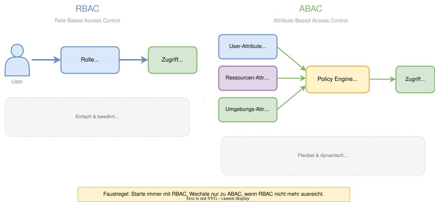
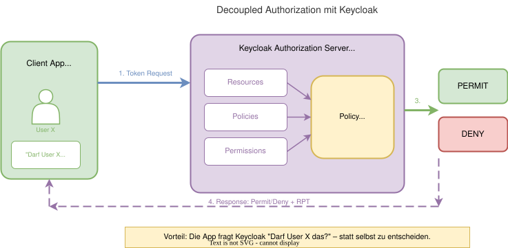
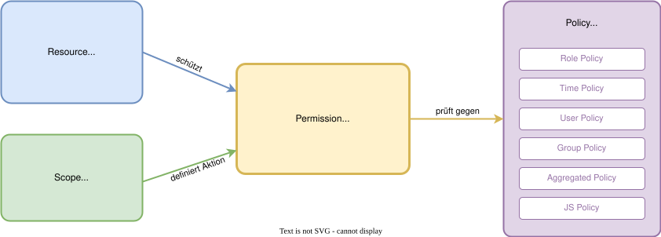
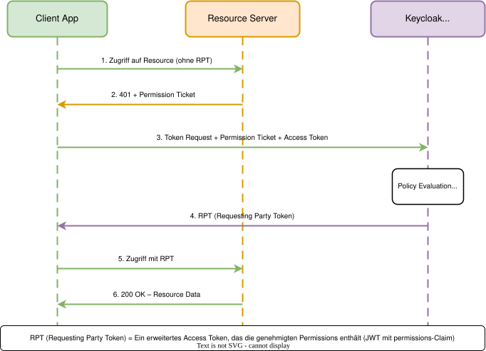

# Modul 08

## Zugriffskontrolle & Authorization Services

---

## Lernziele

Nach diesem Modul kannst du:

- Den Unterschied zwischen **RBAC** und **ABAC** erklären.
- Wissen, wann **Rollen allein nicht ausreichen** und Authorization Services nötig werden.
- Die **Authorization Services** von Keycloak aktivieren und nutzen.
- **Policies**, **Permissions** und **Resources** definieren.
- **Decision Strategies** und **Policy-Typen** verstehen.
- Das **Evaluate Tool** zum Testen von Zugriffsregeln einsetzen.

---

## 1. Rückblick: RBAC

In Modul 04 haben wir das Rollenkonzept kennengelernt:

**User → Group → Composite Role → Client Role**

### Wann reicht RBAC?

- Zugriff basiert auf **festen Rollen** (Manager, Editor, Viewer)
- Einfach zu verstehen und zu managen
- Gut für die meisten Anwendungsfälle

> **Faustregel:** Starte immer mit RBAC. Wechsle nur zu ABAC, wenn RBAC nicht mehr ausreicht.

---

## 2. Die Grenzen von RBAC

RBAC wird problematisch bei dynamischen Regeln:

| Anforderung | RBAC möglich? |
| ----------- | ------------- |
| "Manager dürfen Berichte lesen" | Ja |
| "Manager dürfen **nur eigene Abteilung** sehen" | Schwierig |
| "Zugriff **nur Mo-Fr 9-17 Uhr**" | Nein |
| "Nur aus dem **Firmennetzwerk**" | Nein |
| "Nur der **Ersteller** darf löschen" | Nein |

> **Wenn Rollen + Attribute + Kontext zusammenspielen müssen → ABAC.**

---

## 3. RBAC vs. ABAC im Vergleich



---

## 3.1 ABAC: Attribut-Typen

| Attribut-Typ | Beispiele | Quelle |
| ------------ | --------- | ------ |
| **User-Attribute** | Abteilung, Standort, Rolle | Keycloak User-Profil |
| **Ressourcen-Attribute** | Besitzer, Klassifizierung, Typ | Resource Server |
| **Umgebungs-Attribute** | Uhrzeit, IP-Adresse, Gerätetyp | Request-Kontext |

**Vorteil:** Extrem flexibel - beliebig kombinierbar.
**Nachteil:** Komplexer zu konfigurieren und zu debuggen.

---

## 4. Keycloak Authorization Services

Keycloak bietet einen vollwertigen **Authorization Server** (UMA 2.0 Standard).
Dies verlagert die Zugriffslogik aus der App heraus (**"Decoupled Authorization"**).

### Aktivieren:

1. Client muss **Client authentication: ON** sein (Confidential).
2. Schalter **Authorization Enabled: ON**.
3. Neuer Tab **Authorization** erscheint im Client-Menü.

> **Vorteil:** Die App fragt Keycloak "Darf User X das?" - statt selbst zu entscheiden.

---

## 4.1 Architektur: Decoupled Authorization



---

## 5. Core-Konzepte: Übersicht



---
<style scoped>
section {
    font-size: 1.6rem;
}
</style>

## 5.1 Resource

> "**WAS** wird geschützt?"

- Jede geschützte Einheit: API-Endpunkt, Seite, Dokument, etc.
- Hat einen **Namen** und optional einen **Typ**
- Kann **Scopes** zugeordnet bekommen

**Beispiele:**

| Resource | Typ |
| -------- | --- |
| "Vertrauliche Berichte" | `urn:docs:confidential` |
| "Premium-Bereich" | `urn:app:premium` |
| "API /users" | `urn:api:users` |

---
<style scoped>
section {
    font-size: 1.6rem;
}
</style>

## 5.2 Authorization Scope

> "**WAS** darf man mit der Resource tun?"

- Definiert **Aktionen** auf einer Resource
- Unabhängig von der Resource wiederverwendbar

**Typische Scopes:**

| Scope | Bedeutung |
| ----- | --------- |
| `read` | Lesen / Anzeigen |
| `write` | Erstellen / Bearbeiten |
| `delete` | Löschen |
| `manage` | Administrieren |

---
<style scoped>
section {
    font-size: 1.6rem;
}
</style>

## 5.3 Policy

> "**WER** darf es / **WANN** gilt es?"

Die Bedingung, die erfüllt sein muss:

| Policy-Typ | Beschreibung | Beispiel |
| ---------- | ------------ | -------- |
| **Role Policy** | User hat bestimmte Rolle | Rolle = `Manager` |
| **Time Policy** | Zeitbasierte Einschränkung | Mo-Fr 9-17 Uhr |
| **User Policy** | Bestimmter User | Nur User "Alice" |
| **Group Policy** | Gruppenmitgliedschaft | Gruppe "IT-Abteilung" |
| **Aggregated** | Kombination (AND/OR) | Rolle X **UND** Uhrzeit Y |
| **JS Policy** | Eigene Logik (JavaScript) | Benutzerdefinierte Regeln |

---
<style scoped>
section {
    font-size: 1.6rem;
}
</style>

## 5.4 JavaScript-basierte Policies

Für Fälle, die mit Standard-Policies nicht abbildbar sind:

```javascript
// Beispiel: Nur der Ersteller darf löschen
var context = $evaluation.getContext();
var identity = context.getIdentity();
var resource = $evaluation.getPermission().getResource();

if (resource.getOwner().equals(identity.getId())) {
    $evaluation.grant();
}
```

> **Sicherheitshinweis:** JS-Policies sind mächtig, aber auch riskant.
> In Keycloak müssen sie explizit via `--spi-policy-js-enabled=true` aktiviert werden.

---
<style scoped>
section {
    font-size: 1.6rem;
}
</style>

## 5.5 Permission

> "**Die Verknüpfung** von Resource + Scope + Policy"

- Bindet eine **Resource** (+ optional Scope) an eine oder mehrere **Policies**
- Ist der zentrale Baustein, der alles zusammenbringt

**Beispiel:**

| Feld | Wert |
| ---- | ---- |
| **Name** | "Manager Berichte lesen" |
| **Resource** | "Vertrauliche Berichte" |
| **Scope** | `read` |
| **Policy** | Aggregated: Role=Manager AND Time=Arbeitszeit |

---
<style scoped>
section {
    font-size: 1.4rem;
}
</style>

## 6. Decision Strategies

Wenn **mehrere Policies** an einer Permission hängen - wie wird entschieden?

| Strategy | Logik | Ergebnis |
| -------- | ----- | -------- |
| **Unanimous** | **Alle** Policies müssen PERMIT liefern | Strengste Option (Default) |
| **Affirmative** | **Mindestens eine** Policy muss PERMIT liefern | Lockerste Option |
| **Consensus** | **Mehrheit** der Policies muss PERMIT liefern | Demokratisch |

### Beispiel:

- Permission mit 3 Policies: Role=Manager (**PERMIT**), Time=Arbeitszeit (**DENY**), IP=Intern (**PERMIT**)
- **Unanimous:** DENY (nicht alle PERMIT)
- **Affirmative:** PERMIT (mindestens eine PERMIT)
- **Consensus:** PERMIT (2 von 3 = Mehrheit)

---
<style scoped>
section {
    font-size: 1.6rem;
}
</style>

## 6.1 Praxisbeispiel: Dokumentenverwaltung

**Szenario:** Vertrauliche Berichte sollen nur von Managern während der Arbeitszeit gelesen werden.

| Baustein | Konfiguration |
| -------- | ------------- |
| **Resource** | "Vertrauliche Berichte" |
| **Scope** | `read` |
| **Policy 1** | Role Policy: Rolle = `Manager` |
| **Policy 2** | Time Policy: Mo-Fr, 8:00-18:00 |
| **Aggregated Policy** | Policy 1 **AND** Policy 2 |
| **Permission** | Resource + Scope + Aggregated Policy |
| **Decision Strategy** | Unanimous (beide müssen PERMIT) |

---

## 7. UMA 2.0 & RPT-Flow

UMA 2.0 (User-Managed Access) ist der Standard hinter den Authorization Services.
Zentrales Konzept: der **RPT (Requesting Party Token)**.

### Was ist ein RPT?

- Ein **erweitertes Access Token** (JWT)
- Enthält einen `permissions`-Claim mit den genehmigten Zugriffsrechten
- Wird vom Authorization Server nach erfolgreicher Policy-Evaluation ausgestellt

---

## 7.1 UMA 2.0 Sequenz



---
<style scoped>
section {
    font-size: 1.4rem;
}
</style>

## 8. Evaluierung & Testing

Der Tab **Authorization → Evaluate** ist ein mächtiges Debugging-Tool.

### So funktioniert es:

1. **User auswählen** - z.B. "Max Mustermann"
2. **Resource wählen** - z.B. "Vertrauliche Berichte"
3. **Scope angeben** - z.B. `read`
4. **"Evaluate" klicken**

### Ergebnis:

- Keycloak zeigt: **PERMIT** oder **DENY**
- Detaillierte Aufschlüsselung: **welche Policy** hat gegriffen (oder nicht)
- Erlaubt **Debugging** komplexer Regelwerke ohne Code zu schreiben

> **Tipp:** Teste immer mit verschiedenen Usern und Szenarien, um unerwünschte Seiteneffekte zu finden.

---
<style scoped>
section {
    font-size: 1.6rem;
}
</style>

## 9. Wo wird autorisiert? Architekturvergleich

| Ansatz | Beschreibung | Wann sinnvoll? |
| ------ | ------------ | -------------- |
| **App-Level** | Spring Security, Express Middleware | Einfache Rollen-Checks, feingranulare Business-Logik |
| **Keycloak AuthZ** | Authorization Services (dieses Modul) | Zentrale Policy-Verwaltung, mandantenfähige Systeme |
| **API-Gateway** | Kong, Envoy, AWS API Gateway | Grobe Zugriffskontrolle am Eingang |

### Empfehlung:

- **Kombination:** Gateway für grobe Checks + Keycloak für Policy-basierte Entscheidungen + App für Business-Logik
- **Nicht entweder/oder**, sondern **Defense in Depth**
