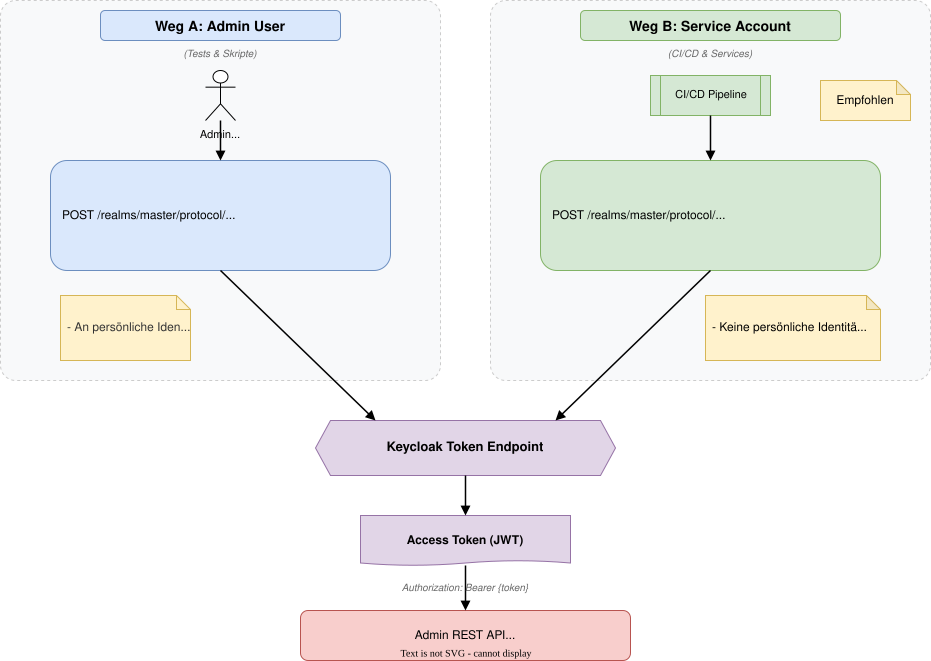
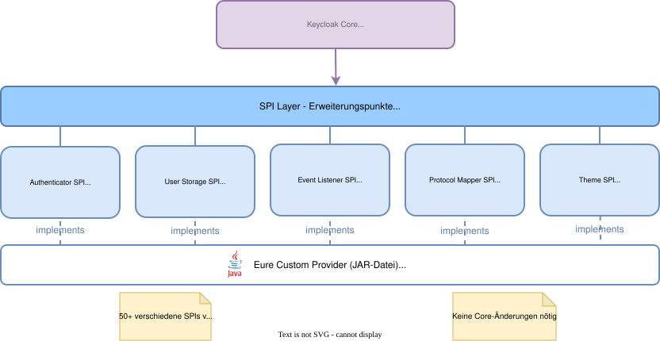

# Modul 09

## Anpassung – Theming, APIs & SPIs

---

## Lernziele

Nach diesem Modul kannst du:

- Die **Theme-Struktur** von Keycloak verstehen.
- Ein eigenes **Login-Theme** erstellen (Logo, CSS, Texte).
- **Theme Inheritance** (Vererbung) nutzen, um Updates zu erleichtern.
- Die **Admin REST API** nutzen, um Keycloak zu automatisieren.
- Eine Vorstellung davon haben, was **SPIs (Service Provider Interfaces)** sind.

---

## 1. Wie funktionieren Themes?

Keycloak nutzt **Freemarker Templates (.ftl)** für HTML und **Properties-Dateien** für Konfiguration und Texte.

- **Trennung von Code und Design:** Du musst kein Java kompilieren, um das Logo zu ändern.
- **Vererbung:** Themes können von anderen Themes erben (`parent=keycloak`).
  - Du überschreibst nur das, was du ändern willst (z.B. nur `styles.css`).
  - Bleibt Update-sicher(er).

---

## 2. Verzeichnisstruktur & Typen

Standardpfad: `/themes/` (oder im Classpath/JAR).

Vier Haupt-Typen von Themes:

1. **login:** Alles rund um Anmeldung, Registrierung, Passwort vergessen.
2. **account:** Das User-Self-Service Portal.
3. **admin:** Die Admin-Konsole (selten angepasst).
4. **email:** Text/HTML Templates für System-Mails (Reset Password, Verify Email).

---

## 3. Ein eigenes Theme erstellen

**Best Practice Workflow:**

1. Kopiere niemals den `base` Theme Ordner.
2. Lege einen neuen Ordner an: `/themes/my-company/login`.
3. Erstelle `theme.properties`:

   ```properties
   parent=keycloak
   import=common/keycloak
   styles=css/my-styles.css
   ```

4. Lege deine CSS-Datei und Bilder ab.
5. Aktiviere das Theme im Realm (*Realm Settings -> Themes*).

---

## 4. Messages & Internationalisierung

Keycloak unterstützt viele Sprachen out-of-the-box.

**Aktivieren:**

- *Realm Settings -> Themes -> Internationalization Enabled: ON*.
- Wähle unterstützte Locales (de, en, es...).

**Texte anpassen:**

- Erstelle `messages_de.properties` in deinem Theme-Ordner.
- Überschreibe Keys:

  ```properties
  loginTitle=Willkommen bei Firma XY
  ```

---

## 5. E-Mail Templates

Liegen unter `/themes/my-company/email`.

- Dateien: `password-reset.ftl`, `email-verification.ftl`, etc.
- Unterstützen HTML und Plain Text.
- Vorsicht bei HTML-Mails: Teste in verschiedenen Mail-Clients!
- **Tipp:** Nutze das *Email Theme* setting im Realm, um das Branding auch in Mails konsistent zu haben.

---

## 6. Die Admin REST API

Fast alles, was man in der GUI machen kann, geht auch per REST.

- **Basis-URL:** `/admin/realms/{realm}`
- **Dokumentation:** [Keycloak API Docs](https://www.keycloak.org/docs-api/latest/rest-api/)
- **Anwendungsfälle:**
  - Automatisches Anlegen von Realms/Clients (CI/CD).
  - User-Synchronisation aus Drittsystemen.
  - Skript-gesteuerte Rollenzuweisung.

---
<style scoped>
section {
    font-size: 1.6rem;
}
</style>
## 7. Authentifizierung an der API

Um die Admin API zu nutzen, braucht man ein **Access Token** mit entsprechenden Rechten (z.B. `realm-admin` oder `manage-users`).

### Weg A: Admin User (für Tests/Skripte)

- Login via `username`/`password` (Grant Type: Password).
- Nachteil: Hängt an einer persönlichen Identität.

### Weg B: Service Account (für Services)

- Client (`admin-cli` oder eigener Client) als **confidential** anlegen.
- Service Accounts Enabled: ON.
- Service Account Roles: `realm-admin` (oder feingranular).
- Login via `client_id`/`client_secret` (Grant Type: Client Credentials).

---



---
## 7.1 Der Java Admin Client

Keycloak bietet eine offizielle Java-Bibliothek, die REST-Calls kapselt.

```java
Keycloak keycloak = KeycloakBuilder.builder()
    .serverUrl("https://sso.example.com")
    .realm("master")
    .clientId("admin-cli")
    .username("admin")
    .password("password")
    .build();

// User suchen
List<UserRepresentation> users = keycloak.realm("demo").users().search("alice");
```

> Erspart das manuelle Bauen von HTTP-Requests.

---

## 8. SPIs (Service Provider Interfaces)

Keycloak ist extrem modular. Fast alles ist austauschbar durch Java-Plugins (JARs).

Wichtige SPIs:

- **User Storage SPI:** User aus SQL-Legacy-Datenbanken oder CSV laden (ohne Import).
- **Event Listener SPI:** Events (Logins) an Splunk/Kafka senden.
- **Protocol Mapper SPI:** Komplexe Logik für Token-Inhalte.
- **Authenticator SPI:** Eigene Login-Schritte (z.B. SMS-OTP Provider).

> **Deployment:** JAR in `/providers` Ordner legen und `kc.sh build` ausführen.

---

## 8. SPI-Architektur: Überblick



---

## Zusammenfassung

- **Themes** erlauben CI/CD-konformes Branding (Login, Email).
- Nutze immer **Inheritance** (`parent=keycloak`).
- Die **Admin REST API** ist mächtig für Automatisierung (Infrastructure as Code).
- Nutze **Service Accounts** für Maschinen-Zugriffe auf die API.
- **SPIs** erlauben tiefgreifende Anpassungen (Java-Kenntnisse nötig).
