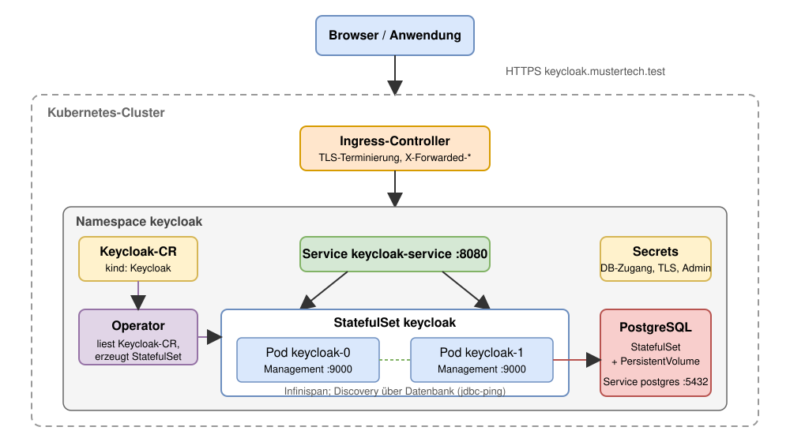

# Modul 11

## Keycloak auf Kubernetes

---

## Lernziele

Nach diesem Modul kannst du:

- Die **Grundarchitektur** eines Keycloak-Deployments auf Kubernetes benennen.
- Den **Keycloak Operator** und seine Custom Resources einsetzen.
- **Ingress**, **TLS** und **Hostname** so konfigurieren, dass Redirects und Token stimmen.
- Eine externe **Datenbank** über Secrets anbinden.
- Keycloak **skalieren** und die **Cluster-Bildung** über Infinispan nachvollziehen.
- **Backup**, **Upgrades** und **Monitoring** im Cluster planen.

---

## 1. Warum Kubernetes?

Keycloak hält seinen Zustand in der Datenbank. Die Pods sind austauschbar.

- Ein Pod kann jederzeit ersetzt werden; die Daten bleiben in der Datenbank.
- Skalierung ist eine Zahl in der Konfiguration (`instances: 3`).
- Fällt ein Pod aus, startet Kubernetes ihn neu.
- Ein Rolling Update tauscht die Pods nacheinander; der Login bleibt erreichbar.
- Die gesamte Konfiguration liegt als YAML im Git-Repository.

> **Merke:** Keycloak hält keinen Zustand. Verfügbarkeit und Backup hängen an der Datenbank.

---



---
<style scoped>
section {
    font-size: 1.5rem;
}
</style>

## 1.1 Die Bausteine

| Ressource | Aufgabe |
| --- | --- |
| **Ingress** | Nimmt HTTPS von außen an, terminiert TLS, leitet an den Service weiter |
| **Service** | Stabiler DNS-Name und Load Balancing auf die Pods |
| **StatefulSet** | Betreibt die Keycloak-Pods mit stabilen Namen (`keycloak-0`, `keycloak-1`) |
| **Headless Service** | Liefert die Pod-IPs für die JGroups-Cluster-Bildung |
| **Secret** | Datenbank-Zugangsdaten, TLS-Zertifikate, Admin-Passwort |
| **PostgreSQL** | Außerhalb des Keycloak-StatefulSets: eigener Operator oder externer Dienst |

---
<style scoped>
section {
    font-size: 1.5rem;
}
</style>

## 2. Deployment-Wege

| Weg | Was du bekommst | Wann sinnvoll |
| --- | --- | --- |
| **Keycloak Operator** | Upstream, CRDs `Keycloak` und `KeycloakRealmImport`, Rolling Updates | Standardfall |
| **Helm Chart** (codecentric, Bitnami) | Klassisches Templating, viele Werte | Bestehende Helm-Landschaft |
| **Eigene Manifeste** | Volle Kontrolle über StatefulSet und Config | Sonderfälle, die die CR nicht abbildet |

Der Bitnami-Katalog liegt seit 2025 im Legacy-Bereich; der codecentric-Chart ist ein Community-Projekt.
Der Operator wird vom Keycloak-Team mit jeder Version veröffentlicht.

---
<style scoped>
section {
    font-size: 1.5rem;
}
</style>

## 2.1 Der Keycloak Operator

Ein Operator ist ein Controller, der eine **Custom Resource** in Standard-Ressourcen übersetzt.

**Installation:** CRDs und Operator per `kubectl apply` aus `keycloak-k8s-resources`, Version gleich Keycloak.

**Was der Operator übernimmt:**

- **StatefulSet, Services, Secrets** aus der CR erzeugen und aktuell halten.
- **Bootstrap-Admin** als Secret `<name>-initial-admin` anlegen.
- **Cache-Stack** `kubernetes` und DNS-Discovery konfigurieren.
- **Probes** auf dem Management-Port setzen.
- **Upgrades** ausrollen und dabei die Kompatibilität der Konfiguration prüfen.

---
<style scoped>
section {
    font-size: 1.5rem;
}
</style>

## 2.2 Die Keycloak-CR

```yaml
apiVersion: k8s.keycloak.org/v2alpha1
kind: Keycloak
spec:
  instances: 2
  db:
    vendor: postgres
    host: postgres
    usernameSecret: { name: postgres-credentials, key: username }
    passwordSecret: { name: postgres-credentials, key: password }
  hostname:
    hostname: https://keycloak.mustertech.test
  http:
    httpEnabled: true
  proxy:
    headers: xforwarded
  additionalOptions:
    - name: metrics-enabled
      value: "true"
```

Jede `kc.sh`-Option, die kein eigenes Feld hat, geht über `additionalOptions`.

---
<style scoped>
section {
    font-size: 1.5rem;
}
</style>

## 3. Ingress und TLS

Zwei Muster, wo TLS endet:

| Muster | Ablauf | Konsequenz |
| --- | --- | --- |
| **Terminierung am Ingress** | Ingress entschlüsselt, HTTP im Cluster | Keycloak braucht `proxy.headers: xforwarded` |
| **Re-Encrypt / Passthrough** | TLS bis zum Pod, `http.tlsSecret` in der CR | Zertifikat liegt im Pod, Rotation nötig |

**cert-manager** stellt Zertifikate aus (Let's Encrypt, interne CA) und erneuert sie als Secret.

Mit `proxy.headers` vertraut Keycloak den Headern.

Ein ohne Ingress erreichbarer Pod nimmt deshalb auch gefälschte `X-Forwarded-*`-Header an.

---

## 3.1 Hostname

Keycloak baut aus dem Hostnamen den **Issuer** im Token und jede **Redirect-URL**.

- **`hostname.hostname`:** Öffentliche URL (z.B. `https://keycloak.mustertech.test`).
- **`hostname.admin`:** Optional eine separate URL für die Admin-Konsole (z.B. nur intern).
- **`hostname.strict`:** Ohne Hostname startet Keycloak in Produktion nicht.

Ein falscher Hostname zeigt sich erst beim Login als Redirect auf eine interne Adresse und als Issuer, den keine App kennt.

---

## 4. Datenbank

- **Kein H2:** Der eingebettete Speicher ist nur für `start-dev`.
- **Zugangsdaten als Secret:** Die CR referenziert `usernameSecret` und `passwordSecret`.
- **Außerhalb des Keycloak-StatefulSets:** Eigener Lebenszyklus, eigenes Backup.
- **Optionen im Cluster:**
  - **CloudNativePG:** PostgreSQL-Operator mit Replikation, Failover und Backup nach S3.
  - **Managed Service:** RDS, Cloud SQL, Azure Database.
- **Connection Pool:** `db.poolMinSize` / `poolMaxSize` in der CR; pro Instanz.

---
<style scoped>
section {
    font-size: 1.5rem;
}
</style>

## 5. Skalierung und Hochverfügbarkeit

- **`instances: 3`** startet drei Pods, verteilt über die Knoten.
- **Infinispan** repliziert Caches; die Mitglieder finden sich per DNS über den Headless Service.
- **`cache-stack=kubernetes`** und `jgroups.dns.query` setzt der Operator selbst.
- **Persistente Sessions:** Seit Keycloak 26 in der Datenbank; ein Pod-Ausfall beendet keine Sitzung.
- **Sticky Sessions** am Ingress sind nicht mehr nötig, sparen aber Cache-Zugriffe.
- **PodDisruptionBudget:** Ein Node-Drain trifft nie alle Pods gleichzeitig.
- **Ressourcen:** Heap über `JAVA_OPTS_KC_HEAP`; Requests und Limits in `spec.resources`.

---
<style scoped>
section {
    font-size: 1.5rem;
}
</style>

## 5.1 Probes und Metriken

Der **Management-Port 9000** trägt Health und Metriken, getrennt vom Anwendungs-Port.

| Endpoint | Zweck |
| --- | --- |
| `/health/started` | Startup Probe: JVM und Konfiguration geladen |
| `/health/live` | Liveness Probe: Prozess reagiert |
| `/health/ready` | Readiness Probe: Datenbank erreichbar; erst dann kommt Traffic |
| `/metrics` | Prometheus-Format: JVM, Datenbank-Pool, Logins |

- **`spec.serviceMonitor.enabled: true`** erzeugt den `ServiceMonitor` für Prometheus.
- Der Management-Port gehört nicht in den Ingress.

---
<style scoped>
section {
    font-size: 1.5rem;
}
</style>

## 6. Backup und Restore im Cluster

| Was | Wie |
| --- | --- |
| **Datenbank** | Backup des DB-Operators (CloudNativePG nach S3) oder `pg_dump` als CronJob |
| **Realm-Konfiguration** | `KeycloakRealmImport`-CRs im Git-Repository; Export per `kc.sh export` als Job |
| **Secrets** | TLS-Zertifikate, DB-Zugang, Signatur-Keys: Sealed Secrets oder External Secrets |
| **CRs** | Alle Manifeste versioniert; der Cluster ist aus Git wiederherstellbar |

Ein Restore auf ein Testsystem gehört in den regelmäßigen Betrieb.

---

## 7. Betrieb

- **Upgrades:** Neues Image in der CR; der Operator wählt Rolling Update oder Neustart (`spec.update.strategy`).
- **Logging:** JSON nach stdout (`log-console-output=json`), eingesammelt vom Cluster-Logging.
- **Isolation:** Ein Namespace pro Instanz; `spec.networkPolicy` lässt nur Ingress und Monitoring zu.
- **Secrets extern:** External Secrets Operator holt Zugangsdaten aus Vault oder Cloud-KMS.
- **GitOps:** Argo CD oder Flux wenden die CRs an; die Admin-Konsole bleibt für Nutzerdaten.

---

## Zusammenfassung

- **Keycloak ist stateless**, die Datenbank hält den Zustand.
- Der **Operator** übersetzt die `Keycloak`-CR in StatefulSet, Services und Secrets.
- **Ingress** terminiert TLS; `proxy.headers` und `hostname` müssen zusammenpassen.
- **Skalierung** ist eine Zahl in der CR; persistente Sessions überstehen den Pod-Wechsel.
- **Management-Port 9000** trägt Probes und Metriken.
- **Realm-Konfiguration** liegt als `KeycloakRealmImport` in Git.
