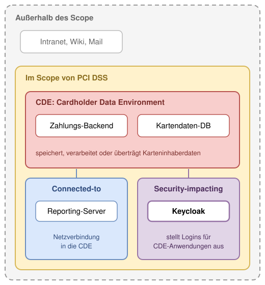

# Modul 12

## Keycloak und PCI DSS

---

## Lernziele

Nach diesem Modul kannst du:

- Den **Scope** von PCI DSS bestimmen und Keycloak darin einordnen.
- Die **Anforderungen 7, 8 und 10** auf konkrete Keycloak-Einstellungen abbilden.
- **Passwort-Policy**, **Sperrverhalten** und **Session-Timeouts** auf die Grenzwerte setzen.
- **MFA** ohne Ausnahme erzwingen, auch für die Admin-Konsole.
- Admin-Rechte mit **Admin Permissions** auf einzelne Operationen beschränken.
- Ein **Audit-Log** konfigurieren, das die Pflichtfelder und die Aufbewahrung erfüllt.
- Benennen, was Keycloak **nicht** abdeckt und außerhalb geregelt werden muss.

---

## 1. Was ist PCI DSS?

Der **Payment Card Industry Data Security Standard** ist das Regelwerk der Kartenorganisationen.

Er gilt für jede Organisation, die Karteninhaberdaten speichert, verarbeitet oder überträgt.

- **Version:** 4.0.1, seit Juni 2024. Alle zuvor „future-dated" Anforderungen sind seit März 2025 Pflicht.
- **Zwölf Anforderungen** in sechs Zielen, von Netzwerksicherheit bis Richtlinien.
- **Nachweis:** Selbstauskunft (SAQ) oder Prüfung durch einen **QSA** (Qualified Security Assessor).
- **Wer entscheidet:** Der QSA legt aus, was im Einzelfall genügt. Diese Folien ordnen Anforderungen Einstellungen zu.

---

## 1.1 Scope: Wo steht Keycloak?

Die **CDE** (Cardholder Data Environment) umfasst alle Systeme mit Karteninhaberdaten.

Im Scope sind zusätzlich:

- **Connected-to:** Netzverbindung in die CDE.
- **Security-impacting:** beeinflusst die Sicherheit der CDE.

Ein IdP, der Logins für CDE-Anwendungen ausstellt, ist **security-impacting** und damit im Scope.

---

## 2. Die zwölf Anforderungen und Keycloak

| Nr. | Anforderung | Keycloak-Relevanz |
| --- | --- | --- |
| 1 | Netzwerk-Sicherheitskontrollen | Gering: Firewall um Keycloak und DB |
| 2 | Sichere Konfigurationen | **Mittel:** keine Default-Zugangsdaten, Prod-Modus |
| 3 | Gespeicherte Kontodaten schützen | Keine: Keycloak speichert keine Kartendaten |
| 4 | Verschlüsselung in Transit | **Mittel:** TLS, `sslRequired` |
| 5 | Schutz vor Malware | Keine |
| 6 | Sichere Systeme und Software | **Mittel:** Patch-Zyklus, Security Header |
| 7 | Zugriff nach Need-to-know | **Hoch:** Rollen, Admin Permissions |
| 8 | Identifizierung und Authentifizierung | **Hoch:** das Kernthema |
| 9 | Physischer Zugang | Keine |
| 10 | Protokollierung und Überwachung | **Hoch:** Events, Retention |
| 11 | Sicherheitstests | Gering: Keycloak im Pentest-Scope |
| 12 | Richtlinien und Programme | Keine: Organisation |

---

## 3. Anforderung 8: Identität

| Punkt | Verlangt | In Keycloak |
| --- | --- | --- |
| **8.2.1** | Eindeutige ID pro Person | Ein User pro Person, keine Sammelkonten |
| **8.2.2** | Gemeinsame Konten nur mit Ausnahme | Service Accounts nur für Systeme |
| **8.2.5** | Zugang bei Austritt sofort weg | `Enabled: Off` beendet auch aktive Sessions |
| **8.2.6** | Inaktiv nach 90 Tagen deaktiviert | Kein Feld „letzter Login": Workflow oder externes Skript |
| **8.2.8** | Re-Auth nach 15 Minuten Inaktivität | `SSO Session Idle: 15 min` |

> **Merke:** Keycloak kennt den letzten Login nur über Events. Die 90-Tage-Regel braucht einen Prozess dahinter.

---

## 3.1 Anforderung 8: Passwörter

| Punkt | Verlangt | In Keycloak |
| --- | --- | --- |
| **8.3.4** | Sperre nach ≤10 Fehlversuchen, ≥30 min | Brute Force `10` / `30 min` |
| **8.3.5** | Erstpasswort einmalig | Credential `Temporary: On` |
| **8.3.6** | ≥12 Zeichen, Buchstaben und Ziffern | `length(12)`, `digits(1)`, `lowerCase(1)`, `upperCase(1)` |
| **8.3.7** | Keines der letzten 4 | `passwordHistory(4)` |
| **8.3.9** | Wechsel alle 90 Tage, falls einziger Faktor | `forceExpiredPasswordChange(90)` |
| **8.3.11** | Faktoren nicht teilbar | Ein OTP pro User |

Eine Policy greift bei der nächsten Passwortänderung; `Expire password` erzwingt sie für Bestandsnutzer.

---

## 3.2 Anforderung 8: MFA

- **8.4.1** MFA für jeden Admin-Zugang: Realm `master` mit `OTP Form: Required`.
- **8.4.2** MFA für jeden Zugang zur CDE: `Required` statt `Conditional` im Browser-Flow.
- **8.4.3** MFA für Remote-Zugang ins Firmennetz: VPN gegen Keycloak per OIDC oder RADIUS-Bridge.
- **8.5.1** MFA nicht umgehbar, replay-resistent, zwei verschiedene Faktortypen:
  - **Look ahead window** `1`, **Reusable token** `Off`.
  - Kein Flow-Pfad ohne zweiten Faktor: Conditional-Subflows deaktivieren.
  - **WebAuthn** erfüllt Besitz und Phishing-Resistenz zugleich.

Ein `Required` OTP Form erzwingt bei Usern ohne OTP die Einrichtung beim nächsten Login.

---

## 3.3 Anforderung 8: System-Accounts

- **8.6.1** Interaktiver Login nur mit Begründung: `Direct access grants: Off` bei Service Accounts.
- **8.6.2** Keine Secrets in Skripten: Secret aus Vault oder Kubernetes Secret, nie im Code.
- **8.6.3** Secrets rotieren: Client Policy mit Executor `secret-rotation`.
  - **Secret Expiration:** Laufzeit des aktiven Secrets.
  - **Rotated Secret Expiration:** Übergangsfrist, in der das alte Secret weiter gilt.
  - Rotation über die Admin-API aus dem Secret-Manager heraus auslösbar.

Alternativ **Client Authentication** per Signed JWT oder mTLS; dann entfällt die Rotation.

---

## 4. Anforderung 7: Zugriff nach Need-to-know

- **7.2.1** Least Privilege: `realm-admin` nur für wenige, alles andere feiner.
- **Admin Permissions:** Rechte pro Ressourcentyp und Operation.
  - Helpdesk: `view` + `reset-password` auf Users, sonst nichts.
  - Abteilungsadmin: `manage-members` auf eine Gruppe.
  - Konsolenzugang über `query-users`, `query-groups`, `query-clients`.
- **Realm `master`** nur für Plattform-Admins; Fach-Admins in der Realm-Konsole (`/admin/<realm>/console/`).
- **`hostname.admin`:** Admin-Konsole auf eine interne Adresse legen.
- **7.2.4** Halbjährlicher Rechte-Review: die Admin-API liefert die Liste.

---

## 5. Anforderung 10: Protokollierung

| Punkt | Verlangt | In Keycloak |
| --- | --- | --- |
| **10.2.1** | Logins, Admin-Aktionen, Fehlversuche, Credential-Änderungen | User und Admin Events mit Representation |
| **10.2.2** | Wer, Was, Wann, Erfolg, Herkunft, Ziel | `userId`, `type`, `time`, `error`, `ipAddress`, `clientId` |
| **10.3** | Logs vor Änderung geschützt | Datenbank-Rechte, Export ins Log-System |
| **10.4** | Tägliche Auswertung sicherheitsrelevanter Events | `LOGIN_ERROR`-Spitzen, Admin Events, SIEM-Regeln |
| **10.5.1** | 12 Monate, 3 Monate sofort verfügbar | `Expiration: 90 d` + `jboss-logging` nach stdout |
| **10.6** | Zeitsynchronisation | NTP auf den Hosts, nicht in Keycloak |

`jboss-logging` schreibt Logins auf `DEBUG`; für das Log-System `--spi-events-listener--jboss-logging--success-level=info`.

---

## 6. Anforderungen 2, 4 und 6

- **2.2.2** Keine Default-Zugangsdaten: temporären Bootstrap-Admin ersetzen, `admin/admin` nur im Lab.
- **2.2.4** Nur nötige Funktionen: ungenutzte Features und Protokolle abschalten, `start` statt `start-dev`.
- **4.2.1** Starke Kryptografie in Transit: TLS ≥1.2 (`https-protocols`), `sslRequired: all`, HSTS am Proxy.
- **4.2.1** Auch intern: Keycloak ↔ Datenbank per TLS.
- **6.3.3** Kritische Patches innerhalb eines Monats: Keycloak-Releases verfolgen, Operator-Upgrade (Modul 11).
- **6.4.1** Schutz vor Web-Angriffen: CSP, X-Frame-Options, CORS (Modul 10).

---

## 7. Was Keycloak nicht liefert

| Lücke | Warum | Weg außenrum |
| --- | --- | --- |
| **Letzter Login am User** | Kein Attribut, nur Events | Workflow `disable-user` oder Skript über Events |
| **12 Monate Log-Retention** | Realm-Wert, Datenbank wächst | Export nach stdout, Log-System hält 12 Monate |
| **Zeitsynchronisation** | Keycloak nutzt die Systemzeit | NTP auf Hosts und Knoten |
| **Rechte-Review** | Kein eingebauter Report | Admin-API abfragen, Ergebnis dokumentieren |
| **Prozesse** | Eintritt, Austritt, Ausnahmen | Anforderung 12: Richtlinien der Organisation |

In allen fünf Fällen liefert Keycloak die Daten. Den Prozess dahinter regelt die Organisation.

---

## 8. Audit-Checkliste

Das Lab arbeitet eine Checkliste ab: Soll, Ist vorher, Ist nachher und das, was außerhalb bleibt.

| Nr. | Soll | Einstellung | Vorher | Nachher | Außerhalb |
| --- | --- | --- | --- | --- | --- |
| 8.3.4 | ≤10 Versuche, ≥30 min | Brute force | 5 / 15 min | 10 / 30 min | |
| 8.3.6 | ≥12 Zeichen | Password policy | `length(10)` | `length(12)` | |
| 8.4.2 | MFA für alle | OTP Form | Conditional | Required | Welche Clients sind CDE? |
| 10.5.1 | 12 Monate | Expiration, Log-System | 7 Tage | 90 Tage, stdout | Log-System |

Die ausgefüllte Liste ist das Arbeitsdokument für das Gespräch mit dem QSA.

---

## Zusammenfassung

- Keycloak ist im **Scope**, sobald es Logins für die CDE ausstellt.
- **Anforderung 8** ist bis auf 8.2.6 in Keycloak einstellbar: Policy, Sperre, Sessions, MFA.
- **Anforderung 7** erfüllen Admin Permissions statt breiter Admin-Rollen.
- **Anforderung 10** braucht Events plus ein Log-System für die Aufbewahrung.
- **Nicht in Keycloak:** die fünf Lücken aus Abschnitt 7. Sie stehen in der Checkliste.
