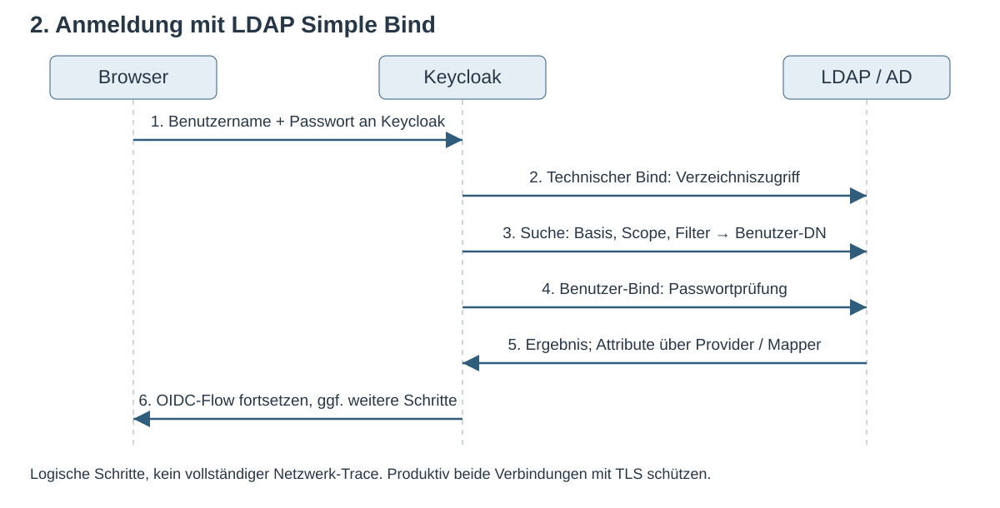

# Modul 07: Vertiefung

## LDAP, Active Directory und Keycloak

Vom Verzeichnis zum Login und zur Berechtigung · 90 Minuten

---

## Lernziele

Nach diesem Modul kannst du:

- **LDAP-Suchen** anhand von Basis, Scope und Filter erklären.
- **Bind-Konto und Benutzerlogin** auseinanderhalten.
- **Import, Cache und Tokens** bei Änderungen getrennt betrachten.
- Eine OpenLDAP-Konfiguration auf ihre **AD-Annahmen** prüfen.

---

## 1. Ein Verzeichnis lesen

LDAP ist ein Protokoll zum Abfragen und Verwalten von Verzeichniseinträgen.

```text
dc=mustertech,dc=de
├── ou=users
│   ├── uid=hans.mueller
│   └── uid=anna.schmidt
└── ou=groups
    ├── cn=entwicklung
    └── cn=vertrieb
```

**Eintrag:** Attribute wie `uid`, `mail`, `givenName` und `objectClass`.
**Gruppe im Lab:** `member` enthält den vollständigen DN des Mitglieds.

---

## 1.1 Name, Suchbasis und stabile ID

| Begriff         | Beispiel / Bedeutung                                    |
| --------------- | ------------------------------------------------------- |
| DN              | `uid=hans.mueller,ou=users,dc=mustertech,dc=de`         |
| RDN             | `uid=hans.mueller`, relativ zum übergeordneten Eintrag  |
| Base DN         | `ou=users,dc=mustertech,dc=de`, Ausgangspunkt der Suche |
| Stabile LDAP-ID | Im Lab `entryUUID`, bei AD typischerweise `objectGUID`  |

Beim Verschieben kann sich der DN ändern. Die ID desselben Objekts bleibt erhalten.
LDAP-ID, Keycloak-Benutzer-ID und OIDC-Subject sind unterschiedliche Bezeichner.

---

## 1.2 Eine Suche braucht drei Entscheidungen

- **Basis:** Unter welchem Eintrag beginnt die Suche?
- **Scope:** Nur dieser Eintrag, direkte Kinder oder der ganze Teilbaum?
- **Filter:** Welche Attribute müssen passen, etwa `(uid=hans.mueller)`?

**Vorhersage:** Was liefert derselbe Filter unter `ou=groups`?

Ein erfolgreicher LDAP-Aufruf kann null Treffer liefern.

---

## 2. Zwei verschiedene Anmeldungen am LDAP

Ein Bind authentifiziert eine Verbindung gegenüber dem LDAP-Server.

| Identität              | Zweck                                           |
| ---------------------- | ----------------------------------------------- |
| Technisches Bind-Konto | Benutzer und benötigte Attribute suchen / lesen |
| Gefundener Benutzer    | Sein eingegebenes Passwort per Bind überprüfen  |

**Test authentication** prüft die konfigurierten Bind-Zugangsdaten.
Ein erfolgreicher Test belegt noch keinen erfolgreichen Benutzerlogin.

---



---

## 2.1 Drei Zustände und ein Token

- **LDAP:** Benutzer, Passwortprüfung und LDAP-verwaltete Zugehörigkeiten
- **Lokaler Import:** Dauerhafte Benutzerdaten mit Verknüpfung zum LDAP-Provider
- **User Cache:** Zwischengespeicherte Sicht, zusätzlich zum Import
- **Access Token:** Bereits ausgestellte Claims ändern sich nicht nachträglich

Im READ_ONLY-Lab werden LDAP-Passwörter nicht nach Keycloak kopiert.
Eine bestehende SSO-Sitzung kann eine erneute Passwortprüfung vermeiden.

---

## 2.2 Wer darf Daten verändern?

| Edit Mode | Bedeutung                                                       |
| --------- | --------------------------------------------------------------- |
| READ_ONLY | Über diesen Provider keine Änderungen an LDAP-verwalteten Daten |
| WRITABLE  | Unterstützte Änderungen können ins LDAP geschrieben werden      |
| UNSYNCED  | Änderungen können lokal bleiben, auch lokal gesetzte Passwörter |

**Zusätzlich prüfen:** Import Users, Attribut-Mapper und tatsächliche LDAP-Rechte.
Ein späterer Moduswechsel baut vorhandene Mapper nicht automatisch passend um.

---

## 3. Selbst bearbeiten: Lab 07c · 30 Minuten

1. Verzeichnis lesen und Benutzerquelle anbinden.
2. Benutzer importieren und einen frischen Login testen.
3. Gruppen-Mapper einrichten und Gruppen auf Rollen abbilden.

**Nachweise:** Richtiger Vorname, Federation Link und geerbte Rolle.

Eine Person erklärt jeweils, was der nächste Klick bewirken soll.

---

## 3.1 Gegenproben · 15 Minuten

**A: Suche**
Gleicher Bind, gleicher Filter, andere Suchbasis. Erst vorhersagen, dann ausführen.

**B: Gruppenrecht**
Anna vorübergehend zu `entwicklung` hinzufügen. LDAP und Keycloak getrennt prüfen,
gezielt aktualisieren und die Änderung zurücknehmen.

**Frage:** Was geschieht dabei mit einem bereits ausgestellten Token?

---

## 4. Welches Microsoft-System ist gemeint?

| System / Verfahren               | Einordnung                                             |
| -------------------------------- | ------------------------------------------------------ |
| Active Directory Domain Services | Verzeichnisdienst, unter anderem LDAP und Kerberos     |
| Microsoft Entra ID               | Cloud-Identitätsdienst, etwa über OIDC/SAML angebunden |
| Microsoft Entra Domain Services  | Verwaltete Domänendienste; von Entra ID unterscheiden  |

**Entscheidung:** Benutzerquelle direkt anbinden oder einem externen IdP vertrauen?

---

## 4.1 AD ist mehr als ein anderer Servername

- **Login:** `sAMAccountName` oder bewusst gewählter `userPrincipalName`
- **Objekt-ID:** `objectGUID`; ein DN oder eine E-Mail ist kein Ersatz
- **Gruppen:** Direkte und verschachtelte Mitgliedschaft unterscheiden
- **Kontozustand:** MSAD User Account Mapper und Passwortzustände prüfen

Ein UPN muss nicht der Mail-Adresse entsprechen.
Bei mehreren Domänen muss die Kontozuordnung eindeutig bleiben.

---

## 4.2 Eine Sperre wirkt auf mehreren Ebenen

Anna verliert eine AD-Gruppe oder ihr Konto wird deaktiviert.

1. Ist die Änderung im verwendeten Verzeichnis sichtbar?
2. Wann laden Keycloak und seine Mapper den neuen Zustand?
3. Was passiert bei neuem Login, bestehendem SSO und Refresh?
4. Was akzeptiert die API mit einem vorhandenen Token noch?

Die produktive Sperrwirkung braucht Tests und eine vereinbarte Zeitgrenze.

---

## 4.3 TLS und Betriebszugang

- **LDAPS:** TLS ab Verbindungsbeginn, typischerweise Port `636`
- **StartTLS:** Upgrade einer LDAP-Verbindung, typischerweise auf Port `389`
- **Vertrauen:** Zertifikatskette, Servername, Gültigkeit und Truststore prüfen
- **Bind-Konto:** Nur die benötigten Rechte, getrennt von der Benutzerprüfung

Im lokalen Lab nutzen wir vereinfachte Zugänge.
READ_ONLY in Keycloak ersetzt keine Berechtigungsbegrenzung im LDAP.

---

## 4.4 Windows-SSO ist ein eigener Anmeldeweg

Kerberos/SPNEGO kann eine vorhandene Windows-Anmeldung für Keycloak nutzbar machen.

- **Dienstidentität:** Service Principal und Keytab
- **Umgebung:** Passendes DNS und abgestimmte Zeit
- **Browser:** Kerberos-Nutzung für den Dienst zulassen
- **Keycloak:** Kerberos-Anmeldung und Benutzerzuordnung konfigurieren

LDAP-Federation allein aktiviert diesen Ablauf nicht.

---

## 4.5 Abschluss: Fünf Antworten ohne Admin-Konsole

- Warum kann Test authentication erfolgreich sein und Hans trotzdem nicht einloggen?
- Was ändert ein OU-Wechsel an Suche und Identität?
- Welche Wirkung hat Gruppenentzug auf ein vorhandenes JWT?
- Welche Einstellung fehlt für verschachtelte Gruppen möglicherweise?
- Warum reicht LDAP-Anbindung nicht für Windows-SSO?

AD-spezifisches Verhalten muss an der tatsächlichen AD-Umgebung erprobt werden.

---

## Quellen

- [LDAP-Federation und Mapper, Keycloak 26.5.0][ldap]
- [Keycloak: Kerberos][kerberos]
- [Microsoft: AD DS und Entra ID][compare]
- [Microsoft: objectGUID][guid]

Der Trainerleitfaden enthält Musterantworten und Hinweise zur produktiven Abnahme.

[ldap]: https://github.com/keycloak/keycloak/blob/26.5.0/docs/documentation/server_admin/topics/user-federation/ldap.adoc
[kerberos]: https://www.keycloak.org/docs/latest/server_admin/index.html#_kerberos
[compare]: https://learn.microsoft.com/en-us/entra/fundamentals/compare
[guid]: https://learn.microsoft.com/en-us/windows/win32/adschema/a-objectguid
